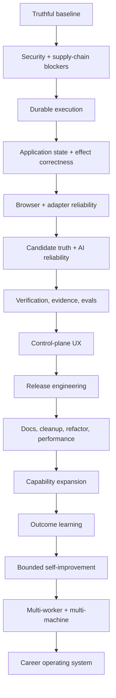
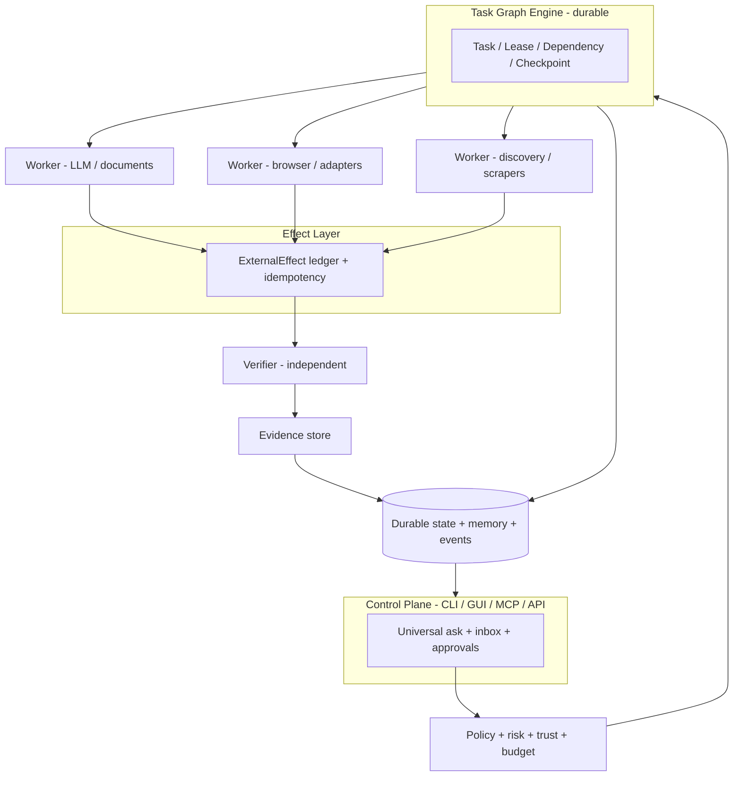
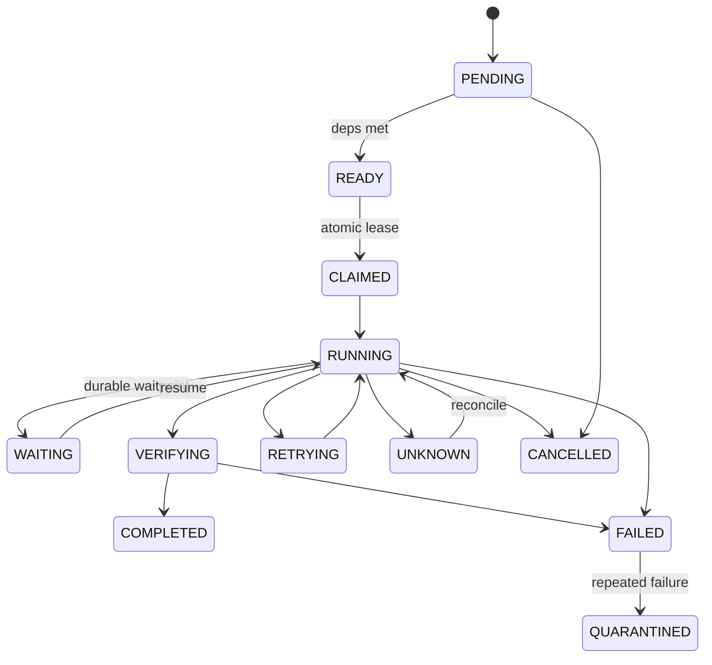
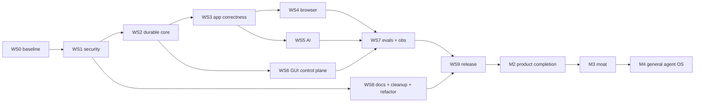

# JoBot Master Implementation Plan

**Document type:** Canonical Master Implementation Plan (supersedes all source plans)
**Date:** 2026-08-16
**Repository:** https://github.com/aryansinghnagar/JoBot
**Guiding doctrine:** `AGENTS.md` (task-driven, verification-first, production-grade, deterministic, zero-hallucination)
**Source set synthesized:** `agents.md`, `Plan1.md` (+`Plan1.pdf`), `Plan2.md`, `Plan3.md`, `plan4.md`, `plan5.md`, `Plan6.md`, `Plan7.md`, `Plan8.md` (+`Plan8.pdf`), `Plan9.md` (empty file), `Plan10.md`, `Plan11.md`
**Deliverables:** this file + `MASTER_PLAN.pdf`

---

## 1. Executive Summary & North Star

**Strategy.** Do not rewrite JoBot. Do not add breadth first. Turn the existing architecture into a trustworthy execution substrate, prove one complete application workflow durable under crash/failure/restart, then expand capability on top of that substrate. A high-throughput agent that duplicates a submission or loses state is materially worse than a missing feature.



**v1.0 product promise (narrow and strong).**

> JoBot reliably discovers, evaluates, prepares, verifies, submits, and tracks applications across a defined set of supported job sources and ATSs, while preserving durable state, respecting explicit policies, surviving crashes, grounding candidate facts, capturing evidence, and exposing every consequential action to the user.

**Long-term moat.** durable execution + trustworthy candidate data + evidence + human-governed autonomy + outcome learning + career intelligence. The moat is not the number of job boards.

**Core production invariants (mandatory in every phase).**

```text
NO ACTION WITHOUT A STATE          NO STATE WITHOUT AN EVENT
NO COMPLETION WITHOUT VERIFICATION NO SIDE EFFECT WITHOUT POLICY
NO RETRY WITHOUT IDEMPOTENCY       NO LONG RUN WITHOUT CHECKPOINT
NO MEMORY WITHOUT PROVENANCE       NO AUTONOMY WITHOUT MEASUREMENT
NO PLUGIN WITHOUT PERMISSIONS      NO SECRET IN LOGS/PROMPTS/EVENTS/TELEMETRY
NO EXTERNAL CONTENT TRUSTED        NO UNKNOWN STATE TREATED AS SUCCESS
NO AMBIGUOUS EFFECT REPLAYED       NO SECURITY GATE BYPASSED FOR VELOCITY
NO RELEASE WITHOUT REPRODUCIBLE EVIDENCE
```

**Autonomy model.** Autonomy is scoped (user x site x adapter x skill x action class), earned from measured outcomes, never a global switch.

| Tier | Example | Default |
|---|---|---|
| R0 | Local read / analysis | Automatic |
| R1 | Public job discovery | Automatic |
| R2 | Resume/cover generation | Automatic + validation |
| R3 | Application preparation / draft fill | Automatic or draft-only |
| R4 | Save / bookmark / tracker mutation | Policy dependent |
| R5 | Submit application | Human approval; bounded autonomy after proven trust |
| R6 | Recruiter outreach / external message | Approval by default |
| R7 | Credential / security-setting change | Human approval |
| R8 | Irreversible high-impact action | Human only |

Risk = f(action, target, reversibility, credentials, external side effect, personal data, cost, volume, confidence, trust). Hard blocks come from policy rules; the score routes escalation.

**Definition of done (one sentence).** An average user installs JoBot, builds a profile, discovers jobs, receives grounded and independently verified application materials, approves and executes applications that survive injected crashes without duplicate effects, inspects evidence, backs up and restores data, and runs on signed/attested release artifacts — all under explicit policy controls and eval gates.

---

## 2. Current State Assessment (Repo + Plan Gap Matrix)

### 2.1 Evidence hierarchy (conflict resolution rule)

| Rank | Source | Rule |
|---|---|---|
| 1 | `AGENTS.md` | Governing doctrine |
| 2 | Live repo at working commit | Ground truth for what exists/passes/fails |
| 3 | Code contracts + tests | Behavioral truth |
| 4 | This Master Plan | Target architecture + sequence |
| 5 | Source Plan1–Plan11 | Requirements/evidence (merged here) |
| 6 | External research | Hypotheses only; never adopted without local eval |
| 7 | Historical docs/worklogs | Context only |

Several plans carry conflicting snapshots ("release 2.0 tagged" vs live `pyproject.toml` 0.1.0; differing test counts). Resolution: every phase opens with a machine-generated baseline; release notes describe only what is verified at the release commit; historical claims stay in the archive.

### 2.2 Verified repo facts (2026-08-16 audit)

**Architecture.** Dual stack: Python 3.11+ core (~13.8k LOC, 27 packages under `src/jobot/`) + Tauri 2 / React 18 GUI with thin Rust shell and stdio JSON-RPC sidecar (`gui/sidecar.py`, 416 lines, 22 methods). SQLite WAL storage (0600 perms, FK on) + Fernet vault + OS keyring. 12-phase Application Submission Pipeline + saga orchestrator with DoD gates and persisted saga instances/steps. Adapter registry: greenhouse, lever, linkedin, workday, indeed, mock_ats, naukri, more_adapters + JobSpy boards. Policy engine, circuit breakers, quarantine, traces, alerts, doctor, backup/migrate, scheduler with caps, plugins, evals harness, interview coach, outreach, digest, PII masker, analytics (skill gap, salary). Tests: 69 Python test files, hermetic mock ATS/LinkedIn fixtures; vitest GUI suite; multi-OS CI.

**Defects and debt (verified in code).**

- `task_graph.py`: `TaskGraphEngine.tasks` is an **in-memory dict**; DB `tasks` table exists but the engine never persists leases/attempts — no durable multi-worker coordination.
- All 7 LLM provider `stream()` methods + `scrapers/ats.py` + most of `adapters/linkedin.py` raise `NotImplementedError`.
- `cli/main.py` is a 1,748-line monolith.
- Version drift: pyproject 0.1.0, root package.json 0.1.0, gui package.json 2.0.0, tauri.conf.json 2.0.0.
- `tauri.conf.json` `"csp": null`; shell capabilities `args: true` (arbitrary args).
- CI: tag-pinned actions (not SHA), narrow Ruff (`--select E,F`), node 18/20 (EOL), stale `dev` triggers, no coverage floor, no security-gates job; `publish.yml` uses long-lived PyPI token; Dependabot lacks cargo.
- Ad-hoc DB migrations (`_ensure_column`), no `schema_migrations`.
- `stealth/` selectors hard-coded; `proxy.py`/`captcha.py` vision unwired; `form_field_memory` not persisted; no event bus; AlertDispatcher not wired to scheduler/GUI; broad `except Exception` / `# noqa: BLE001` swallowing.
- `EightTierMemorySystem` + `memory/vector.py` skeletal (~140 LOC) — memory exists in name more than substance.
- Root cruft: tracked `JoBot_Merge_Plan.pdf`, `Plan1.pdf`, `cover.html`; duplicate plan sets at root and `Plans/`; `repo_research.md`; ignored-but-present 403 KB `log.md`, `.env`, `applications_export.json`, `.freebuff/`, `.mimosa/`; README is 25 lines pointing to a nonexistent `plan.md`; `queues/improve.md` stale vs worklog.
- Zero TODO/FIXME comments; `datetime.utcnow()` usage; missing governance files (SECURITY/CONTRIBUTING/CODE_OF_CONDUCT/CHANGELOG/FUNDING/templates/CODEOWNERS).

**Known vulnerability set (plan5, re-verify at execution).** vite CVE-2026-53571/53632/39365 (high), esbuild GHSA-67mh-4wv8-2f99, glib GHSA-wrw7-89jp-8q8g (tauri-2 transitive, no in-tree fix), nanoid <3.3.18; 9 CodeQL `py/incomplete-url-substring-sanitization` alerts in `registry.py infer_site()` + `workday.py:95`.

### 2.3 Runtime capability matrix

| Capability | State | Notes |
|---|---|---|
| Shell / process mgmt | yes | CLI + sidecar stdio |
| Filesystem r/w + search | yes | state/, artifacts, docs |
| Git | yes | repo, history clean of secrets (gitleaks verified in plan5) |
| Network (HTTP) | yes | httpx with TLS-fingerprint client |
| Local database | yes | SQLite WAL; migrations weak |
| Browser automation | partial | Patchright wired; selectors fragile, no healing/pool manager |
| Screenshot/evidence | partial | capture exists; not systematic pre/post + DOM snapshot |
| Tool calling / LLM | yes | 12-provider router; streaming stubbed |
| Sub-agent delegation | partial | task graph in-memory; no worker loop |
| Long-running background | partial | scheduler loop exists; not durable/checkpointed |
| Schedules/cron | partial | 4-mode loop; DST/catch-up untested |
| Persistent storage | yes | SQLite + vault + keyring |
| UI/dashboard | partial | 5 GUI views; no approvals/evidence/kanban depth |
| Secret management | partial | keyring+Fernet; keyfile perms window |
| Approval/interruption | partial | PENDING_APPROVAL phase; not a durable entity |
| Multi-machine | no | future AR-11 |

### 2.4 Gap Matrix — [Plan capability] x [Repo state] x [Missing coverage]

| # | Capability (source plans) | Repo state | Missing coverage / gap |
|---|---|---|---|
| G1 | Durable task graph, leases, events (Plan1/6/8/10/11) | In-memory dict | DB-backed Task/Attempt/Lease/Event/Artifact/Dependency; atomic claiming; heartbeats |
| G2 | Effect ledger + idempotency (Plan1, plan5) | Pipeline key job_url+profile_id | ExternalEffect table, reservation protocol, request_hash, replay policy |
| G3 | Unknown states + reconciliation (Plan1) | Binary SUBMITTED/VERIFIED | SUBMISSION_UNKNOWN etc., reconciliation service |
| G4 | Durable approvals (Plan1/7) | Phase flag | ApprovalRequest entity shared CLI/GUI/MCP |
| G5 | Policy as universal pre-effect gate (Plan9-style synthesis) | Injected but not universal; big numeric caps | Mandatory gate before every side effect; typed decisions; tiered caps |
| G6 | Browser reliability stack (Plan1, Plan3 AR-2/3) | Hard-coded selectors; unwired proxy/captcha | SelectorRegistry+healing, BrowserSessionManager/pool, evidence protocol, site health, CAPTCHA boundary |
| G7 | Adapter family generalization (Plan3 AR-1) | Workday cxs bespoke | CxsApiAdapter base + Workable/Recruitee/Teamtailor/BambooHR |
| G8 | Boundary schemas (Plan3 AR-4) | Duck-typed protocol | Pydantic models validated at registry + ASP phases; quarantine on invalid |
| G9 | Apply-method classification (Plan3 F-10) | Absent | classify_apply_method + policy override |
| G10 | API apply paths (Plan2/Plan7) | Partial adapters | Greenhouse/Lever/Ashby/SmartRecruiters submission + authorization modes |
| G11 | LLM streaming (Plan2/Plan7) | All stubs | stream() per provider + router fallback + CLI/GUI wiring |
| G12 | Candidate truth system (Plan1) | Absent | CandidateFact entity + grounding verifier |
| G13 | Prompt registry/versioning (Plan1) | Absent | prompts/ tree + per-call prompt_id/version |
| G14 | ModelRouter v2 economics (Plan1) | Cost-aware routing exists | llm_calls/budgets/reservations/health/capabilities/routing_decisions tables |
| G15 | Multi-stage matching (Plan1/Plan7) | Keyword overlap | 4-stage ladder + explanations |
| G16 | Resume pipeline reviewer (Plan1) | Drafter->reviewer exists | Independent reviewer rubric + PDF text/visual verification |
| G17 | Resume PDF ingestion (Plan2) | Absent | pdfminer parser + LLM assist + import-resume command |
| G18 | Layered memory (Plan1) | 8-tier skeleton | Persisted tiers + provenance/confidence; answer bank table |
| G19 | Versioned migrations (Plan1/9) | _ensure_column | schema_migrations + db CLI |
| G20 | Backup/restore/purge (plan4) | backup exists | Encrypted round-trip, golden fixtures, restore drills in CI, purge |
| G21 | GUI control plane (Plan1/2/3) | 5 basic views | Home/task inspector/approval inbox/evidence/trace/cost/incident/kanban/settings + a11y |
| G22 | Sidecar supervision (plan4 R3.1, AR-5) | Basic spawn | Auto-respawn, EOF/backpressure, process-tree kill, double-run lock |
| G23 | GUI E2E (plan4 R3.6) | None | tauri-driver suite |
| G24 | Event bus (AR-7) | None | Typed events + subscribers; ledger stays source of truth |
| G25 | Observability (plan4 R3.5, Plan2) | File traces | JSONL logs+rotation, OTEL, alert wiring, trace export |
| G26 | Telemetry/privacy (plan4 R4) | None | Opt-in Sentry+analytics, redaction, kill switch, privacy doc tested |
| G27 | Eval platform as release gate (Plan1) | Harness exists | Suites: capability/reliability/safety/truthfulness/long-horizon/regression/production-derived |
| G28 | Failure injection + soak (plan4 R3.2/3.3) | None | Suite + 1000-iteration soak |
| G29 | Security remediation (plan5 W1–W10) | Open alerts | vite/vitest stack, URL sanitization, vault, Tauri CSP/caps, CI hardening, trusted publishing |
| G30 | Version authority + packaging metadata (plan4/plan5) | 4-way drift | sync_versions.py, SPDX license, classifiers, drift-failing CI |
| G31 | Governance + docs suite (plan4 R1/R5) | Missing | SECURITY/CONTRIBUTING/COC/CHANGELOG/FUNDING/templates + VitePress site |
| G32 | Release channels + artifacts (plan4 R2) | Publish-on-release only | GHCR multi-arch, desktop CI 3-OS, icons, updater, signing, release.yml |
| G33 | Doctor expansion (Plan1/plan4) | Basic | Full check tree + --json + --fix-safe |
| G34 | Repo cleanup (all plans) | Heavy cruft | Archive plan set, dedupe, .gitignore, secret sweep, queue reconciliation |
| G35 | Refactor RF-1..12 (Plan1/3) | Monolith + duck typing | CLI split, boundaries, repositories, async hot paths, plugin ABI |
| G36 | Performance program (Plan6/8/9) | Unmeasured | Baselines + budgets + soak SLOs + profiling guards |
| G37 | Multi-profile (Plan2) | Hardcoded "default" | Named profiles through vault/DB/tasks/applications |
| G38 | MCP/API/TUI/extension surfaces (Plan1/2/3) | None | jobot mcp (stdio), jobot serve loopback, textual TUI, post-1.0 extension |
| G39 | Career intelligence + outcome learning (Plan1) | Tracker stats only | Outcome tracking, funnel analytics, career graph (post-v1) |
| G40 | Self-improvement + skills (Plan1) | None | Bounded loop, skill registry, trust promotion (post-v1) |
| G41 | Community/launch ops (plan4 R5) | None | stale-bot, roadmap page, launch checklist |
| G42 | ToS-risk features (Plan3 F-19/20/21) | None | Behind JOBOT_ENABLE_RISKY=1, default off, capped |

**Repo needs no plan covers:** README referencing nonexistent `plan.md`; case-duplicate `Plans/` vs `plans/` on Windows; 403 KB `log.md` and `.freebuff/`/`.mimosa/` workspace dirs; skeletal EightTierMemory marketed as built; `jobs` DB table unused by the task engine; zero-coverage modules (`digest/`, `notify/`, `outreach/`, `scheduler/loop.py`); `applications_export.json` (user data) sitting in repo root.

### 2.5 Implementation contract (Phase 0 output)

- **Mission:** ship JoBot v1.0.0 — reliable, policy-governed, evidence-producing autonomous job-application agent for an average end user.
- **Runtime profile:** local-first, single-user; CLI + Tauri desktop GUI; SQLite WAL; Patchright browser behind a replaceable interface; BYOK LLM providers (12-provider router); optional Docker headless.
- **First milestone:** one end-to-end durable verified application under injected failure (Section 17).
- **Non-goals v1:** hosted SaaS, multi-tenant auth/billing, defeating platform anti-bot controls, high-volume bulk apply, remote workers.
- **Constraints:** AGPL-3.0 core; no secrets in logs/telemetry; opt-in telemetry only; live adapters stay opt-in (`JOBOT_RUN_LIVE_BROWSER=1`); human approval default for submission.
- **Safety posture:** conservative ToS stance (LinkedIn/boards), policy envelope R0–R8, sandbox ladder for plugins.
- **Proof-of-progress metrics:** gate table G0–G7; release criteria in Section 15.
- **Verification strategy:** 8-level pyramid (Section 9) + eval release gates (Section 10).

---

## 3. Target Architecture & Design Decisions

### 3.1 Assumptions (stated, verifiable)

1. **Environment:** developer laptop / end-user desktop, Windows/macOS/Linux Tier-1; WSL2 + Docker documented.
2. **Persona:** average non-CLI-first job seeker (GUI-primary) plus power users (CLI/TUI); single user per install.
3. **Deployment:** local-first; distribution via PyPI, GHCR, desktop installers; no server component in v1.
4. **Runtime/token budget:** BYOK provider keys; daily/monthly cost caps enforced by budget reservations before expensive work; local Ollama path for privacy/cost.
5. **Stack:** Python 3.11+ (Typer, Pydantic v2, SQLite, httpx, Patchright), Tauri 2 + React 18, Node >= 20.19. All libraries verified against repo manifests; nothing assumed.
6. **Allowed external services:** LLM providers via router; public job boards/ATS APIs; recruiter email via Gmail API OAuth (opt-in). LinkedIn and similar boards: policy-gated, opt-in, ToS-reviewed, never anti-control circumvention.
7. **Legal/compliance posture:** never defeat CAPTCHAs/anti-bot/usage limits; CAPTCHA = detection + human-handoff boundary; bulk/ste/connection features default-off behind `JOBOT_ENABLE_RISKY=1`; release notes state validation status honestly.

### 3.2 Unified target architecture



Agents propose; policy decides; execution adapters perform; effects are recorded; independent verification confirms; only then does durable state transition. Never let the producer of a step certify it.

**Closed loop (every substantial workflow):**


### 3.3 First-class entities and state machines

Entities: `Goal, Task, TaskAttempt, TaskLease, TaskDependency, TaskEvent, TaskArtifact, ApprovalRequest, ExternalEffect, Checkpoint, Incident, BudgetReservation, CandidateFact`.



Application protocol (separate from task states; explicit transition table, no free enum mutation):

```mermaid
stateDiagram-v2
    [*] --> DISCOVERED
    DISCOVERED --> NORMALIZED --> DEDUPLICATED --> ENRICHED --> MATCHED --> SHORTLISTED
    SHORTLISTED --> PREPARING --> PREPARED --> AWAITING_APPROVAL
    AWAITING_APPROVAL --> SUBMITTING: approved
    SUBMITTING --> SUBMITTED
    SUBMITTING --> SUBMISSION_UNKNOWN
    SUBMISSION_UNKNOWN --> VERIFYING: reconcile
    SUBMITTED --> VERIFYING
    VERIFYING --> VERIFIED
    VERIFYING --> VERIFICATION_UNKNOWN
    VERIFIED --> OUTCOME_TRACKING
    OUTCOME_TRACKING --> INTERVIEW
    OUTCOME_TRACKING --> REJECTED
    OUTCOME_TRACKING --> OFFER
    OUTCOME_TRACKING --> WITHDRAWN
    OUTCOME_TRACKING --> EXPIRED
    SUBMISSION_UNKNOWN --> QUARANTINED: unresolvable
    PREPARING --> FAILED
```

Timestamp semantics split: `submitted_at` / `submission_verified_at` / `first_employer_response_at` / `current_outcome` (with migration + backfill).

### 3.4 Design decisions and tradeoffs

| # | Decision | Alternatives | Tradeoff rationale |
|---|---|---|---|
| A1 | SQLite WAL now; Postgres only on measured need | Postgres from day one | Local-first simplicity; durable interfaces keep migration path open |
| A2 | Pull-based workers + DB-conditional claiming | Push orchestration | Survives partial failure; no in-memory dispatch; two workers never share a lease |
| A3 | Append-only event ledger = source of truth; in-process bus = delivery | Bus-only | Replay/audit/timelines need durable events; bus is replaceable |
| A4 | Policy gate mandatory before every external side effect | Trust pipeline internals | Removes current phase-10/11 split; typed machine-readable decisions |
| A5 | Unknown as first-class state + reconcile-never-replay | Binary success/fail | Eliminates duplicate-submission class of failure |
| A6 | Adapter modes PUBLIC_READ / USER_AUTHORIZED_API / BROWSER_ASSISTED | Fake API flows | Public read API never implies submit authorization |
| A7 | Patchright stays default behind a replaceable browser capability interface | Vanilla Playwright switch now | Stealth value retained; fork-risk mitigated by interface + fallback |
| A8 | Prompts versioned as files; per-call provenance | Inline prompt strings | Measurable, rollbackable; one-change eval loops possible |
| A9 | Layered memory without vector DB until scale justifies | Embedding store now | Current corpus tiny; SQLite + provenance suffices; revisit on measurements |
| A10 | MCP/REST/TUI as thin adapters over shared services | Core-coupled surfaces | No forked business logic; core never depends on MCP |
| A11 | Single-agent baseline first; multi-worker only after G2 | Swarm now | AGENTS.md doctrine; simpler control flow until reliability proven |
| A12 | Async hot paths behind `jobot.asyncx` sync shim | Full-async rewrite | CLI stays sync; >= 1.2x bench gate before adoption |
| A13 | Plugins deny-by-default manifest + sandbox ladder | Open plugin trust | Supply-chain safety; health-checked install |
| A14 | Incremental refactor with import shims, suite green each move | Big-bang restructure | 359-test baseline protects behavior; no multi-week branch |
| A15 | Anti-detection ideas reinterpreted as compliance-bound reliability | Stealth-first | LinkedIn ToS prohibits circumvention; reputation + account safety |
| A16 | Local-first telemetry opt-in with kill switch | Default-on analytics | Privacy promise is a product feature; docs must match code exactly |

### 3.5 Planning layers

Charter (this document Section 1) -> workstreams (Section 5) -> milestones (M1–M4) -> task graph (Section 6) -> execution focus (`queues/now.md`) -> recurring ops (`queues/recurring.md`) -> risk register (Section 7) -> decision register (Section 8). Planning files are living files: if the plan changed and files didn't, the system is lying to itself.

**Feature-priority rubric** (score 1–5 each, weighted): user value x1.5, reliability impact x1.5, unblocking effect x1.5, cost/effort inverse x1.0, implementation risk inverse x1.0. P0 = release-blocking per Section 15.

### 3.6 Failure modes and mitigations

| Failure mode | Mitigation |
|---|---|
| Auth/credential loss | Keyring+vault, hardened keyfiles, rotation, fail-closed startup checks |
| Rate limits (LLM/boards) | Per-provider circuit breakers, jittered backoff, budget reservations, Ollama fallback |
| Bot detection / account bans | Policy-gated opt-in, session reuse, realistic pacing, daily caps, human fallback, circuit breaker |
| Schema/driver drift (boards) | Selector registry + healing + drift fixtures; adapter health monitoring; API-path preference |
| Partial failure mid-workflow | Step checkpoints, saga compensation, effect ledger, resume-without-replay |
| Resume-state loss after crash | Durable task/lease/checkpoint tables; kill-anywhere test gate |
| Secret leakage | Redaction layer at logs/traces/telemetry/prompts; no secrets in events; tests |
| Ambiguous submit outcome | SUBMISSION_UNKNOWN + reconciliation service + evidence |
| DB corruption | Versioned migrations, backup drills, corruption detection, safe-versions rollback list |
| Provider outage | Router fallback chains + health table; degrade, never corrupt task state |

### 3.7 Per-milestone verification rule

Every milestone M delivers: named artifacts (code+docs), a passing gate from Section 9, evidence files under `artifacts/`, updated `worklog.md` + queues, and at least one reusable asset or eval added. No milestone closes on assertion alone.

---

## 4. Unified Feature Catalog (deduplicated, conflict-resolved, source-tagged)

Conflicts resolved here: "anti-detection" -> compliance-bound reliability (A15); "auto-promote best resume after N" -> statistical gate with minimum sample; "delete stubs" vs "honest stubs" -> implement or explicitly mark out-of-scope; Plan8/10/11 sequencing variants -> single build order (Section 16); duplicate F-*/C-* identifiers unified.

| ID | Feature | Source | Priority | Notes |
|---|---|---|---|---|
| UC-01 | Durable task queue + atomic leases + heartbeats | Plan1/6/8/10/11 | P0 | Closes G1 |
| UC-02 | Event ledger + typed event bus | Plan1, AR-7 | P0/P1 | Ledger first, bus after |
| UC-03 | Effect ledger + idempotency audit | Plan1/9 | P0 | All side effects |
| UC-04 | Unknown states + reconciliation service | Plan1 | P0 | Never blind retry |
| UC-05 | Durable ApprovalRequest entity (CLI/GUI/MCP) | Plan1/7 | P0 | Shared lifecycle |
| UC-06 | Risk/trust engine, tiered caps, scoped trust | Plan1/9 | P0 | Replaces big numeric caps |
| UC-07 | Versioned DB migrations + `jobot db` CLI | Plan1/9 | P0 | schema_migrations |
| UC-08 | Encrypted backup/restore drills + purge | plan4 | P0 | Golden fixtures in CI |
| UC-09 | BrowserSessionManager + pool + persistence | Plan1 | P0 | |
| UC-10 | Selector registry + healing + drift tests | AR-2 | P0 | `stealth/selectors.py` |
| UC-11 | Browser evidence protocol (pre/post shot, DOM, args) | Plan1 | P0 | Retention + dedup |
| UC-12 | CAPTCHA boundary: detect + escalate + human handoff | Plan1/3 | P0 | Never bypass |
| UC-13 | Site health + circuit breaker + auto-demote | Plan1/3 | P0 | |
| UC-14 | Pydantic boundary schemas at adapter/ASP phases | AR-4 | P0 | Invalid -> quarantine |
| UC-15 | cxs adapter family (Workable/Recruitee/Teamtailor/BambooHR) | AR-1 | P0/P1 | Workday byte-identical |
| UC-16 | Direct API apply: Greenhouse/Lever/Ashby/SmartRecruiters | Plan2/7 | P0/P1 | Authorization modes |
| UC-17 | LinkedIn Easy Apply completion (assisted, approval-gated) | Plan2/7, F-19-adjacent | P1 | ToS-governed |
| UC-18 | LLM streaming all providers + router fallback | Plan2/7 | P0/P1 | CLI `--stream` |
| UC-19 | Typed LLM contracts + prompt registry/versioning | Plan1 | P0 | |
| UC-20 | ModelRouter v2: capabilities/health/routing/cost tables | Plan1 | P0 | |
| UC-21 | Candidate truth system + grounding verifier | Plan1 | P0 | LLM proposes, never mutates |
| UC-22 | Independent reviewer (resume/cover) | Plan1 | P0 | Catches unsupported claims |
| UC-23 | Multi-stage matching + explanations | Plan1/7 | P0/P1 | Cost ladder |
| UC-24 | Job fraud/quality detection | Plan1 | P1 | Untrusted content |
| UC-25 | Resume PDF ingestion (`import-resume`) | Plan2 | P1 | >=80% field accuracy |
| UC-26 | Layered memory (8 tiers real) + answer bank persistence | Plan1, AR-3, F-02 | P0/P1 | Provenance per record |
| UC-27 | Multi-profile support | Plan2 | P1 | Remove "default" |
| UC-28 | Job/company normalization + dedupe + freshness | Plan1 | P1 | Fingerprints not title-match |
| UC-29 | GUI control plane: Home/task/approval/evidence/trace/cost/incident/settings | Plan1/2 | P0 | + accessibility |
| UC-30 | Kanban + funnel analytics | F-01 | P0 | tracker_move RPC |
| UC-31 | Answer bank UI (search/dedupe) | F-08 | P0 | |
| UC-32 | Browser-health diagnostics in GUI | F-03 | P0 | Healing surfaced |
| UC-33 | Live ATS score + per-job resume variants in GUI | F-07 | P0 | |
| UC-34 | Export/import CSV+JSON round-trip | F-06 | P0 | |
| UC-35 | Apply-method classification + policy override | F-10 | P0 | |
| UC-36 | Follow-up automation (email-only, rate-capped, opt-in) | F-05 | P0* | Human approval to send |
| UC-37 | Job clipping from URL | F-23 | P1 | |
| UC-38 | Sidecar supervision (respawn/EOF/lock/tree-kill) | AR-5/plan4 R3.1 | P0 | |
| UC-39 | GUI E2E (tauri-driver) | plan4 R3.6 | P0 | |
| UC-40 | Failure-injection + soak suites | plan4 R3.2/3.3 | P0 | 1000-iter soak |
| UC-41 | Eval platform as release gate (7 suites) | Plan1 | P0 | Section 10 |
| UC-42 | Prompt-injection boundary + adversarial corpus | Plan1/9 | P0 | OWASP LLM01 |
| UC-43 | Observability: JSONL logs, OTEL traces, alert wiring, trace export | plan4 R3.5 | P0/P1 | |
| UC-44 | Opt-in telemetry + redaction + kill switch + privacy doc | plan4 R4 | P0 | Docs match code |
| UC-45 | Security remediation W1–W10 (deps, URL, vault, Tauri, CI, publishing) | plan5 | P0 | Release-blocking W1/W2/W4 |
| UC-46 | Version authority + packaging metadata + drift CI | plan4 R1.1/plan5 W6 | P0 | |
| UC-47 | Governance files + README overhaul | plan4 R1.6–R1.8 | P0 | |
| UC-48 | Distribution: PyPI trusted publishing, GHCR multi-arch, desktop 3-OS CI, icons, updater, signing | plan4 R2 | P0 | |
| UC-49 | Doctor expansion (--json, --fix-safe, full tree) | Plan1/plan4 | P0 | |
| UC-50 | Docs suite + VitePress site + generated references | plan4 R5, Plan7 | P0 | Section 12 |
| UC-51 | Repo cleanup + planning archive + queue reconciliation | all | P0 | Section 13 |
| UC-52 | Refactor RF-1..RF-12 + typed errors + logging | Plan1/3/7 | P0/P1 | Section 14 |
| UC-53 | Performance program: baselines, budgets, soak SLOs, guards | Plan6/8/9 | P0 | Section 14 |
| UC-54 | Gmail watcher (OAuth) -> status signals | F-09 | P1 | No IMAP passwords |
| UC-55 | 24/7 matcher + opportunity digest | F-11 | P1 | Never submits w/o policy |
| UC-56 | Interview calendar + question bank expansion | F-12/F-22 | P1 | |
| UC-57 | Salary negotiation toolkit + market intel | F-13, Plan1 | P1/P2 | Freshness visible |
| UC-58 | Session recordings in evidence viewer | F-14 | P1 | |
| UC-59 | Resume bank + A/B testing (statistical gate) | F-17, Plan2 | P1 | Min sample size |
| UC-60 | Local LLM path (Ollama incl. vision) | F-18 | P1 | Eval-gated |
| UC-61 | MCP server (stdio first) | F-16/AR-9 | P1 | Pinned spec revision |
| UC-62 | `jobot serve` REST (loopback) | Plan2/7 | P1/P2 | API-key + CORS before expose |
| UC-63 | TUI (textual) | Plan2/7 | P1/P2 | Reuses services |
| UC-64 | HTML reports + funnel charts + PDF export | Plan2 | P1 | |
| UC-65 | OTEL external export (+ optional Langfuse) | Plan2 | P1 | |
| UC-66 | Trust-level automation + audit events | Plan2 | P1 | Configurable thresholds |
| UC-67 | Sandbox ladder (subprocess->container->remote) | Plan1/7 | P1/P2 | Plugins/code |
| UC-68 | Plugin ABI + community gallery | AR-8, F-24 | P2 | Deny-by-default |
| UC-69 | Browser extension (separate repo) | F-15 | P2 | Never a bypass channel |
| UC-70 | Networking graph + referrals | Plan1/2 | P2 | Authorized data only |
| UC-71 | LinkedIn profile scoring | Plan2 | P2 | Exported data only |
| UC-72 | Multilingual resumes | Plan2 | P2 | Locale validation |
| UC-73 | ToS-risk: LinkedIn follow-ups / proxy rotation / bulk apply | F-19/20/21 | P2 | JOBOT_ENABLE_RISKY=1, off |
| UC-74 | Outcome learning loop | Plan1 | P1/P2 | Observational wording |
| UC-75 | Skill extraction + registry | Plan1 | P2 | Trajectory -> skill |
| UC-76 | Bounded self-improvement (one-change rule) | Plan1/9 | P2 | Human gates on policy |
| UC-77 | Automated eval generation from failures | Plan1 | P2 | |
| UC-78 | Career intelligence graph | Plan1 | P2/P3 | Post-v1 |
| UC-79 | Multi-machine workers / remote sandbox | AR-11, Plan1 | P2/P3 | File-protocol sync |
| UC-80 | Conversational `jobot ask` assistant | Plan2 | P1/P2 | Session context |
| UC-81 | Homebrew/Scoop/Flatpak | Plan2 | P2 | |
| UC-82 | Community ops + launch (stale-bot, roadmap page, announcements) | plan4 R5 | P0 (launch) | |

Catalog is exhaustive over the source set: every AR-*, F-*, R*, W*, C-* and plan-phase item maps to a UC id (traceability in Section 20).

---

## 5. Workstream Decomposition & Milestone Roadmap

| WS | Workstream | Scope (UC ids) | Milestone |
|---|---|---|---|
| WS0 | Truth, baseline, freeze | baselines, contracts freeze, scorecard | M1 gate G0 |
| WS1 | Security + supply chain | UC-45, UC-46, UC-47 | M1 gate G1 |
| WS2 | Durable execution core | UC-01..UC-08 | M1 gate G2 |
| WS3 | Application correctness | UC-03..UC-06 (app-level), timestamps | M1 gate G3 |
| WS4 | Browser + adapters | UC-09..UC-17 | M1 gate G4 |
| WS5 | AI reliability + truth | UC-18..UC-26 | M1 gate G5 |
| WS6 | Control-plane UX | UC-29..UC-39 | M1 gate G6 |
| WS7 | Observability + evals | UC-40..UC-44 | M1 gate G5/G7 support |
| WS8 | Docs + cleanup + refactor + perf | UC-50..UC-53 | M1 gate G7 |
| WS9 | Release engineering + launch | UC-48, UC-49, UC-82 | M1 = v1.0.0 |
| WS10 | Product completion (P1) | UC-25..UC-28, 37, 54..66, 80 | M2 |
| WS11 | Strategic moat (P2) | UC-67..UC-79, 81 | M3 |
| WS12 | General agent platform (P3) | career-OS reuse of runtime | M4 |

**Milestones.** M1 = v1.0.0 release (all gates green). M2 = product completion (v1.1.x). M3 = strategic moat (v1.2+/v2). M4 = general agent OS on the same durable runtime. Calendar estimate for M1: ~26–32 focused weeks, parallelizable after WS3 across WS4/WS5/WS6 tracks; every promotion requires evidence the previous layer is reliable.

---

## 6. Task Graph & Dependency Rails



**Rails.** Serialized (dependency-gated): security -> durable core -> app correctness; migrations before any new table consumer; policy gate before any effect-path feature. Fan-out (parallelizable after WS2): adapter family work || LLM streaming || GUI views || docs generation; discovery/ranking fan-out at runtime with bounded concurrency (target >= 2x multi-core). Fan-in: release pipeline assembles WS9 artifacts; verification gate fans in all suites.

**Definition of Done per task cluster (selected core; full per-task DoD lives in `docs/implementation/requirements-matrix.md`).**

| Task | DoD (all required) |
|---|---|
| T1 Baseline reports | Reports committed; contracts regression tests green; scorecard with evidence links |
| T2 npm stack upgrade | npm audit 0 high; vitest green; GUI build OK; engines field; CI node 20/22 |
| T3 URL sanitization | urlsplit exact/suffix match; unknown -> ValueError; adversarial suite green; 9 CodeQL closed |
| T4 Vault hardening | 0600 atomic create; owner/mode checks; O_NOFOLLOW; hardening tests green |
| T5 Tauri hardening | CSP set; args regex allowlist; capability regression tests; dev+build clean |
| T6 CI hardening | SHA-pinned; security-gates job green; actionlint clean; test_imports.py green |
| T7 Durable task engine | Kill-worker-at-every-phase test green; no double lease; heartbeats; lease expiry reclaim |
| T8 Event ledger | Append-only; correlation/causation ids; audit/replay tests |
| T9 Effect ledger | Duplicate-submission test impossible; reservation protocol; compensation/quarantine states |
| T10 Approvals | Entity + CLI/GUI flows; survives restart; edit/defer supported |
| T11 App state machine | Transition table validated; timestamp split migrated + backfilled |
| T12 Browser stack | Registry+healing+drift fixtures; evidence protocol; CAPTCHA boundary; site health |
| T13 Adapter family + schemas | Workday unchanged; 4 new adapters hermetic-tested; schemas enforced; quarantine on invalid |
| T14 LLM platform | Streaming per provider or capability-gated; prompt provenance per call; cost tables |
| T15 Candidate truth | No unsupported claims in critical evals; propose-not-mutate enforced by tests |
| T16 Matching ladder | 4 stages; component scores stored; explanation emitted; cost reduced vs baseline |
| T17 GUI control plane | Views live from real state; a11y baseline; E2E green; supervision kill tests |
| T18 Eval platform | 7 suites runnable in CI; release report shows deltas |
| T19 Telemetry | Opt-in only; redaction tests; kill switch; privacy doc schema-matched |
| T20 Docs + cleanup | Docs tree live + generated refs; archive manifest; root canonical; gates scripts exit clean |
| T21 Refactor/perf | Suite green each move; interface inventory unchanged; perf budgets met vs baseline |
| T22 Release | All Section 15 checks green on RC; artifacts on 3 channels; attestations verified |

**Parallel-work rules:** feature branches + one coherent commit; parallel coding lanes use one git worktree per owned task; never multiple workers editing the same files blindly; merge only after verification.

---

## 7. Risk Register & Mitigations

| ID | Risk | L | I | Mitigation |
|---|---|---|---|---|
| R1 | LinkedIn/board detects Patchright; account bans | H | C | Policy-gated opt-in, session reuse, realistic pacing, daily caps, circuit breaker, human fallback; never circumvent controls |
| R2 | JobSpy/selector breakage on redesigns | M | H | Registry + healing + drift fixtures, health cron, direct-API fallback |
| R3 | LLM rate limits / cost spikes | M | M | Fallback chain, per-provider breaker, budget reservations, Ollama fallback |
| R4 | Duplicate external submissions | L | C | Effect ledger + idempotency + unknown states; zero-tolerance release test |
| R5 | PII leakage to providers/logs | L | C | PII masker at every layer; redaction tests; audit |
| R6 | vite 8 / vitest 4 breakage | M | H | Build+test before proceeding; documented revert path |
| R7 | GUI work delays v1 | M | M | CLI fully functional; GUI ships 1.0.1 if needed |
| R8 | Live adapters unvalidated on dev machine | M | M | Hermetic tests mandatory; live opt-in; honest release notes |
| R9 | Refactor churn vs 359-test baseline | M | M | Full suite green after every package; branches; interface inventory diff |
| R10 | ToS-flagged features harm reputation | M | M | Default-off flags, docs, rate caps, no volume blasting |
| R11 | SQLite single-user ceiling | L | M | Documented limit; Postgres path in roadmap only |
| R12 | AGPL deters enterprise adoption | L | M | Clear license docs; dual-license exploration post-1.0 |
| R13 | infer_site ValueError degrades UX | M | M | Clean error + `jobot list-sites` guidance |
| R14 | P0 feature load delays v1.0.0 | M | M | Scope = enumerated UC set; slippage -> P1 with owner approval |
| R15 | Desktop CI time blowout | M | M | Cargo caching; tag+nightly-only desktop builds; <= 25 min/job |
| R16 | Patchright fork falls behind Playwright | M | M | Monitor upstream; browser capability interface + vanilla fallback |
| R17 | glib RUSTSEC residual (tauri 2) | M | L | Documented in SECURITY.md; cargo Dependabot + audit; re-eval on tauri 3 |
| R18 | Telemetry redaction regression | L | C | Payload schema test + redaction suite + kill switch test |
| R19 | DB corruption on upgrade | L | H | Versioned migrations, pre-release upgrade tests, backups, rollback policy |

---

## 8. Decision Register (decisions, defaults, escalation paths)

| # | Decision | Default | Escalation / revisit trigger |
|---|---|---|---|
| D1 | `infer_site()` unknown URLs | Raise ValueError; no silent default | UX friction reports |
| D2 | vite upgrade path | 5.4.21 -> 8.x line (8.2.1 candidate; re-verify at exec) | Build breakage -> document residual |
| D3 | glib RUSTSEC-2024-0429 | Accepted documented residual | tauri >= 3 / gtk4 |
| D4 | Execution order | Security -> durability -> correctness -> breadth | — |
| D5 | macOS notarization | Defer v1; document Gatekeeper workaround | Adoption friction metrics |
| D6 | Windows signing | SignPath OSS; fallback documented SmartScreen | Approval outcome |
| D7 | Auto-update hosting | GitHub Releases | Scale needs |
| D8 | Docs generator | VitePress | Maintenance cost |
| D9 | Crash reporting | Sentry SaaS free tier, opt-in | Volume/cost |
| D10 | Browser extension | Defer post-1.0, separate repo | Community demand |
| D11 | Gmail auth | Gmail API OAuth only; no IMAP passwords | — |
| D12 | ToS-risk features | JOBOT_ENABLE_RISKY=1 + per-feature flags; default off | Legal review |
| D13 | MCP scope | stdio first, SSE later; pinned spec revision | Ecosystem shifts |
| D14 | GUI in v1 | Required (approvals + evidence + kanban); CLI-first fallback explicit | Schedule risk |
| D15 | Submission autonomy | Human by default; trusted-site promotion only from measured outcomes | Trust evidence |
| D16 | Platforms | macOS/Linux/Windows Tier-1; WSL2/Docker documented | Usage data |
| D17 | Patchright | Default behind replaceable capability interface | Fork health |
| D18 | Local-first | Non-negotiable; cloud optional | — |
| D19 | Database | SQLite WAL; Postgres only on measured need | Concurrency evidence |
| D20 | SaaS/hosted | Out of scope for v1 | Post-1.0 strategy |
| D21 | Structured logging | stdlib-based formatter over new dependency | Complexity |
| D22 | LaTeX resumes | Keep LaTeX + robust fallback engines | Install-friction data |
| D23 | Coverage floor | measured −2%, min 70%, target 75% | Baseline result |
| D24 | Risky-feature caps | Hard caps + human approval even when enabled | Abuse signals |

Human escalation path: any D* change requires an entry in `decisions.md` + queue update; safety-class decisions (D5, D12, D15, D18, D20) additionally require explicit owner sign-off.

---

## 9. Verification & Acceptance Matrix

| Level | Scope | Method/tool | Acceptance |
|---|---|---|---|
| L1 Unit | State transitions, schemas, URL parsing, policy, repos, selector resolver, cost accounting, PII redaction, answer bank, hashing | pytest | Green; coverage >= floor |
| L2 Contract | Every adapter: discover/normalize/questions/prepare/submit-or-dry-run/verify/health | Shared canonical suite | All registered adapters pass |
| L3 Integration | Pipeline + saga + DB + sidecar with mock ATS servers and fake browser/HTTP fixtures | pytest integration | Green, no network |
| L4 Browser-interaction | Named actions, healing, evidence capture against recorded/drifted fixtures | Playwright fixture harness | No silent corruption |
| L5 E2E (GUI) | Boot, discover via mock_ats, dry-run apply, approve, dashboard, kanban, answer bank | tauri-driver + WebDriver | Green in CI (win/ubuntu) |
| L6 Failure injection | Disconnect, DNS, 429, 500, malformed JSON, browser crash, tab close, sidecar death, provider timeout/outage, corrupted checkpoint, DB lock, dup event/effect, stale selector, invalid data, prompt injection, plugin violation, CAPTCHA detect, ambiguity | `tests/test_failure_injection.py` | Breakers open; quarantine receives; GUI recovers; zero dup effects |
| L7 Soak/leak | 1000-iteration sidecar loop; RSS/WAL/fd/browser-process growth | tracemalloc + soak script | RSS ±10%, linear DB growth, 0 crashes |
| L8 Security | CodeQL (py/js/rust), pip-audit, npm audit, gitleaks, bandit, URL fuzzing, prompt-injection corpus, Tauri capability regression, vault perms, plugin sandbox, credential redaction | CI security-gates | 0 unaccepted findings |
| L9 Release candidate | Fresh install per OS, upgrade-from-previous, backup/restore, rollback, wheel/sdist, Docker smoke, desktop launch, doctor, DST/catch-up scheduler | release.yml RC stage | All green + attestations verified |

**Phase gates.** G0 Truth (baselines committed, contradictions tagged, queues truthful) | G1 Security (zero unaccepted blockers, adversarial URL suite, hardened Tauri/vault/CI, provenance working) | G2 Durability (kill-anywhere resume; no double lease) | G3 App correctness (no duplicate submissions under any injected failure; approvals survive restart) | G4 Browser/adapters (mock ATS + Tier-1 survive injected failures; schemas enforced) | G5 AI (zero unsupported candidate claims; PDF dual verification; provider failures degrade cleanly) | G6 UX (new-user journey without source code; a11y baseline) | G7 Release (Section 15 checklist green; onboarding scenario proven under failure injection).

---

## 10. Eval & Self-Improvement Plan

**Suites.** Capability (discovery, parsing, matching, tailoring, QA, form filling, submission, verification, tracking). Reliability (crash/restart, network loss, timeouts, stale selectors, rate limits, browser death; pass@1, pass@N, median/p95, retries, intervention rate, silent-failure rate, unknown-state rate, evidence completeness). Safety (prompt injection from JDs, malicious HTML/URLs, fake jobs, credential exfiltration, secret leakage, destructive tool requests, malicious plugins, compromised adapters). Truthfulness (fabricated credentials, contradictions, unsupported salary/skill claims). Long-horizon (find 20 -> rank -> shortlist 3 -> tailor -> answers -> approvals -> submit authorized -> verify -> tracker -> memory -> outcome, with kills between phases). Regression (every change vs baseline). Production-derived (incidents + human corrections become cases).

**Release rule.** A release must show pass@1, repeated-trial pass rate, cost-to-pass, time-to-pass, intervention frequency, silent-failure rate, regression delta. No "improved" claim without eval/production evidence; quality gains that raise unsafe behavior/cost/intervention are not improvements.

**Trajectory recorder.** Persists operational decisions, tool calls, transitions, validations, evidence, outputs, concise rationales — never chain-of-thought.

**Self-improvement (bounded).** signal -> classify gap (skill/tool/policy/prompt/memory/decomposition/verifier/routing) -> bounded proposal -> isolated branch/sandbox -> targeted eval -> baseline compare -> security/policy gate -> promote/discard. One-change rule; never unrestricted production self-modification; forbidden targets for automation (security policy, credentials, destructive rules, release permissions, autonomy thresholds, secret storage, data-sharing policy) require human approval.

**Skill ladder.** solve once -> trajectory -> skill candidate -> test corpus -> review -> registry (trigger, inputs, tools, permissions, outputs, verification, retry, stop conditions, corpus, trust, version). Trust promotion/demotion recorded as audit events; thresholds configurable, evidence-based.

**Complexity notes.** Multi-stage matching: O(N) deterministic filter, O(N·d) lexical/embedding on survivors, O(k) LLM calls with k << N (shortlist only). Dedupe: O(1) hash fingerprint lookup per posting. Effect/idempotency check: O(1) indexed unique key. Event ledger append: O(1) amortized; timeline query O(log n) via (aggregate, created_at) index.

---

## 11. Observability, Incident Management & Rollback Strategy

- **Traces.** OpenTelemetry-compatible hierarchy Goal -> Task -> Model/Tool/Browser/Policy/Approval/Verification/Artifact/Effect, each span carrying stable ids, provider/model, prompt version, policy version, adapter version, worker, profile, application id. `jobot trace export` verified end-to-end.
- **Logs.** Structured JSONL with rotation, retention limits, correlation-id propagation (stdlib-based formatter, D21). Documented format.
- **Metrics.** Task success/verification rate; median/p95 completion; cost per successful application; intervention, retry, quarantine, browser-failure, provider-fallback, application-verification, unsupported-claim, match-precision, resume-review-failure rates; **duplicate-effect rate (must be zero)**; recovery-after-crash success; memory reuse; regression rate.
- **Audit log.** Append-only consequential-action log (timestamp, actor, action, target, outcome, policy result, effect id, evidence) with tamper-evident hash chain.
- **Alerts.** AlertDispatcher wired (email/webhook) to incidents and breaker trips via the event bus.
- **Incidents.** Record: severity, impact, affected users/apps, timeline, last-known-good version, root cause, mitigation, corrective action, eval/test added. Handling flow: creation -> triage -> mitigation -> postmortem -> prevention -> backlog item.
- **Telemetry privacy.** Opt-in only (Sentry + anonymous analytics: task counts, success rates, cost/run, version — no application data); redaction layer (identity, keys, URLs, evidence paths); GUI consent; `telemetry.enabled` config + `JOBOT_TELEMETRY=off` kill switch; `docs/privacy.md` schema-tested against code.
- **Rollback.** Revoke artifacts, patched release, DB downgrade-or-forward-fix policy, safe-versions list, corrupted-user-state recovery, disable unsafe features via local config. Release notes distinguish hermetic vs live validation.

---

## 12. Documentation Suite Specification

| Doc | Purpose | Audience | Location | Template/source | Owner | Acceptance |
|---|---|---|---|---|---|---|
| README | First contact: promise, quickstart, badges, architecture, honest adapter status, FAQ, sponsorship | All users | `/README.md` | plan4 R1.8; generated diagram | maintainer | Renders; quickstart verified in fresh venv; no stale claims |
| CONTRIBUTING | Dev setup, gates, branch/PR rules, release roles | Contributors | `/CONTRIBUTING.md` | plan4 R1.6 | maintainer | Fresh clone -> gates green following it |
| ARCHITECTURE | System layers, entities, state machines, eventing | Dev/power users | `docs/architecture.md` + `docs/architecture/*` | This plan Section 3 | maintainer | Matches code; diagrams generated |
| USAGE | User guide: profiles, discovery, matching, applications, approvals, resume, interview, tracker, networking, backups | End users | `docs/user/*` | Section 19.1 tree | maintainer | Every command runs as written |
| API | RPC + REST + MCP surfaces | Integrators | `docs/reference/rpc.md`, `api.md` | Generated from sidecar registry / OpenAPI / MCP catalogue | maintainer | Generated, drift-checked |
| CONFIG | All configuration keys, env, telemetry, policies | Users/admins | `docs/reference/configuration.md` | Generated from typed settings | maintainer | Schema-generated |
| SECURITY | Reporting, PGP, glib risk register, threat model, secure config, plugin security, prompt injection, secrets | Users/researchers | `/SECURITY.md` + `docs/security/*` | plan5 W3/W8 | maintainer | Renders; matches implementation |
| PRIVACY | What is/isn't collected, retention, disable, deletion | End users | `docs/privacy.md` | plan4 R4.3 | maintainer | CI test enforces code match |
| CHANGELOG | Release history | All | `/CHANGELOG.md` | Keep a Changelog; backfilled from worklog | maintainer | Entries traceable to worklog |
| ROADMAP | Public milestones from queues | Community | `docs/planning/milestones.md` + site page | Rendered from `queues/now.md` | maintainer | Auto-rendered |
| TROUBLESHOOTING | Doctor decode, common failures, adapter health, recovery | Users | `docs/getting-started/troubleshooting.md`, `doctor.md` | doctor output map | maintainer | Covers every error code |
| DEVELOPMENT | Testing, contracts, plugin dev, browser fixtures, ADRs | Contributors | `docs/developer/*`, `docs/decisions/` | — | maintainer | Current with test pyramid |
| DEPLOYMENT | Install per OS/channel (pip, Docker, desktop), WSL2/headless, upgrade/rollback | Users/admins | `docs/getting-started/installation.md`, `docs/operations/*` | plan4 R2/R3 | maintainer | Install-to-doctor <= 5 min |
| Runbooks | Local gates, release checklist, incident response, backup/restore, migrations, telemetry, rollback | Maintainer | `docs/operations/runbook.md` etc. | plan4 R5.2 | maintainer | Dry-run executed successfully |
| Reference set | CLI, events, schemas, state machines, adapter matrix, error codes | All | `docs/reference/*` | Generated from Typer/event defs/registry | maintainer | Generated, validated |
| Site | All of the above, navigable | All | VitePress -> GitHub Pages | plan4 R5.1 | maintainer | Builds clean; links checked |

**Generation automation:** CLI ref from Typer metadata; RPC ref from sidecar schema registry; adapter matrix from registry metadata; config ref from Pydantic settings; event catalog from typed events; migration list from files; version tables from CI matrix; changelog deltas from PR labels; benchmark summaries from CI artifacts. **Quality gates:** valid links, runnable samples, current versions, no stale claims, privacy docs match telemetry code, screenshots from supported builds, safety caveats at risky operations, command examples verified against current CLI.

---

## 13. Repo Cleanup & Hygiene

**Policy.** Never delete on filename alone. For every candidate: search references -> inspect build/runtime usage -> classify keep/move/archive/regenerate/delete -> cleanup manifest -> full test run. Duplicate detection: exact hash, normalized text hash, semantic similarity; similar titles prove nothing. Rollback: everything in git; archive directory `docs/planning/archive/2026-08-16/` with manifest; deletions reversible via `git revert`.

**Inventory + actions.**

| Item | Class | Action | Rationale |
|---|---|---|---|
| `Plans/` full set + root `Plan1-3/plan4/plan5.md` duplicates | duplicate | Archive one canonical copy to `docs/planning/archive/`; delete the other | Zero-idea-loss guaranteed by this plan + traceability matrix |
| `Plan1.pdf`, `Plan8.pdf`, `Plan9.pdf`, `JoBot_Merge_Plan.pdf` | historical | Archive (PDFs) then remove from root | Binary cruft; superseded |
| `Plan9.md` (empty) | junk | Delete | No content |
| `cover.html` | suspected-dead | Verify references; delete if none | Unused by build/docs |
| `repo_research.md` | historical | Archive under `docs/history/` | Provenance |
| `README.md` 25-line stub + pointer to nonexistent `plan.md` | stale | Replace per Section 12 | Misleading entry point |
| `queues/improve.md` stale entries | stale | Rewrite vs worklog (QAEngine/PolicyEngine/CircuitBreaker/TraceLogger/AlertDispatcher wired) | Truthful queues |
| `log.md` (403 KB), `applications_export.json`, `.freebuff/`, `.mimosa/`, caches | local/untracked | Ensure ignored; do not commit | Local state |
| Tracked build outputs if any (`dist/`, caches, tauri target) | generated | Untrack + ignore | Hygiene |
| `.env` | secret | Verify ignored (it is); gitleaks full history; rotate if ever committed | Security |
| `SETUP.md` (35 KB) | active | Keep; expand doctor section or reduce to docs pointer | Onboarding |
| `docs/history/*` (15 files) | historical | Keep, marked historical | Decisions provenance |
| Unused `black` dep; narrow ruff flags | dead | Remove; pyproject defaults | Tooling hygiene |

**Canonical root layout.**

```text
AGENTS.md README.md LICENSE SECURITY.md CONTRIBUTING.md CODE_OF_CONDUCT.md
CHANGELOG.md MASTER_PLAN.md SETUP.md pyproject.toml package.json package-lock.json
Dockerfile docker-compose.yml .editorconfig
src/ tests/ gui/ docs/ scripts/ queues/ state/ .github/
```

**Migration plan.** Module moves happen only in Section 14 work packages with import shims; docs/planning reorganization lands with WS8; `.gitignore` additions (`.venv/`, `venv/`, `*.p12`, `*.pem`, `*.key`, `.coverage.*`, `htmlcov/`, `__pycache__/`, `*.pyc`, `gui/src-tauri/target/`, `*.log`, `*.db-journal`, `.DS_Store`). **Final gate:** root contains only intentional files; a new contributor identifies the authoritative plan in minutes; exactly one active plan; `git status` clean; no tracked secrets; suite green.

---

## 14. Refactoring & Performance Optimization

**Target layout (incremental, import shims, suite green after every move; Track A low-regression stable before Track B deep restructure):**

```text
src/jobot/
  core/          events, state, tasks, workflows, errors, contracts (no external deps)
  control/       goals, approvals, budgets, policies, trust, incidents
  execution/     workers, leases, checkpoints, effects, sandbox, browser, tools
  ai/            router, providers, prompts, profiles, evaluation
  memory/        semantic, episodic, procedural, retrieval, provenance
  career/        discovery, matching, scoring, companies, market, networking, interview, outcomes
  applications/  state_machine, preparation, submission, verification
  documents/     resume, cover_letter, pdf, ats
  adapters/      ats, boards, browser, email
  observability/ logs, tracing, metrics, events
  plugins/  cli/  gui/
```

**Work packages.** RF-1 CLI monolith split (`main.py` < 100 lines; groups apply/scrape/resume/interview/tracker/profile/config/admin/doctor/helpers; signatures frozen). RF-2 provider boundary (routing/accounting/prompt metadata/health separated; stable interface: completion, streaming, structured output, tools, accounting, health, timeouts, error normalization, cancellation). RF-3 adapter boundary (DTOs + parsing; no persistence reach-in; plugin ABI later). RF-4 storage repositories (connection/transaction, schema/migrations, repositories, projections, backup, queries split; no scattered raw SQL). RF-5 application protocol extraction (state machine independently testable). RF-6 typed event bus. RF-7 sidecar supervision. RF-8 browser infrastructure separation. RF-9 memory tiers made real (provenance/confidence/versioning). RF-10 async hot paths via `jobot.asyncx` (bench >= 1.2x). RF-11 plugin ABI. RF-12 multi-worker foundations (worktree/ownership conventions; AR-11 scaffolding). Accompanying hygiene: typed error taxonomy (`ConfigurationError, ValidationError, PolicyDenied, AuthenticationRequired, RateLimited, TransientNetworkError, AdapterProtocolError, BrowserDriftError, VerificationFailed, ExternalEffectUnknown, QuotaExceeded, DependencyUnavailable, MigrationError, SecurityViolation`) each mapping to user message/retry/severity/quarantine; eliminate `except Exception: pass` and BLE001 swallowing; `datetime.now(timezone.utc)`; structured logging + correlation ids; hypothesis property tests for PII masker; domain services callable from CLI/GUI/TUI/API/MCP/scheduler/tests.

**Performance targets (set after WS0 baseline; regression-guarded in CI).**

| Metric | Target |
|---|---|
| `jobot --help` cold start | < 500 ms (lazy imports) |
| Browser context warm start | < 2 s |
| Hot DB queries (indexed) | < 50 ms |
| Steady-state RSS (normal load) | < 512 MB, bounded by soak not decree |
| Sidecar RPC p95 | Agreed local target from baseline; no regression |
| Async hot-path throughput | >= 1.2x vs sync baseline |
| LLM cost on matching | >= 50% reduction vs single-stage baseline |
| Token cost per application cycle | Tracked + budget-capped; report per release |
| Soak (1000 iters) | RSS ±10%, linear DB/WAL growth, 0 crashes |
| Duplicate external effects | 0 (hard gate) |
| Install-to-doctor | <= 5 min per Tier-1 OS |

**Profiling strategy + regression guards.** WS0 micro-benchmarks (startup, discovery 100, rank 100, prepare 1/10, browser run, GUI idle/active, sidecar p50/95/99) stored as CI artifacts; `scripts/bench/` re-runs per release and diffs against baseline; `tracemalloc` in soak; cProfile/py-spy on hot paths when a budget regresses; DB `EXPLAIN QUERY PLAN` review for new queries; perf regression fails RC.

**Efficiency doctrine.** Deterministic code over LLM calls; cache/reuse over recompute (embeddings, prompts, HTTP sessions, conditional requests); batch writes/parse/embed; bounded concurrency with per-domain rate limits + jittered backoff; browser only when API path absent; screenshots only at evidence checkpoints, compressed; artifacts deduped by hash; large binaries outside tables (hash+path); WAL checkpoint policy; lazy GUI rendering (virtualized lists, event-driven updates, paginated evidence); retrieval-first context (only relevant skills/rules/memory in prompts; stable prefixes); cost ladder deterministic -> cheap semantic -> small structured -> strong reasoning.

---

## 15. Release Readiness Checklist (v1.0.0)

| Category | Checks |
|---|---|
| Functional | One E2E durable application (mock + one live opt-in) surviving injected crashes; all P0 UC ids shipped; adapter contract suite green; CLI+GUI smoke |
| Reliable | Kill-anywhere resume; zero duplicate effects under retry; approval/resume; browser reconnect; provider fallback; DB corruption detection; soak pass |
| Tested | L1–L8 green; coverage >= floor (target 75%); failure-injection suite green; eval release report (Section 10) produced |
| Documented | Docs suite live (Section 12); README/CHANGELOG/SECURITY/CONTRIBUTING/LICENSE accurate; privacy doc matches code; release notes distinguish hermetic vs live |
| Packaged | Wheel+sdist install clean; `twine check` clean; SBOMs + attestations generated and verified; Docker multi-arch on GHCR; desktop installers 3 OS |
| Installable | Fresh-VM installers launch (window title "JoBot Desktop"); pip install -> doctor passes; compose smoke (doctor + mock_ats scrape); upgrade-from-previous test |
| Zero-config defaults | Safe defaults on first run: human approval on, low caps, telemetry off, no risky features, backup prompt after profile creation; doctor explains every optional dependency |
| Error-handled | Typed errors surface cleanly in CLI/GUI; no silent failures; unknown states reconcile; quarantine visible |
| Observable | Traces/metrics/logs/audit live; cost dashboard data; incident view; `doctor --json` schema stable |
| Reversible | Backup/restore drills pass; rollback policy documented; updater signed; safe-versions list |
| Safe | Policy envelope enforced; prompt-injection suite green; secrets redacted everywhere; Tauri capabilities least-privilege; plugins deny-by-default; platform protections never defeated |
| Community | Governance files render; roadmap page from queues; sponsorship page; launch announcement drafted with honest adapter-status notes |

Post-launch (30 days): CI green every PR; telemetry opt-in >= 10% with zero PII incidents; >= 1 external contribution; install-to-doctor <= 5 min each OS.

---

## 16. Build Order (entry/exit criteria + gates)

| Phase | Entry | Work | Exit (gate) |
|---|---|---|---|
| P0 Baseline | Clean tree; this plan adopted | WS0: baselines, contracts freeze, scorecard, queue rewrite | G0 |
| P1 Security | G0 | WS1: W1/W2/W4 release-blockers, then W3/W5–W10, version sync, governance files | G1 |
| P2 Durable core | G1 | WS2: entities, state machine, atomic leases, events, checkpoints, quarantine, migrations | G2 |
| P3 App correctness | G2 | WS3: app state machine, effect ledger, approvals, policy gate, unknown states, reconciliation, timestamp split | G3 |
| P4 Browser + adapters | G3 (AR items may start at G1 in parallel) | WS4: manager/pool, selectors+healing, evidence, CAPTCHA boundary, cxs family, schemas, API apply, classification, wire unwired | G4 |
| P5 AI reliability | G2 (parallel with P4) | WS5: streaming, prompts, router v2, candidate truth, reviewer, matching ladder, fraud, ingestion, answer bank | G5 |
| P6 Control-plane UX | G3 | WS6: GUI views, kanban, answer bank UI, diagnostics, sidecar supervision, E2E, a11y | G6 |
| P7 Obs + evals | G5/G6 | WS7: failure injection, soak, eval platform, telemetry, privacy | G5/G7 inputs |
| P8 Docs/cleanup/refactor/perf | G1 (rolling) | WS8: docs suite, cleanup archive, RF packages, perf budgets | G7 pre |
| P9 Release | all gates | WS9: distribution, signing, updater, doctor, RC pipeline, launch | G7 = v1.0.0 tag |
| P10 Product completion | v1.0.0 | WS10 P1 features (profiles, Gmail, digest, MCP, Ollama, A/B, ...) | M2 |
| P11 Moat + platform | M2 | WS11/WS12: plugins, extension, networking, self-improvement, multi-machine, career OS | M3/M4 |

Rules: freeze scope during P0; no big-bang branches; every phase ends with gates green + worklog/queues/CHANGELOG updated; parallel tracks only where Section 6 rails allow; live adapters remain opt-in throughout.

---

## 17. First Milestone Proof (end-to-end)

**Scenario: one durable, verified application under injected failure.** Sequence: 1 resolve job -> 2 persist job -> 3 create goal/task -> 4 policy evaluation -> 5 fit evaluation -> 6 tailored resume -> 7 cover letter -> 8 independent review -> 9 PDF compile -> 10 ATS-verify PDF -> 11 approval request -> 12 persist waitpoint -> 13 resume after approval -> 14 open browser (or API path) -> 15 fill application -> 16 submit -> 17 verify confirmation -> 18 capture evidence -> 19 persist outcome -> 20 update memory -> 21 emit trace -> 22 update metrics -> 23 generate improvement candidate.

**Failure injection:** kill the process after steps 4, 8, 12, 15, 18 (and 22 in the extended 32-step variant), restart, and prove: execution resumes from the last checkpoint; no external effect is replayed; approvals survive; state is traceable via events; evidence intact.

**Human-visible artifact:** application detail view (job, match explanation, resume/cover artifacts, answers, submission state, screenshots, verification, timeline, cost) + trace + metrics delta.

**Learned improvement (at least one):** e.g., classify the first injected failure into a gap (missing skill/policy/test) and land it — concretely: convert the step-15 kill into `tests/test_failure_injection.py` case + `improve.md` entry + selector-healing data point. This milestone is the foundation of v1.0.0 and the release-blocking scenario of Section 15.

---

## 18. Operational Momentum Queues (seeded)

Live files under `queues/` are updated with this plan (truthful against the repo):

- **now:** Adopt `MASTER_PLAN.md` as the single authority; execute P0 baselines (inventory, tests, security, performance) and produce `docs/quality/production-readiness.md` scorecard.
- **next:** W1 npm stack upgrade; W2 URL sanitization + adversarial tests; `scripts/sync_versions.py` + drift CI; governance files (W8); `tests/test_imports.py`; coverage floor; durable task entity migrations design.
- **blocked:** D15 final submission autonomy default (owner confirm — safe default: human-by-default); D5 macOS notarization budget; geographic adapter priority (India vs US/EU first); W10 manual repo settings (push protection, branch protection — needs owner).
- **improve:** Add `tests/test_imports.py` undeclared-deps guard (first queued improvement candidate); reconcile stale wired-subsystem entries; split `cli/main.py` (RF-1) as first refactor slice; property-based PII masker tests.
- **recurring:** Weekly issue triage + dependency review; monthly release train; quarterly architecture review + external-intelligence digest (LangGraph/Temporal/Letta/PydanticAI/OpenHands/MCP ecosystem monitor); adapter-health sweep; backup drill.

Anti-stall rules apply: blocked > short interval -> decompose; same failure twice -> guardrail/test/policy; never finish a run empty-handed.

---

## 19. Open Questions for the Human (blocking items only)

1. **D15 — Submission autonomy default.** Confirm human-approval-by-default with trusted-site promotion (safe default chosen; only blocks F-19/21 scope, not v1.0).
2. **Geographic adapter priority.** India-first (Naukri/LinkedIn India) vs US/EU-first for the first three months post-v1.0? Affects adapter live-validation order only.
3. **D5/D6 — Signing budget.** Approve SignPath OSS enrollment (Windows) and decide macOS notarization spend vs documented workaround. Blocks signing steps of WS9 only; fallback documented.
4. **W10 — Repo settings authority.** Owner must enable push protection, Dependabot security updates, branch protection (needs repo admin).
5. **Hard deadline?** Job-search timing vs continuous delivery — affects M1 scope compression decisions (D14 fallback pre-authorized).

All have safe defaults recorded in Section 8; none block Phase 0–3 execution.

---

## 20. Appendix: Source Plan Traceability Matrix

| Source | Intent (one line) | Mapped sections | Justification |
|---|---|---|---|
| `agents.md` | Doctrine: agentic OS principles, reliability math, harness engineering | 1, 3 (invariants, closed loop, A11), 10 (eval doctrine), 18 (queues) | Governs all; never a task list |
| `Plan1.md` (+pdf dup) | Architectural spine: durable execution, effect ledger, verification, memory, evals, career OS | 2.4 G1–G5, 3.2–3.3, 4 UC-01..08/18..24/74–79, 6, 9, 10, 17 | Backbone P0 |
| `Plan2.md` | Product parity: streaming, CLI refactor, LinkedIn, multi-profile, PDF ingest, GUI, API, launch | 4 UC-16/17/25/27/62–66/69–72/80/81, 14 RF-1, 16 | P1 expansion after substrate |
| `Plan3.md` | Refactor AR-1..11 + F-01..24 backlog + competitive research | 4 UC-09..UC-15 mapping (AR), UC-30..37 (F), 13, 14, 20 rows preserved | P0–P1 refactor/extension |
| `plan4.md` | Production readiness R1–R5: artifacts, reliability, telemetry, docs, launch | 4 UC-38/39/40/43/44/46–50/82, 12, 15, 16 P1/P9, 18 | P0 release track |
| `plan5.md` | Vulnerability remediation W1–W10 + decisions D-1..4 | 2.2 vuln set, 4 UC-45, 7 R6/R13/R17, 8 D1–D3, 16 P1 | P0 release blocker |
| `Plan6.md` | Unified roadmap P0–P10 with work packages | 5 WS mapping, 6 T-table, 14 targets, 15 criteria | Synthesis input; sequence merged |
| `Plan7.md` | Parts I–V: hygiene, cleanup, optimization, phases 0–8 | 12, 13, 14, 16 | Synthesis input |
| `Plan8.md` (+pdf dup) | Master plan v2: phases, cleanup, perf, docs checklist, decision/risk/metrics, post-1.0 | 5, 13, 14, 15, 16, M2/M3 roadmap | Synthesis input |
| `Plan9.md` | Empty file — no content | — | Nothing to preserve (documented, not invented) |
| `Plan10.md` | Master plan: phases 0–21+, privacy/plugin security, doctor, onboarding, waves, backlog | 2.4 G20–G42, 3.6, 4, 11, 12, 15, 17, 21-era content in 5/16 | Synthesis input |
| `Plan11.md` | Near-identical to Plan10 with unified source-set note | (same as Plan10) | Duplicate; merged |

**Item-family traceability.** AR-1..AR-11 -> UC-09..15, 24 (AR-4), 38 (AR-5), 02 (AR-7), 68 (AR-8), 61 (AR-9), RF-10 (AR-10), 79 (AR-11). F-01..F-24 -> UC-30..37, 54..61, 68–73 as cataloged. plan4 R1.1–R5.5 -> UC-34/38–40/43–50/82 + Sections 12/15/16. plan5 W1–W10 -> UC-45 + Section 16 P1. Plan6 P0.1–P10.5 -> WS0–WS9 tasks. Plan1 §47–49 backlogs -> UC catalog P0/P1/P2 rows. Plan10/11 §34 backlog + §28 matrix -> UC-01..82 complete set. Zero-idea-loss check: every UC row carries >= one source; every source item carries >= one UC/section — verified during Phase 3 self-check.

**Verification of this document (Phase 3).** Coverage: all twelve sources represented (Plan9 emptiness documented). Conflict: resolutions recorded in Sections 1, 3.4, 4 header, 8. Repo coverage: all 42 gap rows addressed by UC ids or Sections 12–14. Completeness: 20 sections, no stubs. Executability: Sections 5, 6, 16, 17 give a competent engineer an immediate starting sequence. Release readiness: Section 15 defines shippable-done. Format: valid GitHub-flavored Markdown; PDF rendered and page-verified.

---

*End of Master Implementation Plan. Generated 2026-08-16 from exhaustive synthesis of all twelve source plans, a live repository audit, and the AGENTS.md doctrine. Supersedes all prior plans for execution; originals archived under `docs/planning/archive/` for provenance.*
