# JoBot Master Implementation Plan — Expanded

**Document type:** Canonical Master Implementation Plan (Expanded) — supersedes `MASTER_PLAN.pdf` for execution
**Date:** 2026-08-16
**Repository:** https://github.com/aryansinghnagar/JoBot
**Guiding doctrine:** `AGENTS.md` (task-driven, verification-first, production-grade, deterministic, zero-hallucination, self-improving agentic operating system)
**Source set synthesized:** `agents.md`, `MASTER_PLAN.pdf`, `Plan1.md` (+`Plan1.pdf`), `Plan2.md`, `Plan3.md`, `plan4.md`, `plan5.md`, `Plan6.md`, `Plan7.md`, `Plan8.md` (+`Plan8.pdf`), `Plan9.md`, `Plan10.md`, `Plan11.md`
**Primary consumer:** Zcode (agentic coding system) — this document is structured for machine consumption: explicit schemas, dependency rails, DoD per task, machine-checkable verification gates.
**Deliverables:** `MASTER_PLAN_EXPANDED.md` (canonical) + `MASTER_PLAN_EXPANDED.pdf` (rendered)

---

## How to consume this document (for Zcode and any agentic executor)

This is not a wish list. It is an execution specification sitting immediately below `AGENTS.md` in authority and above individual implementation tasks.

**Reading order (mandatory):**
1. `AGENTS.md` — governing doctrine (read completely before any code change)
2. This document Sections 1–4 — context, current state, target architecture, feature catalog
3. This document Sections 5–11 — execution fabric, verification, evals, observability
4. This document Sections 12–19 — agents.md doctrine mapped to JoBot (NEW material)
5. This document Sections 20–31 — delivery, operations, appendices

**Execution protocol:**
- Repository truth outranks stale plan text. Inspect the repo before trusting any statement here.
- Every task cites a UC id (Section 4) and a gate (Section 9). Do not start work without both.
- Every task ends with: artifact committed + verification gate green + worklog row + queue update.
- One-change rule: one bounded change per eval loop. No giant prompt surgery, no multi-week branches.
- When in doubt, choose the safe default (Section 8) and proceed. Ask only for material ambiguities.

**Anti-patterns (forbidden):**
- Starting breadth work before P0 substrate is proven
- Marking a feature complete because code exists (DoD requires tests + evidence + docs)
- Bypassing policy gates for velocity
- Trusting model output / browser completion / local status flag as verified real-world success
- Leaving temporary scaffolding, duplicate docs, fake adapters, dead code, or unverified claims

---

## Section 1 — Executive Summary & North Star

### 1.1 Strategy

Do not rewrite JoBot. Do not add breadth first. Turn the existing architecture into a trustworthy execution substrate, prove one complete application workflow durable under crash/failure/restart, then expand capability on top of that substrate. A high-throughput agent that duplicates a submission or loses state is materially worse than a missing feature.

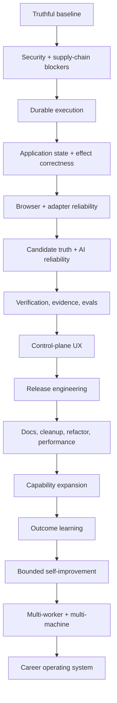

### 1.2 North Star (from `AGENTS.md`)

Build a durable agentic system that: accepts goals → turns them into explicit tasks → routes to capable agents/machines → executes and verifies → keeps memory/knowledge over time → learns from each success/failure → safely increases autonomy → improves its own prompts, skills, tools, workflows, evals, architecture → expands toward general computer work.

### 1.3 "Most Capable" — 10 Dimensions

JoBot's capability is defined across these dimensions (from `AGENTS.md`), each measurable:

| Dimension | Definition | JoBot measurement |
|---|---|---|
| **Breadth** | Task types supported | Adapter count, workflow count, harness count |
| **Depth** | Long multi-step ambiguous tasks | Long-horizon eval pass rate (Section 10) |
| **Reliability** | Finishes correctly | pass@1, pass@N, silent-failure rate |
| **Transfer** | New domains/tools | Adapter onboarding time, skill creation rate |
| **Memory** | Preserves knowledge across days/projects/machines | Memory reuse rate, provenance coverage |
| **Self-improvement** | Gets better without hand-editing | Improvements merged per cycle, eval delta |
| **Governance** | Knows when not to act/ask/escalate | Policy denial rate, escalation accuracy |
| **Economics** | Chooses cheaper when sufficient, expensive when justified | Cost per successful task, model routing efficiency |
| **Durability** | Survives crashes/restarts/model swaps | Kill-anywhere resume success rate |
| **Autonomy** | safely increases without hand-holding | Trust tier distribution, intervention rate |

### 1.4 Success Metrics (tracked)

Tasks completed, tasks verified, median time to completion, cost per successful task, intervention rate, retry rate, regression rate, autonomy level by task type, eval pass rate, repeat-run stability, memory reuse rate, % proactive vs reactive work, % work by domain (coding, browser, docs, ops, research, science, business).

### 1.5 v1.0 Product Promise (narrow and strong)

> JoBot reliably discovers, evaluates, prepares, verifies, submits, and tracks applications across a defined set of supported job sources and ATSs, while preserving durable state, respecting explicit policies, surviving crashes, grounding candidate facts, capturing evidence, and exposing every consequential action to the user.

### 1.6 Long-term Moat

Durable execution + trustworthy candidate data + evidence + human-governed autonomy + outcome learning + career intelligence. The moat is not the number of job boards.

### 1.7 Core Production Invariants (mandatory in every phase)

```text
NO ACTION WITHOUT A STATE          NO STATE WITHOUT AN EVENT
NO COMPLETION WITHOUT VERIFICATION NO SIDE EFFECT WITHOUT POLICY
NO RETRY WITHOUT IDEMPOTENCY       NO LONG RUN WITHOUT CHECKPOINT
NO MEMORY WITHOUT PROVENANCE       NO AUTONOMY WITHOUT MEASUREMENT
NO PLUGIN WITHOUT PERMISSIONS      NO SECRET IN LOGS/PROMPTS/EVENTS/TELEMETRY
NO EXTERNAL CONTENT TRUSTED        NO UNKNOWN STATE TREATED AS SUCCESS
NO AMBIGUOUS EFFECT REPLAYED       NO SECURITY GATE BYPASSED FOR VELOCITY
NO RELEASE WITHOUT REPRODUCIBLE EVIDENCE
```

### 1.8 Autonomy Model

Autonomy is scoped (user × site × adapter × skill × action class), earned from measured outcomes, never a global switch.

| Tier | Example | Default |
|---|---|---|
| R0 | Local read / analysis | Automatic |
| R1 | Public job discovery | Automatic |
| R2 | Resume/cover generation | Automatic + validation |
| R3 | Application preparation / draft fill | Automatic or draft-only |
| R4 | Save / bookmark / tracker mutation | Policy dependent |
| R5 | Submit application | Human approval; bounded autonomy after proven trust |
| R6 | Recruiter outreach / external message | Approval by default |
| R7 | Credential / security-setting change | Human approval |
| R8 | Irreversible high-impact action | Human only |

**Risk function:** `Risk = f(action, target, reversibility, credentials, external side effect, personal data, cost, volume, confidence, trust)`. Hard blocks come from policy rules; the score routes escalation.

### 1.9 Definition of Done (one sentence)

An average user installs JoBot, builds a profile, discovers jobs, receives grounded and independently verified application materials, approves and executes applications that survive injected crashes without duplicate effects, inspects evidence, backs up and restores data, and runs on signed/attested release artifacts — all under explicit policy controls and eval gates.

---

## Section 2 — Current State Assessment (Repo + Plan Gap Matrix)

### 2.1 Evidence Hierarchy (conflict resolution rule)

| Rank | Source | Rule |
|---|---|---|
| 1 | `AGENTS.md` | Governing doctrine |
| 2 | Live repo at working commit | Ground truth for what exists/passes/fails |
| 3 | Code contracts + tests | Behavioral truth |
| 4 | This Master Plan (Expanded) | Target architecture + sequence |
| 5 | Source Plan1–Plan11 | Requirements/evidence (merged here) |
| 6 | External research | Hypotheses only; never adopted without local eval |
| 7 | Historical docs/worklogs | Context only |

Several plans carry conflicting snapshots ("release 2.0 tagged" vs live `pyproject.toml` 0.1.0; differing test counts). **Resolution:** every phase opens with a machine-generated baseline; release notes describe only what is verified at the release commit; historical claims stay in the archive.

### 2.2 Verified Repo Facts (2026-08-16 audit)

**Architecture.** Dual stack: Python 3.11+ core (~13.8k LOC, 27 packages under `src/jobot/`) + Tauri 2 / React 18 GUI with thin Rust shell and stdio JSON-RPC sidecar (`gui/sidecar.py`, 416 lines, 22 methods). SQLite WAL storage (0600 perms, FK on) + Fernet vault + OS keyring. 12-phase Application Submission Pipeline + saga orchestrator with DoD gates and persisted saga instances/steps. Adapter registry: greenhouse, lever, linkedin, workday, indeed, mock_ats, naukri, more_adapters + JobSpy boards. Policy engine, circuit breakers, quarantine, traces, alerts, doctor, backup/migrate, scheduler with caps, plugins, evals harness, interview coach, outreach, digest, PII masker, analytics (skill gap, salary). Tests: 69 Python test files, hermetic mock ATS/LinkedIn fixtures; vitest GUI suite; multi-OS CI.

**Defects and debt (verified in code):**

- `task_graph.py`: `TaskGraphEngine.tasks` is an in-memory dict; DB `tasks` table exists but the engine never persists leases/attempts — no durable multi-worker coordination.
- All 7 LLM provider `stream()` methods + `scrapers/ats.py` + most of `adapters/linkedin.py` raise `NotImplementedError`.
- `cli/main.py` is a 1,748-line monolith.
- Version drift: `pyproject` 0.1.0, root `package.json` 0.1.0, `gui/package.json` 2.0.0, `tauri.conf.json` 2.0.0.
- `tauri.conf.json` `"csp": null`; shell capabilities `args: true` (arbitrary args).
- CI: tag-pinned actions (not SHA), narrow Ruff (`--select E,F`), node 18/20 (EOL), stale dev triggers, no coverage floor, no security-gates job; `publish.yml` uses long-lived PyPI token; Dependabot lacks cargo.
- Ad-hoc DB migrations (`_ensure_column`), no `schema_migrations`.
- `stealth/` selectors hard-coded; `proxy.py`/`captcha.py` vision unwired; `form_field_memory` not persisted; no event bus; `AlertDispatcher` not wired to scheduler/GUI; broad `except Exception` / `# noqa: BLE001` swallowing.
- `EightTierMemorySystem` + `memory/vector.py` skeletal (~140 LOC) — memory exists in name more than substance.
- Root cruft: tracked `JoBot_Merge_Plan.pdf`, `Plan1.pdf`, `cover.html`; duplicate plan sets at root and `Plans/`; `repo_research.md`; ignored-but-present 403 KB `log.md`, `.env`, `applications_export.json`, `.freebuff/`, `.mimosa/`; README is 25 lines pointing to a nonexistent `plan.md`; `queues/improve.md` stale vs worklog.
- Zero TODO/FIXME comments; `datetime.utcnow()` usage; missing governance files (`SECURITY`/`CONTRIBUTING`/`CODE_OF_CONDUCT`/`CHANGELOG`/`FUNDING`/templates/`CODEOWNERS`).

**Known vulnerability set (plan5, re-verify at execution):** vite CVE-2026-53571/53632/39365 (high), esbuild GHSA-67mh-4wv8-2f99, glib GHSA-wrw7-89jp-8q8g (tauri-2 transitive, no in-tree fix), nanoid <3.3.18; 9 CodeQL `py/incomplete-url-substring-sanitization` alerts in `registry.py infer_site()` + `workday.py:95`.

### 2.3 Runtime Capability Matrix

| Capability | State | Notes |
|---|---|---|
| Shell / process mgmt | yes | CLI + sidecar stdio |
| Filesystem r/w + search | yes | `state/`, `artifacts`, `docs` |
| Git | yes | repo, history clean of secrets (gitleaks verified in plan5) |
| Network (HTTP) | yes | httpx with TLS-fingerprint client |
| Local database | yes | SQLite WAL; migrations weak |
| Browser automation | partial | Patchright wired; selectors fragile, no healing/pool manager |
| Screenshot/evidence | partial | capture exists; not systematic pre/post + DOM snapshot |
| Tool calling / LLM | yes | 12-provider router; streaming stubbed |
| Sub-agent delegation | partial | task graph in-memory; no worker loop |
| Long-running background | partial | scheduler loop exists; not durable/checkpointed |
| Schedules/cron | partial | 4-mode loop; DST/catch-up untested |
| Persistent storage | yes | SQLite + vault + keyring |
| UI/dashboard | partial | 5 GUI views; no approvals/evidence/kanban depth |
| Secret management | partial | keyring+Fernet; keyfile perms window |
| Approval/interruption | partial | `PENDING_APPROVAL` phase; not a durable entity |
| Multi-machine | no | future AR-11 |

### 2.4 Gap Matrix — [Plan capability] × [Repo state] × [Missing coverage]

| # | Capability (source plans) | Repo state | Missing coverage |
|---|---|---|---|
| G1 | Durable task graph, leases, events (Plan1/6/8/10/11) | In-memory dict | DB-backed Task/Attempt claiming; heartbeats |
| G2 | Effect ledger + idempotency (Plan1, plan5) | Pipeline key `job_url+profile_id` | ExternalEffect table, reservation protocol |
| G3 | Unknown states + reconciliation (Plan1) | Binary `SUBMITTED`/`VERIFIED` | `SUBMISSION_UNKNOWN` + reconcile service |
| G4 | Durable approvals (Plan1/7) | Phase flag | ApprovalRequest entity + surface |
| G5 | Policy as universal pre-effect gate (Plan9-style synthesis) | Injected but not universal; big numeric caps | Mandatory gate before every effect |
| G6 | Browser reliability stack (Plan1, Plan3 AR-2/3) | Hard-coded selectors; unwired proxy/captcha | SelectorRegistry+healing protocol, site health, CAPTCHA boundary |
| G7 | Adapter family generalization (Plan3 AR-1) | Workday cxs bespoke | CxsApiAdapter base + Workable/Recruitee/Teamtailor/BambooHR |
| G8 | Boundary schemas (Plan3 AR-4) | Duck-typed protocol | Pydantic models validated at phase boundaries |
| G9 | Apply-method classification (Plan3 F-10) | Absent | `classify_apply_method` + policy override |
| G10 | API apply paths (Plan2/Plan7) | Partial adapters | Greenhouse/Lever/Ashby modes |
| G11 | LLM streaming (Plan2/Plan7) | All stubs | `stream()` per provider + router fallback |
| G12 | Candidate truth system (Plan1) | Absent | CandidateFact entity + grounding verifier |
| G13 | Prompt registry/versioning (Plan1) | Absent | `prompts/` tree + per-call provenance |
| G14 | ModelRouter v2 economics (Plan1) | Cost-aware routing exists | `llm_calls`/`budgets`/`reservations` tables |
| G15 | Multi-stage matching (Plan1/Plan7) | Keyword overlap | 4-stage ladder + explanation |
| G16 | Resume pipeline reviewer (Plan1) | Drafter→reviewer exists | Independent reviewer rubric + tests |
| G17 | Resume PDF ingestion (Plan2) | Absent | pdfminer parser + LLM abstraction |
| G18 | Layered memory (Plan1) | 8-tier skeleton | Persisted tiers + provenance |
| G19 | Versioned migrations (Plan1/9) | `_ensure_column` | `schema_migrations` + db CLI |
| G20 | Backup/restore/purge (plan4) | backup exists | Encrypted round-trip, golden fixtures |
| G21 | GUI control plane (Plan1/2/3) | 5 basic views | Home/task inspector/approval inbox/evidence/trace/cost |
| G22 | Sidecar supervision (plan4 R3.1, AR-5) | Basic spawn | Auto-respawn, EOF/backpressure, tree-kill |
| G23 | GUI E2E (plan4 R3.6) | None | tauri-driver suite |
| G24 | Event bus (AR-7) | None | Typed events + subscribers |
| G25 | Observability (plan4 R3.5, Plan2) | File traces | JSONL logs+rotation, OTel export |
| G26 | Telemetry/privacy (plan4 R4) | None | Opt-in Sentry+analytics, redaction, kill switch |
| G27 | Eval platform as release gate (Plan1) | Harness exists | Suites: capability/reliability/safety/truth/long-horizon/regression/production |
| G28 | Failure injection + soak (plan4 R3.2/3.3) | None | Suite + 1000-iteration soak |
| G29 | Security remediation (plan5 W1–W10) | Open alerts | vite/vitest stack, URL sanitization, vault, Tauri, CI, trusted publishing |
| G30 | Version authority + packaging metadata (plan4/plan5) | 4-way drift | `sync_versions.py`, SPDX license, classifiers |
| G31 | Governance + docs suite (plan4 R1/R5) | Missing | SECURITY/CONTRIBUTING/CODE_OF_CONDUCT/CHANGELOG/FUNDING/templates/CODEOWNERS + VitePress site |
| G32 | Release channels + artifacts (plan4 R2) | Publish-on-release only | GHCR multi-arch, desktop 3-OS CI, icons, updater, signing |
| G33 | Doctor expansion (Plan1/plan4) | Basic | Full check tree + `--json` + `--fix-safe` |
| G34 | Repo cleanup (all plans) | Heavy cruft | Archive plan set, dedupe, canonical root |
| G35 | Refactor RF-1..12 (Plan1/3) | Monolith + duck typing | CLI split, boundaries, repos, event bus, async |
| G36 | Performance program (Plan6/8/9) | Unmeasured | Baselines + budgets + soak SLOs + guards |
| G37 | Multi-profile (Plan2) | Hardcoded "default" | Named profiles through vault |
| G38 | MCP/API/TUI/extension surfaces (Plan1/2/3) | None | `jobot mcp` (stdio), `jobot serve` (loopback REST), TUI (textual) |
| G39 | Career intelligence + outcome learning (Plan1) | Tracker stats only | Outcome tracking, funnel analytics, market intel |
| G40 | Self-improvement + skills (Plan1) | None | Bounded loop, skill registry |
| G41 | Community/launch ops (plan4 R5) | None | stale-bot, roadmap page, launch announcement |
| G42 | ToS-risk features (Plan3 F-19/20/21) | None | Behind `JOBOT_ENABLE_RISKY=1` + per-feature flags |

**Repo needs no plan covers:** README referencing nonexistent `plan.md`; case-duplicate `Plans/` vs `plans/` on Windows; 403 KB `log.md` and `.freebuff/`/`.mimosa/` workspace dirs; skeletal `EightTierMemory` marketed as built; `jobs` DB table unused by the task engine; zero-coverage modules (`digest/`, `notify/`, `outreach/`, `scheduler/loop.py`); `applications_export.json` (user data) sitting in repo root.

### 2.5 Implementation Contract (Phase 0 output)

| Field | Value |
|---|---|
| **Mission** | Ship JoBot v1.0.0 — reliable, policy-governed, evidence-producing autonomous job-application agent for an average end user |
| **Runtime profile** | Local-first, single-user; CLI + Tauri desktop GUI; SQLite WAL; Patchright browser behind a replaceable interface; BYOK LLM providers (12-provider router); optional Docker headless |
| **First milestone** | One end-to-end durable verified application under injected failure (Section 25) |
| **Non-goals v1** | Hosted SaaS, multi-tenant auth/billing, defeating platform anti-bot controls, high-volume bulk apply, remote workers |
| **Constraints** | AGPL-3.0 core; no secrets in logs/telemetry; opt-in telemetry only; live adapters stay opt-in (`JOBOT_RUN_LIVE_BROWSER=1`); human approval default for submission |
| **Safety posture** | Conservative ToS stance (LinkedIn/boards), policy envelope R0–R8, sandbox ladder for plugins |
| **Proof-of-progress metrics** | Gate table G0–G7; release criteria in Section 23 |
| **Verification strategy** | 9-level pyramid (Section 9) + eval release gates (Section 10) |

---

## Section 3 — Target Architecture & Design Decisions

### 3.1 Assumptions (stated, verifiable)

1. **Environment:** developer laptop / end-user desktop, Windows/macOS/Linux Tier-1; WSL2 + Docker documented.
2. **Persona:** average non-CLI-first job seeker (GUI-primary) plus power users (CLI/TUI); single user per install.
3. **Deployment:** local-first; distribution via PyPI, GHCR, desktop installers; no server component in v1.
4. **Runtime/token budget:** BYOK provider keys; daily/monthly cost caps enforced by budget reservations before expensive work; local Ollama path for privacy/cost.
5. **Stack:** Python 3.11+ (Typer, Pydantic v2, SQLite, httpx, Patchright), Tauri 2 + React 18, Node >= 20.19. All libraries verified against repo manifests; nothing assumed.
6. **Allowed external services:** LLM providers via router; public job boards/ATS APIs; recruiter email via Gmail API OAuth (opt-in). LinkedIn and similar boards: policy-gated, opt-in, ToS-reviewed, never anti-control circumvention.
7. **Legal/compliance posture:** never defeat CAPTCHAs/anti-bot/usage limits; CAPTCHA = detection + human-handoff boundary; bulk/ste/connection features default-off behind `JOBOT_ENABLE_RISKY=1`; release notes state validation status honestly.

### 3.2 Unified Target Architecture

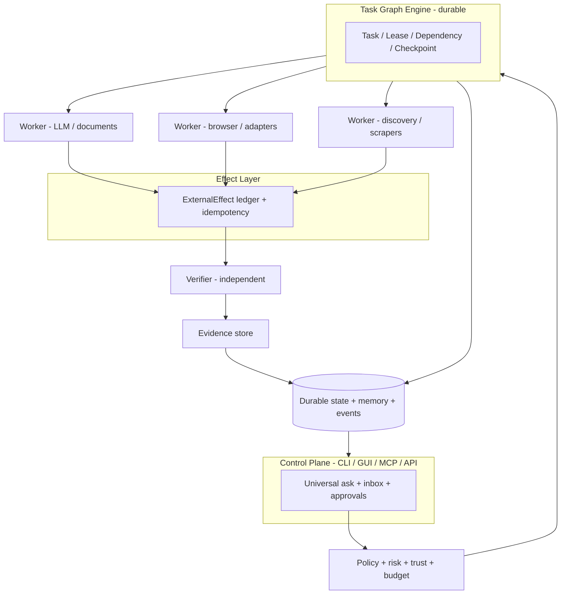

**Agents propose; policy decides; execution adapters perform; effects are recorded; independent verification confirms; only then does durable state transition.** Never let the producer of a step certify it.

### 3.3 Closed Loop (every substantial workflow)


### 3.4 First-Class Entities and State Machines

**Entities:** Goal, Task, TaskAttempt, TaskLease, TaskDependency, TaskEvent, TaskArtifact, ApprovalRequest, ExternalEffect, Checkpoint, Incident, BudgetReservation, CandidateFact.

**Task state machine:**

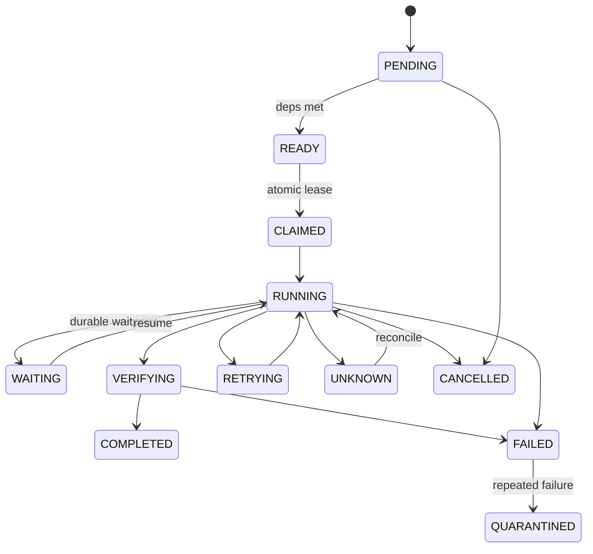

**Application protocol (separate from task states; explicit transition table, no free enum mutation):**

```mermaid
stateDiagram-v2
    [*] --> DISCOVERED
    DISCOVERED --> NORMALIZED --> DEDUPLICATED --> ENRICHED --> MATCHED --> SHORTLISTED
    SHORTLISTED --> PREPARING --> PREPARED --> AWAITING_APPROVAL
    AWAITING_APPROVAL --> SUBMITTING: approved
    SUBMITTING --> SUBMITTED
    SUBMITTING --> SUBMISSION_UNKNOWN
    SUBMISSION_UNKNOWN --> VERIFYING: reconcile
    SUBMITTED --> VERIFYING
    VERIFYING --> VERIFIED
    VERIFYING --> VERIFICATION_UNKNOWN
    VERIFIED --> OUTCOME_TRACKING
    OUTCOME_TRACKING --> INTERVIEW
    OUTCOME_TRACKING --> REJECTED
    OUTCOME_TRACKING --> OFFER
    OUTCOME_TRACKING --> WITHDRAWN
    OUTCOME_TRACKING --> EXPIRED
    SUBMISSION_UNKNOWN --> QUARANTINED: unresolvable
    PREPARING --> FAILED
```

**Timestamp semantics split:** `submitted_at` / `submission_verified_at` / `first_employer_response_at` / `current_outcome` (with migration + backfill).

### 3.5 Design Decisions and Tradeoffs

| Decision | Alternatives | Tradeoff rationale |
|---|---|---|
| A1 | SQLite WAL now; Postgres only on measured need | Local-first simplicity; durable interfaces keep migration path open |
| A2 | Pull-based workers + DB-conditional claiming | Survives partial failure; no in-memory dispatch; two workers never share a lease |
| A3 | Append-only event ledger = source of truth; in-process bus = delivery | Replay/audit/timelines need durable events; bus is replaceable |
| A4 | Policy gate mandatory before every external side effect | Removes current phase-10/11 split; typed machine-readable decisions |
| A5 | Unknown as first-class state + reconcile-never-replay | Eliminates duplicate-submission class of failure |
| A6 | Adapter modes: PUBLIC_READ / USER_AUTHORIZED_API / BROWSER_ASSISTED | Public read API never implies submit authorization |
| A7 | Patchright stays default behind a replaceable browser capability interface | Stealth value retained; fork-risk mitigated by interface + fallback |
| A8 | Prompts versioned as files; per-call provenance | Measurable, rollbackable; one-change eval loops possible |
| A9 | Layered memory without vector DB until scale justifies | Current corpus tiny; SQLite + provenance suffices; revisit on measurements |
| A10 | MCP/REST/TUI as thin adapters over shared services | No forked business logic; core never depends on MCP |
| A11 | Single-agent baseline first; multi-worker only after G2 | AGENTS.md doctrine; simpler control flow until reliability proven |
| A12 | Async hot paths behind `jobot.asyncx` sync shim | CLI stays sync; ≥ 1.2x bench gate before adoption |
| A13 | Plugins deny-by-default manifest + sandbox ladder | Supply-chain safety; health-checked install |
| A14 | Incremental refactor with import shims, suite green each move | 359-test baseline protects behavior; no multi-week branch |
| A15 | Anti-detection ideas reinterpreted as compliance-bound reliability | LinkedIn ToS prohibits circumvention; reputation + account safety |
| A16 | Local-first telemetry opt-in with kill switch | Privacy promise is a product feature; docs must match code exactly |

### 3.6 System Layers A–L (agents.md mapping to JoBot)

| Layer | agents.md name | JoBot module(s) | State |
|---|---|---|---|
| A | Control Plane | `cli/`, `gui/sidecar.py`, `gui/src/` | partial — needs approvals/evidence/kanban |
| B | Execution Fabric | `scheduler/`, `asp/` (saga) | partial — needs durable worker loop |
| C | Task Graph Engine | `task_graph.py` | **critical gap G1** — in-memory only |
| D | Skill & Profile System | `plugins/`, `prompts/` (to create) | absent |
| E | Memory System | `memory/` | **critical gap G18** — skeletal |
| F | Tool Adapters | `adapters/`, `stealth/`, `scrapers/` | partial — needs healing, unwired subsystems |
| G | Model Routing & Economics | `llm/` | partial — streaming stubbed, no budgets table |
| H | Governance, Policy, Trust | `policy/` | partial — needs universal pre-effect gate |
| I | Evaluation & Learning | `evals/` | partial — needs 7 suites + release gate |
| J | Self-Improvement | (to create) | absent |
| K | Observability & Incidents | `obs/` | partial — no event bus, no incident lifecycle |
| L | Context Management | (implicit) | absent — needs snapshot protocol |

### 3.7 Planning Layers

Charter (this document Section 1) → workstreams (Section 5) → milestones (M1–M4) → task graph (Section 6) → execution focus (`queues/now.md`) → recurring ops (`queues/recurring.md`) → risk register (Section 7) → decision register (Section 8).

Planning files are **living files**: if the plan changed and files didn't, the system is lying to itself.

**Feature-priority rubric** (score 1–5 each, weighted): `user_value × 1.5 + reliability_impact × 1.5 + unblocking_effect × 1.5 + (6 - cost_effort) × 1.0 + (6 - implementation_risk) × 1.0`. P0 = release-blocking per Section 23.

### 3.8 Failure Modes and Mitigations

| Failure mode | Mitigation |
|---|---|
| Auth/credential loss | Keyring+vault, hardened keyfiles, rotation, fail-closed startup checks |
| Rate limits (LLM/boards) | Per-provider circuit breakers, jittered backoff, budget reservations, Ollama fallback |
| Bot detection / account bans | Policy-gated opt-in, session reuse, realistic pacing, daily caps, human fallback, circuit breaker |
| Schema/driver drift (boards) | Selector registry + healing + drift fixtures; adapter health monitoring; API-path preference |
| Partial failure mid-workflow | Step checkpoints, saga compensation, effect ledger, resume-without-replay |
| Resume-state loss after crash | Durable task/lease/checkpoint tables; kill-anywhere test gate |
| Secret leakage | Redaction layer at logs/traces/telemetry/prompts; no secrets in events; tests |
| Ambiguous submit outcome | `SUBMISSION_UNKNOWN` + reconciliation service + evidence |
| DB corruption | Versioned migrations, backup drills, corruption detection, safe-versions rollback list |
| Provider outage | Router fallback chains + health table; degrade, never corrupt task state |

### 3.9 Per-Milestone Verification Rule

Every milestone M delivers: named artifacts (code+docs), a passing gate from Section 9, evidence files under `artifacts/`, updated `worklog.md` + queues, and at least one reusable asset or eval added. **No milestone closes on assertion alone.**

---

## Section 4 — Unified Feature Catalog (deduplicated, conflict-resolved, source-tagged)

### 4.1 Conflict Resolutions

- "anti-detection" → compliance-bound reliability (A15)
- "auto-promote best resume after N" → statistical gate with minimum sample
- "delete stubs" vs "honest stubs" → implement or explicitly mark out-of-scope
- Plan8/10/11 sequencing variants → single build order (Section 24)
- Duplicate F-/C- identifiers unified

### 4.2 Feature Catalog (UC-01 .. UC-82)

Each UC carries: ID, Feature, Source, Priority, **Capability Acquisition Ladder step** (1–10, see Section 14).

| ID | Feature | Source | Prio | Ladder |
|---|---|---|---|---|
| UC-01 | Durable task queue + atomic leases + heartbeats | Plan1/6/8/10/11 | P0 | 4 |
| UC-02 | Event ledger + typed event bus | Plan1, AR-7 | P0/P | 4 |
| UC-03 | Effect ledger + idempotency audit | Plan1/9 | P0 | 5 |
| UC-04 | Unknown states + reconciliation service | Plan1 | P0 | 5 |
| UC-05 | Durable ApprovalRequest entity (CLI/GUI/MCP) | Plan1/7 | P0 | 4 |
| UC-06 | Risk/trust engine, tiered caps, scoped trust | Plan1/9 | P0 | 4 |
| UC-07 | Versioned DB migrations + `jobot db` CLI | Plan1/9 | P0 | 4 |
| UC-08 | Encrypted backup/restore drills + purge | plan4 | P0 | 7 |
| UC-09 | BrowserSessionManager + pool + persistence | Plan1 | P0 | 5 |
| UC-10 | Selector registry + healing + drift tests | AR-2 | P0 | 5 |
| UC-11 | Browser evidence protocol (pre/post shot, DOM, args) | Plan1 | P0 | 5 |
| UC-12 | CAPTCHA boundary: detect + escalate + human handoff | Plan1/3 | P0 | 5 |
| UC-13 | Site health + circuit breaker + auto-demote | Plan1/3 | P0 | 6 |
| UC-14 | Pydantic boundary schemas at adapter/ASP phases | AR-4 | P0 | 4 |
| UC-15 | cxs adapter family (Workable/Recruitee/Teamtailor/BambooHR) | AR-1 | P0/P | 3 |
| UC-16 | Direct API apply: Greenhouse/Lever/Ashby/SmartRecruiters | Plan2/7 | P0/P | 4 |
| UC-17 | LinkedIn Easy Apply completion (assisted, approval-gated) | Plan2/7, F-19-adjacent | P1 | 4 |
| UC-18 | LLM streaming all providers + router fallback | Plan2/7 | P0/P | 4 |
| UC-19 | Typed LLM contracts + prompt registry/versioning | Plan1 | P0 | 3 |
| UC-20 | ModelRouter v2: capabilities/health/routing/cost tables | Plan1 | P0 | 4 |
| UC-21 | Candidate truth system + grounding verifier | Plan1 | P0 | 5 |
| UC-22 | Independent reviewer (resume/cover) | Plan1 | P0 | 4 |
| UC-23 | Multi-stage matching + explanations | Plan1/7 | P0/P | 4 |
| UC-24 | Job fraud/quality detection | Plan1 | P1 | 4 |
| UC-25 | Resume PDF ingestion (`import-resume`) | Plan2 | P1 | 3 |
| UC-26 | Layered memory (8 tiers real) + answer bank persistence | Plan1, AR-3, F-02 | P0/P | 4 |
| UC-27 | Multi-profile support | Plan2 | P1 | 3 |
| UC-28 | Job/company normalization + dedupe + freshness | Plan1 | P1 | 4 |
| UC-29 | GUI control plane: Home/task/approval/evidence/trace/cost/incident/settings | Plan1/2 | P0 | 6 |
| UC-30 | Kanban + funnel analytics | F-01 | P0 | 6 |
| UC-31 | Answer bank UI (search/dedupe) | F-08 | P0 | 6 |
| UC-32 | Browser-health diagnostics in GUI | F-03 | P0 | 6 |
| UC-33 | Live ATS score + per-job resume variants in GUI | F-07 | P0 | 6 |
| UC-34 | Export/import CSV+JSON round-trip | F-06 | P0 | 3 |
| UC-35 | Apply-method classification + policy override | F-10 | P0 | 3 |
| UC-36 | Follow-up automation (email-only, rate-capped, opt-in) | F-05 | P0* | 5 |
| UC-37 | Job clipping from URL | F-23 | P1 | 3 |
| UC-38 | Sidecar supervision (respawn/EOF/lock/tree-kill) | AR-5/plan4 R3.1 | P0 | 5 |
| UC-39 | GUI E2E (tauri-driver) | plan4 R3.6 | P0 | 6 |
| UC-40 | Failure-injection + soak suites | plan4 R3.2/3.3 | P0 | 6 |
| UC-41 | Eval platform as release gate (7 suites) | Plan1 | P0 | 6 |
| UC-42 | Prompt-injection boundary + adversarial corpus | Plan1/9 | P0 | 5 |
| UC-43 | Observability: JSONL logs, OTEL traces, alert wiring, trace export | plan4 R3.5 | P0/P | 6 |
| UC-44 | Opt-in telemetry + redaction + kill switch + privacy doc | plan4 R4 | P0 | 6 |
| UC-45 | Security remediation W1–W10 (deps, URL, vault, Tauri, CI, publishing) | plan5 | P0 | 3 |
| UC-46 | Version authority + packaging metadata + drift CI | plan4 R1.1/plan5 W6 | P0 | 3 |
| UC-47 | Governance files + README overhaul | plan4 R1.6–R1.8 | P0 | 3 |
| UC-48 | Distribution: PyPI trusted publishing, GHCR multi-arch, desktop 3-OS CI, icons, updater, signing | plan4 R2 | P0 | 7 |
| UC-49 | Doctor expansion (`--json`, `--fix-safe`, full tree) | Plan1/plan4 | P0 | 3 |
| UC-50 | Docs suite + VitePress site + generated references | plan4 R5, Plan7 | P0 | 7 |
| UC-51 | Repo cleanup + planning archive + queue reconciliation | all | P0 | 3 |
| UC-52 | Refactor RF-1..RF-12 + typed errors + logging | Plan1/3/7 | P0/P | 4 |
| UC-53 | Performance program: baselines, budgets, soak SLOs, guards | Plan6/8/9 | P0 | 6 |
| UC-54 | Gmail watcher (OAuth) → status signals | F-09 | P1 | 4 |
| UC-55 | 24/7 matcher + opportunity digest | F-11 | P1 | 7 |
| UC-56 | Interview calendar + question bank expansion | F-12/F-22 | P1 | 3 |
| UC-57 | Salary negotiation toolkit + market intel | F-13, Plan1 | P1/P | 3 |
| UC-58 | Session recordings in evidence viewer | F-14 | P1 | 6 |
| UC-59 | Resume bank + A/B testing (statistical gate) | F-17, Plan2 | P1 | 6 |
| UC-60 | Local LLM path (Ollama incl. vision) | F-18 | P1 | 3 |
| UC-61 | MCP server (stdio first) | F-16/AR-9 | P1 | 4 |
| UC-62 | `jobot serve` REST (loopback) | Plan2/7 | P1/P | 4 |
| UC-63 | TUI (textual) | Plan2/7 | P1/P | 4 |
| UC-64 | HTML reports + funnel charts + PDF export | Plan2 | P1 | 3 |
| UC-65 | OTEL external export (+ optional Langfuse) | Plan2 | P1 | 6 |
| UC-66 | Trust-level automation + audit events | Plan2 | P1 | 9 |
| UC-67 | Sandbox ladder (subprocess→container→remote) | Plan1/7 | P1/P | 8 |
| UC-68 | Plugin ABI + community gallery | AR-8, F-24 | P2 | 8 |
| UC-69 | Browser extension (separate repo) | F-15 | P2 | 8 |
| UC-70 | Networking graph + referrals | Plan1/2 | P2 | 3 |
| UC-71 | LinkedIn profile scoring | Plan2 | P2 | 3 |
| UC-72 | Multilingual resumes | Plan2 | P2 | 3 |
| UC-73 | ToS-risk: LinkedIn follow-ups / proxy rotation / bulk apply | F-19/20/21 | P2 | 5 |
| UC-74 | Outcome learning loop | Plan1 | P1/P | 9 |
| UC-75 | Skill extraction + registry | Plan1 | P2 | 3 |
| UC-76 | Bounded self-improvement (one-change rule) | Plan1/9 | P2 | 10 |
| UC-77 | Automated eval generation from failures | Plan1 | P2 | 10 |
| UC-78 | Career intelligence graph | Plan1 | P2/P | 9 |
| UC-79 | Multi-machine workers / remote sandbox | AR-11, Plan1 | P2/P | 10 |
| UC-80 | Conversational jobot ask assistant | Plan2 | P1/P | 6 |
| UC-81 | Homebrew/Scoop/Flatpak | Plan2 | P2 | 7 |
| UC-82 | Community ops + launch (stale-bot, roadmap page, announcements) | plan4 R5 | P0 (launch) | 7 |

Catalog is exhaustive over the source set: every AR-, F-, R*, W*, C-* and plan-phase item maps to a UC id (traceability in Section 28).

---

## Section 5 — Workstream Decomposition & Milestone Roadmap

### 5.1 Workstream Table

| WS | Workstream | Scope (UC ids) | Milestone |
|---|---|---|---|
| WS0 | Truth, baseline, freeze | baselines, contracts freeze, scorecard | M1 gate G0 |
| WS1 | Security + supply chain | UC-45, UC-46, UC-47 | M1 gate G1 |
| WS2 | Durable execution core | UC-01..UC-08 | M1 gate G2 |
| WS3 | Application correctness | UC-03..UC-06 (app-level), timestamps | M1 gate G3 |
| WS4 | Browser + adapters | UC-09..UC-17 | M1 gate G4 |
| WS5 | AI reliability + truth | UC-18..UC-26 | M1 gate G5 |
| WS6 | Control-plane UX | UC-29..UC-39 | M1 gate G6 |
| WS7 | Observability + evals | UC-40..UC-44 | M1 gate G5/G7 |
| WS8 | Docs + cleanup + refactor + perf | UC-50..UC-53 | M1 gate G7 |
| WS9 | Release engineering + launch | UC-48, UC-49, UC-82 | M1 = v1.0.0 |
| WS10 | Product completion (P1) | UC-25..UC-28, 37, 54..66, 80 | M2 |
| WS11 | Strategic moat (P2) | UC-67..UC-79, 81 | M3 |
| WS12 | General agent platform (P3) | career-OS reuse of runtime | M4 |

### 5.2 Milestones

- **M1 = v1.0.0 release** (all gates green)
- **M2 = product completion** (v1.1.x)
- **M3 = strategic moat** (v1.2+/v2)
- **M4 = general agent OS** on the same durable runtime

**Calendar estimate for M1:** ~26–32 focused weeks, parallelizable after WS3 across WS4/WS5/WS6 tracks; every promotion requires evidence the previous layer is reliable.

---

## Section 6 — Task Graph & Dependency Rails

### 6.1 Dependency Graph

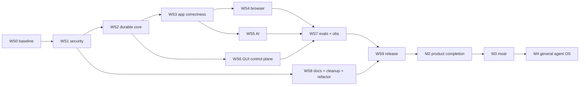

### 6.2 Rails

- **Serialized (dependency-gated):** security → durable core → app correctness; migrations before any new table consumer; policy gate before any effect-path feature.
- **Fan-out (parallelizable after WS2):** adapter family work ‖ LLM streaming ‖ GUI views ‖ docs generation; discovery/ranking fan-out at runtime with bounded concurrency (target ≥ 2x multi-core).
- **Fan-in:** release pipeline assembles WS9 artifacts; verification gate fans in all suites.

### 6.3 Task Schema (Pydantic v2 skeleton)

```python
from datetime import datetime, timezone
from enum import Enum
from typing import Any
from pydantic import BaseModel, Field

class TaskStatus(str, Enum):
    PENDING = "PENDING"
    READY = "READY"
    CLAIMED = "CLAIMED"
    RUNNING = "RUNNING"
    WAITING = "WAITING"
    RETRYING = "RETRYING"
    VERIFYING = "VERIFYING"
    COMPLETED = "COMPLETED"
    FAILED = "FAILED"
    QUARANTINED = "QUARANTINED"
    UNKNOWN = "UNKNOWN"
    CANCELLED = "CANCELLED"

class Task(BaseModel):
    id: str
    goal_id: str
    project_id: str
    description: str
    skill_tags: list[str] = Field(default_factory=list)
    status: TaskStatus = TaskStatus.PENDING
    depends_on: list[str] = Field(default_factory=list)
    owner: str | None = None
    reviewer: str | None = None
    priority: int = 5  # 1 (highest) .. 10 (lowest)
    risk_level: int = 0  # R0..R8
    budget_limit_usd: float | None = None
    tokens_used: int = 0
    attempts: int = 0
    max_attempts: int = 3
    verification_plan: str  # machine-checkable assertion spec
    evidence_paths: list[str] = Field(default_factory=list)
    artifacts: list[str] = Field(default_factory=list)
    escalation_reason: str | None = None
    created_at: datetime = Field(default_factory=lambda: datetime.now(timezone.utc))
    updated_at: datetime = Field(default_factory=lambda: datetime.now(timezone.utc))
    definition_of_done: str  # DoD — required for READY transition
```

### 6.4 Atomic Lease (SQL)

```sql
-- Atomic task claiming: only one worker can lease a READY task
UPDATE tasks
SET status = 'CLAIMED',
    owner = :worker_id,
    updated_at = CURRENT_TIMESTAMP
WHERE id = (
    SELECT id FROM tasks
    WHERE status = 'READY'
      AND id NOT IN (SELECT task_id FROM task_leases WHERE expires_at > CURRENT_TIMESTAMP)
    ORDER BY priority ASC, created_at ASC
    LIMIT 1
    FOR UPDATE SKIP LOCKED
)
RETURNING id;
```

### 6.5 Definition of Done per Task Cluster (selected core)

| Task | DoD (all required) |
|---|---|
| T1 Baseline reports | Reports committed; contracts regression tests green; scorecard with evidence links |
| T2 npm stack upgrade | `npm audit` 0 high; vitest green; GUI build OK; engines field; CI node 20/22 |
| T3 URL sanitization | `urlsplit` exact/suffix match; unknown → `ValueError`; adversarial suite green; 9 CodeQL closed |
| T4 Vault hardening | 0600 atomic create; owner/mode checks; `O_NOFOLLOW`; hardening tests green |
| T5 Tauri hardening | CSP set; args regex allowlist; capability regression tests; dev+build clean |
| T6 CI hardening | SHA-pinned; security-gates job green; actionlint clean; `test_imports.py` green |
| T7 Durable task engine | Kill-worker-at-every-phase test green; no double lease; heartbeats; lease expiry reclaim |
| T8 Event ledger | Append-only; correlation/causation ids; audit/replay tests |
| T9 Effect ledger | Duplicate-submission test impossible; reservation protocol; compensation/quarantine states |
| T10 Approvals | Entity + CLI/GUI flows; survives restart; edit/defer supported |
| T11 App state machine | Transition table validated; timestamp split migrated + backfilled |
| T12 Browser stack | Registry+healing+drift fixtures; evidence protocol; CAPTCHA boundary; site health |
| T13 Adapter family + schemas | Workday unchanged; 4 new adapters hermetic-tested; schemas enforced; quarantine on invalid |
| T14 LLM platform | Streaming per provider or capability-gated; prompt provenance per call; cost tables |
| T15 Candidate truth | No unsupported claims in critical evals; propose-not-mutate enforced by tests |
| T16 Matching ladder | 4 stages; component scores stored; explanation emitted; cost reduced vs baseline |
| T17 GUI control plane | Views live from real state; a11y baseline; E2E green; supervision kill tests |
| T18 Eval platform | 7 suites runnable in CI; release report shows deltas |
| T19 Telemetry | Opt-in only; redaction tests; kill switch; privacy doc schema-matched |
| T20 Docs + cleanup | Docs tree live + generated refs; archive manifest; root canonical; gates scripts exit clean |
| T21 Refactor/perf | Suite green each move; interface inventory unchanged; perf budgets met vs baseline |
| T22 Release | All Section 23 checks green on RC; artifacts on 3 channels; attestations verified |

### 6.6 Parallel-Work Rules

- Feature branches + one coherent commit.
- Parallel coding lanes use one git worktree per owned task.
- Never multiple workers editing the same files blindly.
- Merge only after verification.

---

## Section 7 — Risk Register & Mitigations

| ID | Risk | L | I | Mitigation | Owner |
|---|---|---|---|---|---|
| R1 | LinkedIn/board detects Patchright; account bans | H | C | Policy-gated opt-in, session reuse, realistic pacing, daily caps, circuit breaker, human fallback; never circumvent controls | maintainer |
| R2 | JobSpy/selector breakage on redesigns | M | H | Registry + healing + drift fixtures, health cron, direct-API fallback | maintainer |
| R3 | LLM rate limits / cost spikes | M | M | Fallback chain, per-provider breaker, budget reservations, Ollama fallback | maintainer |
| R4 | Duplicate external submissions | L | C | Effect ledger + idempotency + unknown states; zero-tolerance release test | maintainer |
| R5 | PII leakage to providers/logs | L | C | PII masker at every layer; redaction tests; audit | maintainer |
| R6 | vite 8 / vitest 4 breakage | M | H | Build+test before proceeding; documented revert path | maintainer |
| R7 | GUI work delays v1 | M | M | CLI fully functional; GUI ships 1.0.1 if needed | maintainer |
| R8 | Live adapters unvalidated on dev machine | M | M | Hermetic tests mandatory; live opt-in; honest release notes | maintainer |
| R9 | Refactor churn vs 359-test baseline | M | M | Full suite green after every package; branches; interface inventory diff | maintainer |
| R10 | ToS-flagged features harm reputation | M | M | Default-off flags, docs, rate caps, no volume blasting | maintainer |
| R11 | SQLite single-user ceiling | L | M | Documented limit; Postgres path in roadmap only | maintainer |
| R12 | AGPL deters enterprise adoption | L | M | Clear license docs; dual-license exploration post-1.0 | maintainer |
| R13 | `infer_site` `ValueError` degrades UX | M | M | Clean error + `jobot list-sites` guidance | maintainer |
| R14 | P0 feature load delays v1.0.0 | M | M | Scope = enumerated UC set; slippage → P1 with owner approval | maintainer |
| R15 | Desktop CI time blowout | M | M | Cargo caching; tag+nightly-only desktop builds; ≤ 25 min/job | maintainer |
| R16 | Patchright fork falls behind Playwright | M | M | Monitor upstream; browser capability interface + vanilla fallback | maintainer |
| R17 | glib RUSTSEC residual (tauri 2) | M | L | Documented in `SECURITY.md`; cargo Dependabot + audit; re-eval on tauri 3 | maintainer |
| R18 | Telemetry redaction regression | L | C | Payload schema test + redaction suite + kill switch test | maintainer |
| R19 | DB corruption on upgrade | L | H | Versioned migrations, pre-release upgrade tests, backups, rollback policy | maintainer |

**Risk velocity scoring:** `velocity = likelihood × impact × (1 - mitigation_confidence)`. Review cadence: weekly for R1–R10, monthly for R11–R19.

---

## Section 8 — Decision Register

| # | Decision | Default | Escalation / revisit trigger |
|---|---|---|---|
| D1 | `infer_site()` unknown URLs | Raise `ValueError`; no silent default | UX friction reports |
| D2 | vite upgrade path | 5.4.21 → 8.x line (8.2.1 candidate; re-verify at exec) | Build breakage → document residual |
| D3 | glib RUSTSEC-2024-0429 | Accepted documented residual | tauri ≥ 3 / gtk4 |
| D4 | Execution order | Security → durability → correctness → breadth | — |
| D5 | macOS notarization | Defer v1; document Gatekeeper workaround | Adoption friction metrics |
| D6 | Windows signing | SignPath OSS; fallback documented SmartScreen | Approval outcome |
| D7 | Auto-update hosting | GitHub Releases | Scale needs |
| D8 | Docs generator | VitePress | Maintenance cost |
| D9 | Crash reporting | Sentry SaaS free tier, opt-in | Volume/cost |
| D10 | Browser extension | Defer post-1.0, separate repo | Community demand |
| D11 | Gmail auth | Gmail API OAuth only; no IMAP passwords | — |
| D12 | ToS-risk features | `JOBOT_ENABLE_RISKY=1` + per-feature flags; default off | Legal review |
| D13 | MCP scope | stdio first, SSE later; pinned spec revision | Ecosystem shifts |
| D14 | GUI in v1 | Required (approvals + evidence + kanban); CLI-first fallback explicit | Schedule risk |
| D15 | Submission autonomy | Human by default; trusted-site promotion only from measured outcomes | Trust evidence |
| D16 | Platforms | macOS/Linux/Windows Tier-1; WSL2/Docker documented | Usage data |
| D17 | Patchright | Default behind replaceable capability interface | Fork health |
| D18 | Local-first | Non-negotiable; cloud optional | — |
| D19 | Database | SQLite WAL; Postgres only on measured need | Concurrency evidence |
| D20 | SaaS/hosted | Out of scope for v1 | Post-1.0 strategy |
| D21 | Structured logging | stdlib-based formatter over new dependency | Complexity |
| D22 | LaTeX resumes | Keep LaTeX + robust fallback engines | Install-friction data |
| D23 | Coverage floor | measured −2%, min 70%, target 75% | Baseline result |
| D24 | Risky-feature caps | Hard caps + human approval even when enabled | Abuse signals |

**Decision authority matrix:**
- **Maintainer can change:** D1, D2, D3, D4, D7, D8, D9, D11, D13, D16, D17, D19, D21, D22, D23
- **Owner sign-off required (safety-class):** D5, D6, D10, D12, D14, D15, D18, D20, D24

**Decision change log protocol:** any D* change requires an entry in `decisions.md` + queue update; safety-class decisions additionally require explicit owner sign-off recorded in `worklog.md`.

---

## Section 9 — Verification & Acceptance Matrix

### 9.1 Verification Levels (L1–L9)

| Level | Scope | Method/tool |
|---|---|---|
| L1 | Unit | State transitions, schemas, URL parsing, policy, repos, selector resolver, cost accounting, PII redaction, answer bank, hashing | pytest |
| L2 | Contract | Every adapter: discover/normalize/questions/prepare/submit-or-dry-run/verify/health | Shared canonical suite |
| L3 | Integration | Pipeline + saga + DB + sidecar with mock ATS servers and fake browser/HTTP fixtures | pytest integration |
| L4 | Browser-interaction | Named actions, healing, evidence capture against recorded/drifted fixtures | Playwright fixture harness |
| L5 | E2E (GUI) | Boot, discover via mock_ats, dry-run apply, approve, dashboard, kanban, answer bank | tauri-driver + WebDriver |
| L6 | Failure injection | Disconnect, DNS, 429, 500, malformed JSON, browser crash, tab close, sidecar death, provider timeout/outage, corrupted checkpoint, DB lock, dup event/effect, stale selector, invalid data, prompt injection, plugin violation, CAPTCHA detect, ambiguity | `tests/test_failure_injection.py` |
| L7 | Soak/leak | 1000-iteration sidecar loop; RSS/WAL/fd/browser-process growth | tracemalloc + soak script |
| L8 | Security | CodeQL (py/js/rust), pip-audit, npm audit, gitleaks, bandit, URL fuzzing, prompt-injection corpus, Tauri capability regression, vault perms, plugin sandbox, credential redaction | CI security-gates |
| L9 | Release candidate | Fresh install per OS, upgrade-from-previous, backup/restore, rollback, wheel/sdist, Docker smoke, desktop launch, doctor, DST/catch-up scheduler | `release.yml` RC stage |

### 9.2 Phase Gates (G0–G7)

| Gate | Scope | Criteria (all must pass) |
|---|---|---|
| G0 | Truth | baselines committed, contradictions tagged, queues truthful |
| G1 | Security | zero unaccepted blockers, adversarial URL suite, hardened Tauri/vault/CI, provenance working |
| G2 | Durability | kill-anywhere resume; no double lease |
| G3 | App correctness | no duplicate submissions under any injected failure; approvals survive restart |
| G4 | Browser/adapters | mock ATS + Tier-1 survive injected failures; schemas enforced |
| G5 | AI | zero unsupported candidate claims; PDF dual verification; provider failures degrade cleanly |
| G6 | UX | new-user journey without source code; a11y baseline |
| G7 | Release | Section 23 checklist green; onboarding scenario proven under failure injection |

### 9.3 Verification Gate Checklist Template (machine-checkable)

Each gate produces an evidence file at `artifacts/gates/G<n>.json`:

```json
{
  "gate": "G2",
  "timestamp": "2026-08-16T12:00:00Z",
  "commit_sha": "abc1234",
  "status": "PASS",
  "checks": [
    {"id": "kill-anywhere-resume", "status": "PASS", "evidence": "artifacts/gates/g2/kill_test.log"},
    {"id": "no-double-lease", "status": "PASS", "evidence": "artifacts/gates/g2/lease_test.log"},
    {"id": "heartbeat-expiry", "status": "PASS", "evidence": "artifacts/gates/g2/heartbeat_test.log"}
  ],
  "suite_results": {
    "pytest": "359 passed, 13 skipped",
    "vitest": "18 passed",
    "coverage": "73.2%"
  }
}
```

### 9.4 Verification Status State Machine

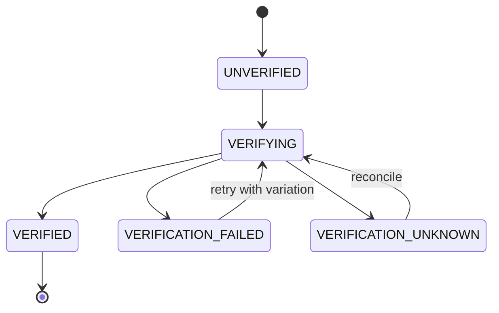

---

## Section 10 — Eval & Self-Improvement Plan

### 10.1 Eval Suites (7)

1. **Capability** — discovery, parsing, matching, tailoring, QA, form filling, submission, verification, tracking
2. **Reliability** — crash/restart, network loss, timeouts, stale selectors, rate limits, browser death; pass@1, pass@N, median/p95, retries, intervention rate, silent-failure rate, unknown-state rate, evidence completeness
3. **Safety** — prompt injection from JDs, malicious HTML/URLs, fake jobs, credential exfiltration, secret leakage, destructive tool requests, malicious plugins, compromised adapters
4. **Truthfulness** — fabricated credentials, contradictions, unsupported salary/skill claims
5. **Long-horizon** — find 20 → rank → shortlist 3 → tailor → answers → approvals → submit authorized → verify → tracker → memory → outcome, with kills between phases
6. **Regression** — every change vs baseline
7. **Production-derived** — incidents + human corrections become cases

### 10.2 Release Rule

A release must show: `pass@1`, repeated-trial pass rate, cost-to-pass, time-to-pass, intervention frequency, silent-failure rate, regression delta. **No "improved" claim without eval/production evidence**; quality gains that raise unsafe behavior/cost/intervention are not improvements.

### 10.3 Trajectory Recorder

Persists operational decisions, tool calls, transitions, validations, evidence, outputs, concise rationales — **never chain-of-thought**.

```python
class Trajectory(BaseModel):
    task_id: str
    spans: list[Span]  # goal -> task -> model/tool/browser/policy/approval/verification/artifact/effect
    decisions: list[Decision]
    evidence_paths: list[str]
    cost_usd: float
    duration_seconds: float
    rationale_summary: str  # concise, not chain-of-thought
```

### 10.4 Self-Improvement Engine (Mode 1 + Mode 2)

#### Mode 1 — Inline (after every task)

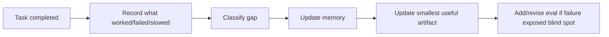

**Gap classification taxonomy (12 types):**
1. missing skill
2. missing tool
3. missing permission
4. missing memory
5. bad decomposition
6. bad verification
7. unsafe autonomy
8. poor model routing
9. context overload
10. weak observability
11. missing eval
12. external dependency failure

Choose the most leverageful repair: add/refine skill, build/wrap tool, improve task specifier, improve verification contract, add memory structure/retrieval, revise policy/trust, add eval coverage, improve dashboard/logs.

#### Mode 2 — Background Loop (one-change rule)

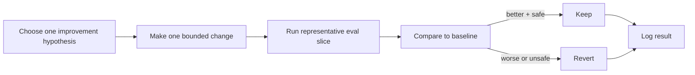

**One-change rule:** never do giant prompt surgery without eval protection. One bounded change per cycle.

**Forbidden automation targets** (require human approval):
- security policy
- credentials
- destructive rules
- release permissions
- autonomy thresholds
- secret storage
- data-sharing policy

**Improvement candidate schema:**

```python
class ImprovementCandidate(BaseModel):
    id: str
    source: str  # task_id, incident_id, external_intel_id
    gap_type: str  # one of 12 taxonomy types
    hypothesis: str
    proposed_change: str  # file path + diff description
    eval_slice: str  # which eval subset to run
    baseline_metrics: dict[str, float]
    candidate_metrics: dict[str, float] | None
    status: str  # PROPOSED | TESTING | ADOPTED | REVERTED | REJECTED
    safety_class: bool  # True if touches forbidden targets
    created_at: datetime
    decided_at: datetime | None
    decided_by: str | None  # human or system
```

### 10.5 Skill Ladder (10 steps — see Section 14 for full mapping)

solve once → trajectory → skill candidate → test corpus → review → registry (trigger, inputs, tools, permissions, outputs, verification, retry, stop conditions, corpus, trust, version). Trust promotion/demotion recorded as audit events; thresholds configurable, evidence-based.

### 10.6 Complexity Notes

- Multi-stage matching: O(N) deterministic filter, O(N·d) lexical/embedding on survivors, O(k) LLM calls with k ≪ N (shortlist only)
- Dedupe: O(1) hash fingerprint lookup per posting
- Effect/idempotency check: O(1) indexed unique key
- Event ledger append: O(1) amortized; timeline query O(log n) via `(aggregate, created_at)` index

### 10.7 Eval Metric Formulas

| Metric | Formula |
|---|---|
| `pass@1` | `successes / total_attempts` (single try) |
| `pass@N` | `1 - Π(i=1..N) (1 - p_i)` where `p_i` is per-attempt success probability |
| `cost_to_pass` | `Σ(cost_per_attempt) until first success` |
| `time_to_pass` | `Σ(duration_per_attempt) until first success` |
| `intervention_rate` | `tasks_requiring_human_intervention / total_tasks` |
| `silent_failure_rate` | `tasks_marked_complete_but_actually_failed / total_tasks` |
| `unknown_state_rate` | `tasks_in_UNKNOWN_state / total_tasks` |
| `evidence_completeness` | `tasks_with_full_evidence_chain / completed_tasks` |

---

## Section 11 — Observability, Incident Management & Rollback

### 11.1 Traces

OpenTelemetry-compatible hierarchy: `Goal → Task → Model/Tool/Browser/Policy/Approval/Verification/Artifact/Effect`, each span carrying stable ids, provider/model, prompt version, policy version, adapter version, worker, profile, application id. `jobot trace export` verified end-to-end.

### 11.2 Logs

Structured JSONL with rotation, retention limits, correlation-id propagation (stdlib-based formatter, D21). Documented format.

```json
{"ts": "2026-08-16T12:00:00Z", "level": "INFO", "logger": "jobot.asp", "correlation_id": "abc-123", "event": "phase_started", "phase": 7, "task_id": "T-456", "application_id": "A-789"}
```

### 11.3 Metrics (15 named)

Task success/verification rate; median/p95 completion; cost per successful application; intervention, retry, quarantine, browser-failure, provider-fallback, application-verification, unsupported-claim, match-precision, resume-review-failure rates; duplicate-effect rate (**must be zero**); recovery-after-crash success; memory reuse; regression rate.

### 11.4 Audit Log

Append-only consequential-action log with tamper-evident hash chain:

```sql
CREATE TABLE audit_log (
    id INTEGER PRIMARY KEY AUTOINCREMENT,
    timestamp TEXT NOT NULL,
    actor TEXT NOT NULL,
    action TEXT NOT NULL,
    target TEXT,
    outcome TEXT NOT NULL,
    policy_result TEXT,
    effect_id TEXT,
    evidence_path TEXT,
    previous_hash TEXT NOT NULL,
    current_hash TEXT NOT NULL  -- SHA256(prev_hash || canonical_json(record_fields))
);
```

### 11.5 Alerts

`AlertDispatcher` wired (email/webhook) to incidents and breaker trips via the event bus.

### 11.6 Incidents

**Record fields:** severity, impact, affected users/apps, timeline, last-known-good version, root cause, mitigation, corrective action, eval/test added.

**Incident severity matrix:**

| Severity | Definition | Response time | Communication |
|---|---|---|---|
| SEV1 | Data loss, duplicate submissions, security breach | immediate | owner + users notified |
| SEV2 | Core workflow broken, no workaround | < 4 hours | owner notified |
| SEV3 | Feature broken, workaround exists | < 24 hours | backlog |
| SEV4 | Cosmetic, minor | next release | backlog |

**Incident lifecycle state machine:**

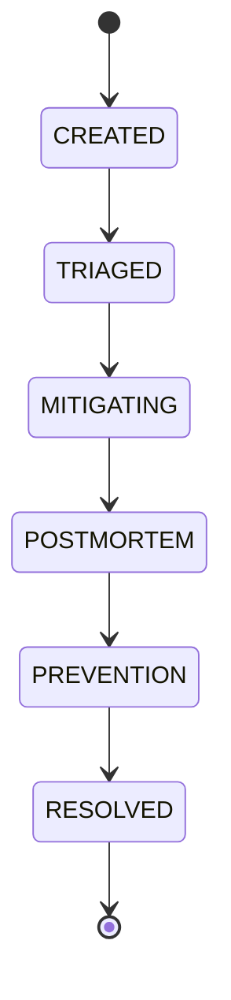

**Handling flow:** creation → triage → mitigation → postmortem → prevention → backlog item.

### 11.7 Telemetry Privacy

Opt-in only (Sentry + anonymous analytics: task counts, success rates, cost/run, version — no application data); redaction layer (identity, keys, URLs, evidence paths); GUI consent; `telemetry.enabled` config + `JOBOT_TELEMETRY=off` kill switch; `docs/privacy.md` schema-tested against code.

### 11.8 Rollback

Revoke artifacts, patched release, DB downgrade-or-forward-fix policy, safe-versions list, corrupted-user-state recovery, disable unsafe features via local config. Release notes distinguish hermetic vs live validation.

**Rollback decision tree:**

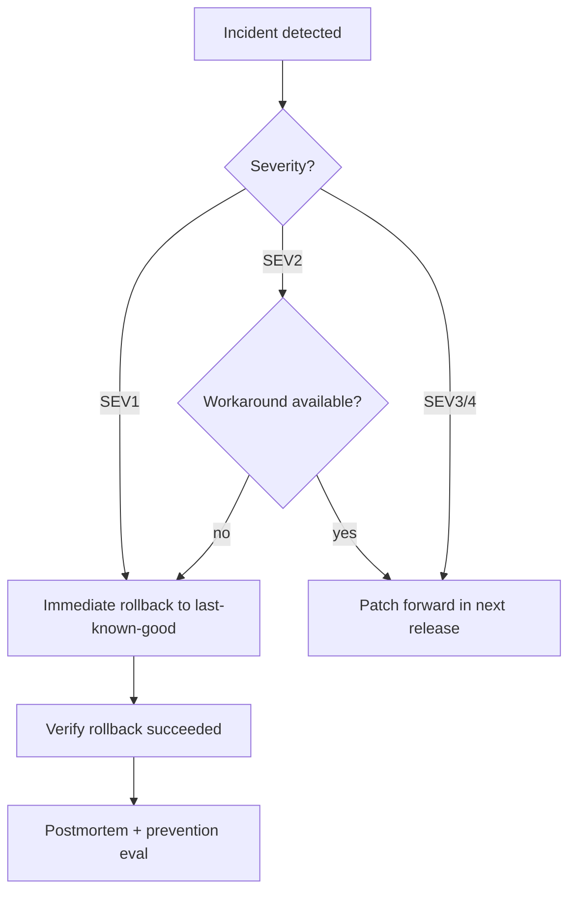

---

## Section 12 — Specialized Harness Library

**From `AGENTS.md`:** "End state is not one giant generalist agent but a platform combining: general-purpose supervisor + task/workflow engine + library of specialized harnesses for recurring high-value workflows."

A specialized harness is a **state machine** with explicit phases, tracked state, entry/exit criteria, artifacts at every stage, and resumable mid-run. The generalist agent handles open-ended work; harnesses handle repeated high-value multi-stage workflows.

JoBot defines **9 specialized harnesses**, each graduating from the Capability Acquisition Ladder (Section 14) step 5. Every harness defines: trigger conditions, fixed vs dynamic phases, required inputs, clarifying questions, workspace layout, intermediate schemas, validation checks per phase, final outputs/templates, approval gates, retry/fallback logic, stop conditions, memory updates, evals.

### 12.1 Harness Catalog

| ID | Harness | Trigger | UC ids | Status |
|---|---|---|---|---|
| H1 | Discovery & Matching | user requests job discovery, or scheduled scan | UC-23, UC-28 | exists (skeletal) |
| H2 | Resume Review | application PREPARING phase | UC-22 | exists (drafter→reviewer) |
| H3 | Application Submission | application PREPARED + approved | UC-03, UC-05, UC-16, UC-17 | exists (12-phase ASP) |
| H4 | Browser Recovery | selector drift, CAPTCHA detected, browser crash | UC-10, UC-12, UC-13 | **gap G6** — to build |
| H5 | Outreach & Follow-up | post-submit follow-up scheduled | UC-36 | exists (outreach/) |
| H6 | Interview Prep | application reaches INTERVIEW state | UC-56 | exists (interview/) |
| H7 | Verification & Reconciliation | application SUBMITTED or UNKNOWN | UC-04 | **gap G3** — to build |
| H8 | Outcome Tracking | application VERIFIED | UC-74 | partial (tracker/) |
| H9 | Self-Improvement | failure detected or eval gap found | UC-76, UC-77 | **gap G40** — to build |

### 12.2 Harness State Schema (shared)

```python
from pydantic import BaseModel, Field
from typing import Any
from datetime import datetime, timezone

class HarnessPhase(BaseModel):
    name: str
    status: str  # PENDING | IN_PROGRESS | COMPLETED | FAILED | SKIPPED
    entered_at: datetime | None = None
    exited_at: datetime | None = None
    artifact_paths: list[str] = Field(default_factory=list)
    validation_results: dict[str, Any] = Field(default_factory=dict)

class HarnessState(BaseModel):
    harness_id: str  # H1..H9
    instance_id: str  # unique per run
    application_id: str | None = None
    task_id: str
    phases: list[HarnessPhase]
    current_phase: str
    waitpoint: str | None = None  # approval_id, external_event_id, etc.
    checkpoint_path: str  # durable state file
    budget_used_usd: float = 0.0
    budget_limit_usd: float | None = None
    retry_count: int = 0
    max_retries: int = 3
    stop_conditions: list[str] = Field(default_factory=list)
    memory_updates: list[str] = Field(default_factory=list)
```

### 12.3 H3 — Application Submission Harness (canonical example)

**Trigger:** application reaches `PREPARED` state AND `ApprovalRequest` for submission is approved.

**Fixed phases (12-phase ASP as state machine):**

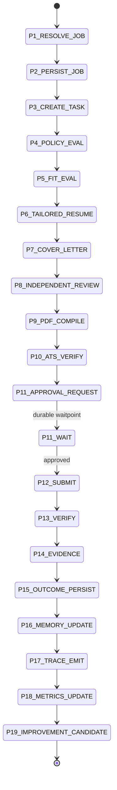

**Required inputs:** `profile_id`, `job_id`, `application_id`, `approval_id`.

**Workspace layout:** `artifacts/applications/<application_id>/{resume.tex, resume.pdf, cover_letter.md, cover_letter.pdf, ats_score.json, answers.json, evidence/, trace.json}`

**Validation checks per phase:**

| Phase | Check | Failure action |
|---|---|---|
| P5 | match_score ≥ threshold | SHORTLISTED → REJECTED |
| P8 | reviewer rubric ≥ B | retry with feedback (max 2) |
| P10 | ATS score ≥ 70 | retry PDF compile with adjustments |
| P11 | approval exists | WAITING (durable) |
| P13 | confirmation_id captured | SUBMISSION_UNKNOWN → reconcile |
| P14 | evidence files exist | FAILED → quarantine |

**Approval gates:** P11 (submission approval, R5), P12 (effect ledger reservation check).

**Retry/fallback:** adapter failure → circuit breaker → quarantine; provider failure → router fallback chain.

**Stop conditions:** budget exceeded, max retries hit, policy denial, human cancel, unresolvable UNKNOWN after 3 reconcile attempts.

**Memory updates:** `CandidateFact` augmentation, `answer_bank` population, `form_field_memory` persistence.

**Evals:** long-horizon suite with kills between phases (Section 10).

### 12.4 H4 — Browser Recovery Harness (NEW — gap G6)

**Trigger:** selector drift detected, CAPTCHA detected, browser crash, site health degraded.

**Phases:**
1. DETECT — selector failure / CAPTCHA presence / process death
2. CAPTURE — pre-failure DOM snapshot + screenshot + last action log
3. CLASSIFY — drift vs CAPTCHA vs ban vs outage
4. HEAL — try alternate locators from registry (AR-2)
5. ESCALATE — if CAPTCHA: human handoff boundary; if ban: circuit breaker + incident
6. RESUME — re-attempt from last checkpoint (never replay effect)
7. EVIDENCE — capture post-recovery state

**Key invariant:** never replay an external effect. If the failure happened after submit but before confirmation, mark `SUBMISSION_UNKNOWN` and reconcile.

### 12.5 H7 — Verification & Reconciliation Harness (NEW — gap G3)

**Trigger:** application in `SUBMITTED` or `SUBMISSION_UNKNOWN` state.

**Phases:**
1. FETCH — adapter `verify()` call
2. CLASSIFY — confirmed / unconfirmed / ambiguous
3. RECONCILE — if ambiguous: cross-check email confirmations, ATS portal, confirmation_id lookup
4. EVIDENCE — capture verification proof (screenshot, email, API response)
5. TRANSITION — `VERIFIED` / `VERIFICATION_UNKNOWN` / `FAILED`
6. QUARANTINE — if UNKNOWN after 3 attempts: quarantine + incident

**Key invariant:** reconcile-never-replay. If uncertain, do not retry the submit; only query.

### 12.6 Harness Graduation Criteria

A workflow graduates from "generalist agent task" to "specialized harness" when ALL of:
- repeated ≥ 3 times in production
- high-value (failure has real cost)
- reliability-sensitive (wrong outcome is worse than no outcome)
- has explicit phases that can be checkpointed
- has validation gates between phases

---

## Section 13 — Layered Memory System Specification

**From `AGENTS.md`:** "Memory is a product surface — inspectable, editable, searchable, versioned. Hidden memory is a liability."

The existing `EightTierMemorySystem` is skeletal (~140 LOC). This section makes it real.

### 13.1 Eight Tiers

| Tier | Name | Storage | Write trigger | Read path | Retention | Provenance |
|---|---|---|---|---|---|---|
| T1 | Hot | in-memory + `state/hot.json` | task in progress | direct | task duration | task_id |
| T2 | Warm | SQLite `memory_warm` table | milestone reached | SQL query by project_id | 90 days | milestone_id |
| T3 | Cold | SQLite `memory_cold` + archived files | project closed | SQL query + file load | indefinite (archive) | project_id |
| T4 | Episodic | SQLite `memory_episodic` table | every task completion | SQL query by task_id/date | 365 days | task_id, timestamp |
| T5 | Semantic | SQLite `memory_semantic` table | promotion from episodic | SQL query by entity | indefinite | source_episodic_ids |
| T6 | Procedural | `skills/` directory + SQLite index | skill created | skill registry lookup | indefinite | skill_version |
| T7 | Preference | SQLite `memory_preference` table | user setting / correction | SQL query by user_id | indefinite | user_id, set_by |
| T8 | Temporal | SQLite `memory_temporal` table | fact changes over time | bi-temporal query | indefinite | superseded_by chain |

### 13.2 SQL DDL

```sql
-- T2 Warm memory
CREATE TABLE memory_warm (
    id INTEGER PRIMARY KEY AUTOINCREMENT,
    project_id TEXT NOT NULL,
    key TEXT NOT NULL,
    value TEXT NOT NULL,
    confidence REAL DEFAULT 1.0,
    freshness TIMESTAMP DEFAULT CURRENT_TIMESTAMP,
    provenance TEXT NOT NULL,
    UNIQUE(project_id, key)
);

-- T4 Episodic memory
CREATE TABLE memory_episodic (
    id INTEGER PRIMARY KEY AUTOINCREMENT,
    task_id TEXT NOT NULL,
    event_type TEXT NOT NULL,
    payload TEXT NOT NULL,  -- JSON
    timestamp TIMESTAMP DEFAULT CURRENT_TIMESTAMP,
    correlation_id TEXT,
    INDEX(task_id), INDEX(timestamp)
);

-- T5 Semantic memory (promoted from episodic)
CREATE TABLE memory_semantic (
    id INTEGER PRIMARY KEY AUTOINCREMENT,
    entity_type TEXT NOT NULL,  -- company | skill | role | adapter | site
    entity_id TEXT NOT NULL,
    fact TEXT NOT NULL,
    confidence REAL DEFAULT 0.5,
    source_episodic_ids TEXT NOT NULL,  -- JSON array
    created_at TIMESTAMP DEFAULT CURRENT_TIMESTAMP,
    superseded_by INTEGER,  -- FK to newer memory_semantic.id
    UNIQUE(entity_type, entity_id, fact)
);

-- T7 Preference memory
CREATE TABLE memory_preference (
    id INTEGER PRIMARY KEY AUTOINCREMENT,
    user_id TEXT NOT NULL,
    key TEXT NOT NULL,
    value TEXT NOT NULL,
    set_by TEXT NOT NULL,  -- 'user' | 'system'
    set_at TIMESTAMP DEFAULT CURRENT_TIMESTAMP,
    UNIQUE(user_id, key)
);

-- T8 Temporal memory (bi-temporal)
CREATE TABLE memory_temporal (
    id INTEGER PRIMARY KEY AUTOINCREMENT,
    entity_type TEXT NOT NULL,
    entity_id TEXT NOT NULL,
    attribute TEXT NOT NULL,
    value TEXT NOT NULL,
    valid_from TIMESTAMP NOT NULL,
    valid_to TIMESTAMP,  -- NULL = currently valid
    recorded_at TIMESTAMP DEFAULT CURRENT_TIMESTAMP,
    superseded_by INTEGER
);

-- CandidateFact (UC-21 — candidate truth system)
CREATE TABLE candidate_facts (
    id INTEGER PRIMARY KEY AUTOINCREMENT,
    profile_id TEXT NOT NULL,
    fact_type TEXT NOT NULL,  -- skill | experience | education | credential
    fact_value TEXT NOT NULL,
    source TEXT NOT NULL,  -- 'resume' | 'linkedin' | 'user_asserted' | 'inferred'
    source_path TEXT,  -- file path or URL
    confidence REAL DEFAULT 1.0,
    verified BOOLEAN DEFAULT FALSE,
    verified_at TIMESTAMP,
    verified_by TEXT,  -- 'human' | 'document_check' | 'cross_reference'
    created_at TIMESTAMP DEFAULT CURRENT_TIMESTAMP,
    superseded_by INTEGER
);

-- Answer bank (UC-26, F-02, F-08)
CREATE TABLE answer_bank (
    id INTEGER PRIMARY KEY AUTOINCREMENT,
    profile_id TEXT NOT NULL,
    question_hash TEXT NOT NULL,  -- SHA256(normalized question text)
    question_text TEXT NOT NULL,
    answer TEXT NOT NULL,
    source TEXT NOT NULL,  -- 'profile' | 'memory' | 'llm' | 'user'
    used_count INTEGER DEFAULT 0,
    last_used_at TIMESTAMP,
    created_at TIMESTAMP DEFAULT CURRENT_TIMESTAMP,
    UNIQUE(profile_id, question_hash)
);

-- Form field memory (UC-26, AR-3)
CREATE TABLE form_field_memory (
    id INTEGER PRIMARY KEY AUTOINCREMENT,
    profile_id TEXT NOT NULL,
    adapter_id TEXT NOT NULL,
    field_selector TEXT NOT NULL,
    field_label TEXT,
    field_type TEXT,
    value TEXT NOT NULL,
    confidence REAL DEFAULT 1.0,
    last_used_at TIMESTAMP,
    UNIQUE(profile_id, adapter_id, field_selector)
);
```

### 13.3 Memory Promotion Protocol (episodic → semantic)

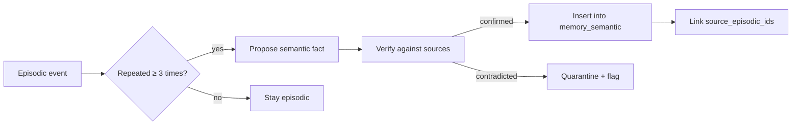

### 13.4 Retrieval-First Context Assembly

Before any LLM call, assemble context from memory:

```python
def assemble_context(task: Task, profile_id: str) -> str:
    """Retrieval-first: only relevant skills/rules/memory in prompts."""
    hot = load_hot_state(task.id)
    warm = query_memory_warm(task.project_id)
    semantic = query_memory_semantic(entities=task.entities)
    preferences = query_memory_preference(profile_id)
    procedural = load_skill(task.skill_tags)
    # Temporal: only currently-valid facts
    temporal = query_memory_temporal_valid_now(task.entities)
    return render_context(hot, warm, semantic, preferences, procedural, temporal)
```

### 13.5 Memory Invariants

- **NO MEMORY WITHOUT PROVENANCE** — every memory row carries source
- **NO CONTRADICTION WITHOUT RESOLUTION** — temporal table tracks supersession
- **NO UNVERIFIED CANDIDATE FACT IN CRITICAL PATH** — `verified=TRUE` required for resume generation
- **MEMORY IS INSPECTABLE** — `jobot memory list/search/export` CLI
- **MEMORY IS EDITABLE** — user can correct any fact; correction creates new temporal row

---

## Section 14 — Capability Acquisition Ladder Mapping

**From `AGENTS.md`:** "Climb in order: (1) Solve once with human support → (2) Make repeatable (capture trajectory) → (3) Turn into a skill → (4) Turn repeated high-value work into a workflow → (5) Turn reliability-critical workflows into specialized harnesses → (6) Add eval coverage → (7) Add automation → (8) Add monitoring/interventions → (9) Add trust-based autonomy → (10) Package the gain."

### 14.1 Ladder Steps Mapped to JoBot

| Step | Definition | JoBot example | Current state | Target state | Exit criteria |
|---|---|---|---|---|---|
| 1 | Solve once with human support | First LinkedIn Easy Apply | done | done | trajectory recorded |
| 2 | Make repeatable (capture trajectory) | Adapter pattern + fixtures | done | done | hermetic test green |
| 3 | Turn into a skill (SOP, triggers) | `discover_jobs` skill | partial | done | skill in registry |
| 4 | Turn into a workflow (phases, typed I/O) | 12-phase ASP | done | done | state machine validated |
| 5 | Turn into a specialized harness | H3 Application Submission Harness | partial | done | checkpoint + resume proven |
| 6 | Add eval coverage | Long-horizon suite | **gap** | done | pass@N measured |
| 7 | Add automation (triggers/schedules) | Scheduler 4-mode loop | partial | done | DST/catch-up tested |
| 8 | Add monitoring/interventions | Browser health diagnostics | **gap** | done | drift detection active |
| 9 | Add trust-based autonomy | R5 submission autonomy | **gap** | done | trust evidence recorded |
| 10 | Package the gain | Skill registry + plugin ABI | **gap** | done | reusable asset shipped |

### 14.2 UC → Ladder Step Mapping

(See Section 4.2 — the "Ladder" column maps each UC to its highest ladder step.)

**Ladder distribution of UC catalog:**

| Ladder step | UC count | Examples |
|---|---|---|
| 3 (skill) | 14 | UC-15, UC-19, UC-25, UC-27, UC-34, UC-35, UC-37, UC-45, UC-46, UC-47, UC-49, UC-51, UC-60, UC-72 |
| 4 (workflow) | 18 | UC-01, UC-02, UC-05, UC-06, UC-07, UC-14, UC-16, UC-18, UC-20, UC-22, UC-23, UC-26, UC-52, UC-54, UC-61, UC-62, UC-63, UC-70 |
| 5 (harness) | 13 | UC-03, UC-04, UC-08, UC-09, UC-10, UC-11, UC-12, UC-17, UC-21, UC-36, UC-38, UC-42, UC-73 |
| 6 (eval coverage) | 10 | UC-13, UC-29, UC-30, UC-31, UC-32, UC-33, UC-39, UC-40, UC-41, UC-43 |
| 7 (automation) | 5 | UC-48, UC-50, UC-55, UC-64, UC-81, UC-82 |
| 8 (monitoring) | 2 | UC-44, UC-58 |
| 9 (trust autonomy) | 3 | UC-66, UC-74, UC-78 |
| 10 (package gain) | 4 | UC-67, UC-68, UC-69, UC-76, UC-77, UC-79 |

### 14.3 Graduation Rules

- A UC cannot skip ladder steps (e.g., no autonomy before eval coverage).
- Graduation requires evidence (eval pass rate, production outcomes).
- Demotion: if a graduated capability regresses (eval fails), it drops back to the previous step until fixed.

---

## Section 15 — Self-Improvement Engine (Mode 1 + Mode 2)

(Detailed in Section 10.4. This section adds the operational protocol.)

### 15.1 Mode 1 — Inline Improvement Protocol

After every task completion (success OR failure), the executor MUST:

1. **Record** — append to `memory_episodic` table: what worked, what failed, what slowed
2. **Classify** — assign gap type from 12-type taxonomy (Section 10.4)
3. **Update memory** — promote episodic → semantic if repeated (Section 13.3)
4. **Update smallest useful artifact** — one of: prompt, skill, playbook, rule, dashboard, eval case, memory structure
5. **Add/revise eval** — if failure exposed a blind spot, add a regression test case

**Anti-pattern:** do not attempt Mode 2 background changes during Mode 1. Mode 1 is for immediate, small, safe updates only.

### 15.2 Mode 2 — Background Improvement Loop

Runs on a schedule (daily off-peak, or on-demand). One bounded change per cycle.

**Protocol:**

1. **Select hypothesis** — from `improve` queue, ranked by leverage (Section 19)
2. **Create branch** — `improve/<candidate-id>` from `main`
3. **Make one bounded change** — single file or tightly scoped diff
4. **Run eval slice** — the subset of suites relevant to the change
5. **Compare to baseline** — metrics from Section 10.7
6. **Decide:**
   - better + safe → merge, log result, update baseline
   - worse or unsafe → revert, log result, mark candidate REJECTED
   - inconclusive → extend eval slice or mark NEEDS_MORE_EVIDENCE
7. **Safety gate** — if change touches forbidden targets (Section 10.4), require human approval before merge

### 15.3 Improvement Target Whitelist

The system MAY autonomously improve:
- prompts (versioned files)
- skills (registry entries)
- playbooks
- rules (non-safety)
- tool adapters (non-security)
- automations
- specialized harnesses
- dashboards
- workflows
- task decomposition policy
- eval suites
- memory structure
- model routing
- retry logic
- documentation
- setup scripts

### 15.4 Forbidden Automation Targets (require human approval)

- approval policy
- security policy
- deployment paths
- destructive action rules
- trust thresholds
- secret storage
- data-sharing policy

### 15.5 One-Change Rule Enforcement

```python
def validate_one_change(diff: Diff) -> bool:
    """Reject changes that touch more than one logical concern."""
    files = diff.changed_files
    concerns = {classify_concern(f) for f in files}
    if len(concerns) > 1:
        return False
    if diff.added_lines + diff.removed_lines > 200:
        return False  # too large for one-change rule
    return True
```

---

## Section 16 — External Intelligence Loop Protocol

**From `AGENTS.md`:** "Recurring loop monitoring major open-source architecture-bearing agent/AI repos... Ingest a repo or project only if it demonstrates one or more of: durable execution, explicit workflow/state-machine control, checkpointing/resumability, typed tool/data contracts, memory/retrieval architecture, model routing/inference infrastructure, sandboxed execution, validation/eval loops, human approvals/control-plane visibility, traceability/observability/portable protocol design."

### 16.1 Monitored Systems (25+)

| System | Category | "Steal from" insight | JoBot adoption candidate | Validation | Status |
|---|---|---|---|---|---|
| **LangGraph** | orchestration | graph-based orchestration, durable execution, checkpointing, HITL state inspection | H3 harness state machine | local eval | monitoring |
| **Letta** | memory | memory-first stateful agents, durable identity, explicit memory blocks | Layered Memory System (Section 13) | local eval | monitoring |
| **Microsoft AutoGen** | architecture | layered: low-level event-driven core, high-level chat, extension, runtime, Studio, Bench | multi-abstraction exposure | local eval | monitoring |
| **Microsoft Agent Framework** | architecture | agents vs workflows separation, type-safe routing, checkpointing, middleware, HITL | task graph vs workflow split | local eval | monitoring |
| **Semantic Kernel** | enterprise | plugin ecosystem, process framework, model flexibility, multimodal | plugin ABI (UC-68) | local eval | monitoring |
| **Google ADK** | tooling | model-agnostic, deployment-agnostic, built-in eval, artifact-aware context, visual builder → code+YAML | eval platform (UC-41) | local eval | monitoring |
| **PydanticAI** | typing | type-safe structured outputs, model-agnostic provider layer, eval integration, MCP/A2A | boundary schemas (UC-14) | local eval | **adopted** (Pydantic v2 already used) |
| **DSPy** | optimization | programming-not-prompting, compositional modules, optimizer/compiler self-improvement against eval sets | Mode 2 self-improvement (Section 15) | local eval | testing |
| **Mastra** | workflows | combining agents with graph workflows, storage-backed pause/resume for HITL, built-in evals | durable waitpoints (UC-05) | local eval | monitoring |
| **AgentScope** | runtime | async multi-agent, message-routing (MsgHub, pipelines), authoring vs deployment runtime separation, sandboxed tool exec | sandbox ladder (UC-67) | local eval | monitoring |
| **OpenHands** | surfaces | file-centric software agent, explicit runtime surfaces, core engine reused across CLI/GUI/SDK/hosted | core engine across CLI/GUI/MCP | local eval | monitoring |
| **OpenClaw** | platform | integrated agent platform: control plane, sessions, browser/desktop, skills, workflows, scheduling, multi-surface | JoBot platform shape | local eval | monitoring |
| **Hermes Agent** | self-improvement | built-in learning loop, autonomous skill creation, cross-session memory, scheduled automations, isolated subagents | Mode 1 + Mode 2 (Section 15) | local eval | monitoring |
| **Paperclip** | business ops | agent work as business operations primitives: companies, teams, inboxes, heartbeats, tickets, budgets, recurring jobs, scoped memory, governance | career-OS objects (UC-78) | local eval | monitoring |
| **Superpowers** | methodology | skill-enforced software workflows: design clarification, worktree isolation, tiny executable plans, subagent dev, mandatory TDD, structured review | engineering methodology | local eval | monitoring |
| **gstack** | specialist stack | opinionated specialist stack: architecture review, design review, browser QA, security review, release flow, repo-local skills | reviewer profiles (UC-22) | local eval | monitoring |
| **SWE-agent** | benchmark | benchmark discipline, sandboxing, trajectory browsers, simple baseline preserved | minimal baseline path | local eval | monitoring |
| **CopilotKit** | UX | generative UI, shared agent and UI state, explicit HITL patterns | GUI control plane (UC-29) | local eval | monitoring |
| **LiteLLM** | routing | unified gateway, budgets, logging, routing, fallback | ModelRouter v2 (UC-20) | local eval | **adopted** (concept) |
| **Graphiti** | memory | temporally-aware knowledge graph, bi-temporal, incremental updates, hybrid retrieval | T8 temporal memory (Section 13) | local eval | **adopted** (concept) |
| **Langfuse** | observability | trace-centric observability, datasets, experiments, prompt management, OTel-friendly | OTEL export (UC-65) | local eval | monitoring |
| **Opik** | eval | observability + automated eval + online scoring + optimizers + production dashboards | eval in production (UC-41) | local eval | monitoring |
| **Invariant Guardrails** | safety | policy rules over traces and tool flows, pre/post-call enforcement | policy gate (UC-06) | local eval | monitoring |
| **vLLM** | serving | high-throughput inference serving, separation of serving from agent logic | Ollama path (UC-60) | local eval | monitoring |
| **E2B** | sandbox | secure isolated sandboxes for AI-generated code, self-hosted | sandbox ladder (UC-67) | local eval | monitoring |
| **Daytona** | sandbox | persistent + elastic sandboxes, programmatic file/git/execute/LSP APIs | sandbox ladder (UC-67) | local eval | monitoring |
| **LlamaIndex** | retrieval | data connectors, indexing, retrieval, workflows, knowledge interaction | retrieval-first context (Section 13.4) | local eval | monitoring |
| **Haystack** | RAG | production-oriented RAG pipelines, eval tooling, composable retrieval stacks | retrieval quality eval | local eval | monitoring |
| **Mem0** | memory service | memory as dedicated service with user/session/agent primitives | memory subsystem | local eval | monitoring |
| **agent-sandbox** | k8s | Kubernetes-native abstraction for isolated stateful singleton sandboxes | multi-machine (UC-79) | local eval | monitoring |
| **Temporal** | durable execution | durable execution, retries, timers, checkpoints, workflow versioning, long-running fault-tolerant orchestration | task graph engine (UC-01) | local eval | **priority study** |
| **MCP** | protocol | protocol approach to connecting agents to tools, data, prompts, resources | `jobot mcp` (UC-61) | local eval | **adopted** |
| **AGENTS.md standard** | conventions | portable project instructions, open governance, vendor-neutral conventions | this document | — | **adopted** |

### 16.2 News-to-Improvement Pipeline

For every relevant external update:

1. **Capture** — source, url, date, category, claim
2. **Extract** — architectural claim
3. **Estimate** — relevance (1-5)
4. **Decide** — does it imply a new eval/skill/playbook/tool adapter/workflow/harness/profile/policy/schema/dashboard/recurring operation/benchmark/roadmap change?
5. **If relevant** — create a bounded experiment
6. **Never adopt** an external claim into the core system without local eval, shadow run, or replay-based validation
7. **Keep or discard** based on evidence

### 16.3 External Knowledge Memory Schema

```sql
CREATE TABLE external_intelligence (
    id INTEGER PRIMARY KEY AUTOINCREMENT,
    source TEXT NOT NULL,
    url TEXT NOT NULL,
    date TEXT NOT NULL,
    category TEXT NOT NULL,
    claim TEXT NOT NULL,
    relevance INTEGER,  -- 1-5
    confidence TEXT,  -- high | moderate | low | unknown
    suggested_experiment TEXT,
    status TEXT DEFAULT 'NEW',  -- NEW | EXPERIMENTING | ADOPTED | REJECTED
    outcome TEXT,
    created_at TIMESTAMP DEFAULT CURRENT_TIMESTAMP
);
```

### 16.4 Loop Cadence

- **Weekly:** digest of important changes, ranked ideas worth testing
- **Monthly:** new eval candidates, new skills/workflows worth creating, model routing/tooling/memory strategy updates
- **Quarterly:** architecture review, assumption staleness check

**De-prioritize:** thin wrappers around provider APIs, generic chat shells, UI-only products with little public architecture, trend-driven multi-agent demos without strong state/eval/reliability design.

---

## Section 17 — Fractal Interface Model for JoBot GUI

**From `AGENTS.md`:** "Scale by scope, not by switching the user into a different product. Same primitives at every level: ask, state, plan, tasks, artifacts, timeline, evidence, cost, approvals, memory, control."

### 17.1 Fractal Levels for JoBot

| Level | JoBot scope | Primitives | UI surface | State backing |
|---|---|---|---|---|
| **Micro** | one answer/file/command/browser action | command, result, evidence | command palette, inline result | task span |
| **Task** | one delegated task with DoD | task card, session trace, verification result | task detail view | `tasks` table + `task_events` |
| **Goal** | multiple tasks (e.g., "apply to 5 jobs this week") | goal card, task graph, progress, blockers, evidence | goal board | `goals` table + task dependencies |
| **Project** | shared memory (e.g., "Software Engineer search Q3 2026") | plan, knowledge, decisions, KPIs, incidents | project workspace | `projects/` folder + memory tiers |
| **Career OS** | discovery/applications/interviews/offers/networking pipelines | department dashboards, recurring ops, lifecycle pipelines | career dashboard | all tables + analytics |
| **Portfolio** | multiple career tracks (e.g., "IC track + consulting track") | cross-track comparison, capital allocation | portfolio view | multiple project folders |

### 17.2 Universal Ask Bar

One universal ask surface. Accepts: plain language, files, screenshots, URLs, structured inputs, follow-up constraints (budget, urgency, risk tolerance, due date). Infers whether user wants a direct answer, draft, plan, one-time execution, long-running goal, recurring automation, or portfolio report.

**Sample asks JoBot must route:**

- "find Senior Python roles in Berlin" → discovery task
- "tailor my resume for this job" → document task
- "apply to this job" → application submission harness (H3)
- "what changed since yesterday?" → state diff view
- "which applications are stuck?" → goal board query
- "show me all work touching company X" → cross-task search
- "what's costing the most?" → cost view
- "run discovery every morning at 8am" → automation (UC-55)
- "operate my job search until I stop you" → career-ops mode

### 17.3 Output Matches the Job

| Intent | Output |
|---|---|
| factual question | concise answer with sources/evidence |
| code change | diff, file references, verification, session trace |
| one-time task | task card + live session + final evidence |
| research request | report, citations, artifacts, follow-up actions |
| workflow issue | board, incident, root cause, proposed fix |
| career status | dashboard, KPI deltas, risks, decisions needed |
| recurring process | automation card with schedule, scope, approval policy |

### 17.4 Altitude Control

Move between raw session transcript → task summary → project summary → career summary without losing continuity. Same underlying state powers all.

- **Low altitude:** exact command, file, screenshot, error
- **High altitude:** theme, risk, KPI trend, pipeline status

### 17.5 Progressive Disclosure

Default to minimum view needed to keep user oriented; expose deeper details on demand. A goal card shows title, owner, status, risk, cost, next step; allows drill-down into tasks, sessions, artifacts, approvals, diffs, metrics, incidents.

### 17.6 Interface Success Criteria

A new user can:
- ask for a tiny task and get a fast result
- ask for a complex goal and understand progress
- discover what the system is doing without reading code
- find approvals/decisions quickly
- inspect evidence without friction
- pause or redirect confidently
- zoom from one task to one project to career OS without getting lost

---

## Section 18 — Skill Registry & Sandbox Ladder

### 18.1 Skill Registry Schema (Pydantic)

```python
class Skill(BaseModel):
    id: str  # e.g., "discover_jobs_greenhouse_api"
    name: str
    description: str
    version: str  # semver
    trigger_conditions: list[str]  # when this skill activates
    inputs: dict[str, str]  # field_name -> type
    outputs: dict[str, str]
    tools_allowed: list[str]  # tool capability categories
    permissions_required: list[str]  # R0-R8 tiers
    verification_standard: str  # how to verify output
    retry_policy: str  # max_attempts, backoff
    stop_conditions: list[str]
    test_corpus_path: str  # eval fixtures
    trust_level: int  # 0-5, promoted from outcomes
    profile_routing: list[str]  # which profiles can use this
    memory_reads: list[str]  # which memory tiers
    memory_writes: list[str]
    created_at: datetime
    last_updated: datetime
    review_status: str  # DRAFT | REVIEWED | APPROVED | DEPRECATED
```

### 18.2 Trust Promotion/Demotion

```python
class TrustEvent(BaseModel):
    skill_id: str
    event_type: str  # PROMOTE | DEMOTE | RESET
    old_level: int
    new_level: int
    reason: str  # "N successes", "failure rate > threshold", "policy violation"
    evidence_path: str
    timestamp: datetime
    decided_by: str  # 'system' | 'human'
```

**Trust thresholds (configurable, evidence-based):**
- Level 0 → 1: skill created, reviewed
- Level 1 → 2: 10 successful uses, 0 failures
- Level 2 → 3: 50 successful uses, < 5% failure rate, eval pass
- Level 3 → 4: 100 successful uses, < 2% failure rate, long-horizon eval pass
- Level 4 → 5: 500 successful uses, < 1% failure rate, production-derived eval pass
- Demotion: any policy violation, failure rate spike, or human override

### 18.3 Sandbox Ladder (UC-67)

| Level | Isolation | Use case | Status |
|---|---|---|---|
| L1 | subprocess (current) | CLI commands, file ops | exists |
| L2 | container (Docker) | untrusted code execution, browser isolation | planned |
| L3 | remote sandbox (E2B/Daytona) | multi-machine, heavy compute | future |

**Plugin deny-by-default manifest:**

```yaml
# plugins/manifest.yaml
plugin_name: my_adapter
version: 1.0.0
permissions:
  - read:jobs  # explicit allowlist
  - write:applications
  - network:greenhouse.io  # specific hosts only
denied:
  - write:filesystem  # deny by default
  - read:vault
  - network:*  # deny all other network
sandbox_level: L2  # container isolation
health_check: my_adapter/health.py
```

### 18.4 Plugin ABI (UC-68)

Adapter plugin interface (loadable via manifest):

```python
class AdapterPlugin(BaseModel):
    manifest: PluginManifest
    discover: Callable[[DiscoveryQuery], list[JobPosting]]
    normalize: Callable[[RawJob], NormalizedJob]
    questions: Callable[[JobPosting], list[Question]]
    prepare: Callable[[JobPosting, Profile], PreparedApplication]
    submit_or_dry_run: Callable[[PreparedApplication, bool], SubmitOutcome]
    verify: Callable[[ApplicationId], VerificationResult]
    health: Callable[[], HealthStatus]
```

Registry auto-discovers installed adapter plugins. Health-checked install: on plugin install, run `health()` and reject if unhealthy.

---

## Section 19 — Momentum Engine Doctrine

**From `AGENTS.md`:** "Many agent systems fail not from lack of intelligence but from repeated stall: finishing one task without setting up the next, discovering problems without converting to backlog, improving once without compounding loops, waiting passively. Design against stall."

### 19.1 Momentum Principle

At all times the system knows:
- what it's doing **now**
- what's **next**
- what's **blocked**
- what **improvement** work runs in background
- what **recurring** loops keep it getting better

### 19.2 Five Default Momentum Queues (never end a meaningful run with all five undefined)

| Queue | Purpose | JoBot content |
|---|---|---|
| `now` | current active milestone/highest-priority task | Section 26 |
| `next` | concrete tasks ready to run immediately | Section 26 |
| `blocked` | waiting on approvals/info/dependencies/capabilities | Section 26 |
| `improve` | eval gaps, flaky workflows, repeated failures, missing skills, stale assumptions, external intelligence experiments | Section 26 |
| `recurring` | schedules, monitors, sweeps, automations | Section 26 |

### 19.3 Next-Work Selection Priority

Prefer work that:
1. unblocks the current milestone
2. fixes reliability/verification gaps
3. converts repeated work into reusable assets
4. adds eval coverage for high-value failures
5. expands breadth only after loop is stable

### 19.4 Momentum Ratchets

Every meaningful success ratchets forward in at least one way:
- new skill
- stronger workflow
- specialized harness
- new eval
- template
- dashboard
- monitor
- policy
- memory artifact

### 19.5 Anti-Stall Rules

- **Blocked > short interval** → decompose blocker, seek smallest missing answer, work on non-blocked sidecar improvements in parallel
- **Same failure twice** → add guardrail/test/policy; don't just retry
- **Long-running task with no visible artifact progress** → write intermediate outputs, checkpoint state, surface clearer progress
- **Waiting for slow task** → fill idle time with eval work, memory cleanup, dashboard improvements, backlog grooming, external intelligence review
- **Milestone "done" but next step undefined** → create next milestone immediately or open explicit choices with recommendations

### 19.6 Background Compounding Loops (8)

1. **Task-completion** — verify, log, learn, create assets
2. **Eval** — improve quality/coverage
3. **Failure** — convert mistakes into tests/policies/constraints
4. **External intelligence** — watch for better patterns/tools/models/protocols/benchmarks
5. **Workflow mining** — convert successful trajectories into workflows/skills
6. **Proactive operations** — inspect for blocked work, stale plans, KPI drift, unattended incidents
7. **Cost** — replace expensive steps with cheaper models/narrower subagents/cached artifacts/deterministic code
8. **Trust** — promote autonomy when outcomes justify, tighten when they don't

### 19.7 First 72 Hours Bias

Scaffold core files/task system → prove one closed-loop task end-to-end → make visible in dashboard → add one verifier → one eval → one memory update path → one self-improvement path → one proactive/recurring loop → define next three milestones.

### 19.8 Momentum Metrics (leading, not lagging)

- time from task completion to next queued task
- reusable assets per milestone
- failures converted into evals/guardrails
- days since last eval improvement
- days since last new skill/workflow
- proactive goals created
- % runs ending with explicit next actions
- % important workflows with both harness and evals

---

## Section 20 — Documentation Suite Specification

### 20.1 Doc Catalog

| Doc | Purpose | Audience | Location |
|---|---|---|---|
| README | First contact: promise, quickstart, badges, architecture, honest adapter status, FAQ, sponsorship | All users | `/README.md` |
| CONTRIBUTING | Dev setup, gates, branch/PR rules, release roles | Contributors | `/CONTRIBUTING.md` |
| ARCHITECTURE | System layers, entities, state machines, eventing | Dev/power users | `docs/architecture.md`, `docs/architecture/*` |
| USAGE | User guide: profiles, discovery, matching, applications, approvals, resume, interview, tracker, networking, backups | End users | `docs/user/*` |
| API | RPC + REST + MCP surfaces | Integrators | `docs/reference/rpc.md` |
| CONFIG | All configuration keys, env, telemetry, policies | Users/admins | `docs/reference/config.md` |
| SECURITY | Reporting, PGP, glib risk register, threat model, secure config, plugin security, prompt injection, secrets | Users/researchers | `/SECURITY.md` + `docs/security/*` |
| PRIVACY | What is/isn't collected, retention, disable, deletion | End users | `docs/privacy.md` |
| CHANGELOG | Release history | All | `/CHANGELOG.md` |
| ROADMAP | Public milestones from queues | Community | `docs/planning/milestones.md` (site page) |
| TROUBLESHOOTING | Doctor decode, common failures, adapter health, recovery | Users | `docs/getting-started/troubleshooting.md`, `doctor.md` |
| DEVELOPMENT | Testing, contracts, plugin dev, browser fixtures, ADRs | Contributors | `docs/developer/*`, `docs/decisions/*` |
| DEPLOYMENT | Install per OS/channel (pip, Docker, desktop), WSL2/headless, upgrade/rollback | Users/admins | `docs/getting-started/installation.md`, `docs/operations/*` |
| Runbooks | Local gates, release checklist, incident response, backup/restore, migrations, telemetry, rollback | Maintainer | `docs/operations/runbooks/*` |
| Reference set | CLI, events, schemas, state machines, adapter matrix, error codes | All | `docs/reference/*` |
| Site | All of the above, navigable | All | VitePress → GitHub Pages |

### 20.2 Generation Automation

- CLI ref from Typer metadata
- RPC ref from sidecar schema registry
- Adapter matrix from registry metadata
- Config ref from Pydantic settings
- Event catalog from typed events
- Migration list from files
- Version tables from CI matrix
- Changelog deltas from PR labels
- Benchmark summaries from CI artifacts

### 20.3 Quality Gates

Valid links, runnable samples, current versions, no stale claims, privacy docs match telemetry code, screenshots from supported builds, safety caveats at risky operations, command examples verified against current CLI.

---

## Section 21 — Repo Cleanup & Hygiene

### 21.1 Policy

**Never delete on filename alone.** For every candidate: search references → inspect build/runtime usage → classify keep/move/archive/regenerate/delete → cleanup manifest → full test run.

**Duplicate detection:** exact hash, normalized text hash, semantic similarity; similar titles prove nothing.

**Rollback:** everything in git; archive directory `docs/planning/archive/2026-08-16/` with manifest; deletions reversible via `git revert`.

### 21.2 Inventory + Actions

| Item | Class | Action |
|---|---|---|
| `Plans/` full set + root `Plan1-3`/`plan4`/`plan5.md` duplicates | duplicate | Archive one canonical copy to `docs/planning/archive/2026-08-16/`; remove other |
| `Plan1.pdf`, `Plan8.pdf`, `Plan9.pdf`, `JoBot_Merge_Plan.pdf` | historical | Archive (PDFs) then remove from root |
| `Plan9.md` (empty) | junk | Delete |
| `cover.html` | suspected-dead | Verify references; delete if none |
| `repo_research.md` | historical | Archive under `docs/history/` |
| `README.md` 25-line stub + pointer to nonexistent `plan.md` | stale | Replace per Section 20 |
| `queues/improve.md` stale entries | stale | Rewrite vs worklog (QAEngine/PolicyEngine/CircuitBreaker wired) |
| `log.md` (403 KB), `applications_export.json`, `.freebuff/`, `.mimosa/`, caches | local/untracked | Ensure ignored; do not commit |
| Tracked build outputs if any (`dist/`, caches, tauri target) | generated | Untrack + ignore |
| `.env` | secret | Verify ignored (it is); gitleaks full history scan |
| `SETUP.md` (35 KB) | active | Keep; expand doctor section or reduce to docs/ |
| `docs/history/*` (15 files) | historical | Keep, marked historical |
| Unused black dep; narrow ruff flags | dead | Remove; pyproject defaults |

### 21.3 Canonical Root Layout

```
AGENTS.md  README.md  LICENSE  SECURITY.md  CONTRIBUTING.md  CODE_OF_CONDUCT.md
CHANGELOG.md  MASTER_PLAN_EXPANDED.md  SETUP.md
pyproject.toml  package.json  package-lock.json
Dockerfile  docker-compose.yml  .editorconfig
src/  tests/  gui/  docs/  scripts/  queues/  state/  .github/
```

### 21.4 Migration Plan

Module moves happen only in Section 22 work packages with import shims; `docs/planning` reorganization lands with WS8; `.gitignore` additions (`.venv/`, `venv/`, `*.p12`, `*.pem`, `*.key`, `.coverage.*`, `htmlcov/`, `__pycache__/`, `*.pyc`, `gui/src-tauri/target/`, `*.log`, `*.db-journal`, `.DS_Store`).

**Final gate:** root contains only intentional files; a new contributor identifies the authoritative plan in minutes; exactly one active plan; `git status` clean; no tracked secrets; suite green.

---

## Section 22 — Refactoring & Performance Optimization

### 22.1 Target Layout (incremental, import shims, suite green after every move)

```
src/jobot/
  core/          events, state, tasks, workflows, errors, contracts (no external deps)
  control/       goals, approvals, budgets, policies, trust, incidents
  execution/     workers, leases, checkpoints, effects, sandbox, browser, tools
  ai/            router, providers, prompts, profiles, evaluation
  memory/        semantic, episodic, procedural, retrieval, provenance
  career/        discovery, matching, scoring, companies, market, networking, interview, outcomes
  applications/  state_machine, preparation, submission, verification
  documents/     resume, cover_letter, pdf, ats
  adapters/      ats, boards, browser, email
  observability/ logs, tracing, metrics, events
  plugins/
  cli/
  gui/
```

### 22.2 Work Packages (RF-1 .. RF-12)

| ID | Refactor | Steps | Verify |
|---|---|---|---|
| RF-1 | **CLI monolith split** (`main.py` < 100 lines; groups: apply/scrape/resume/interview/tracker/profile/config/admin/doctor/helpers; signatures frozen) | Extract groups; import shims; freeze signatures | Suite green; CLI help unchanged |
| RF-2 | **Provider boundary** (routing/accounting/prompt metadata/health separated; stable interface: completion, streaming, structured output, tools, accounting, health, timeouts, error normalization, cancellation) | Split `llm/` into submodules | Suite green; streaming tests added |
| RF-3 | **Adapter boundary** (DTOs + parsing; no persistence reach-in; plugin ABI later) | Extract DTOs to `models/adapter_schemas.py` | Suite green; no behavior change |
| RF-4 | **Storage repositories** (connection/transaction, schema/migrations, repositories, projections, backup, queries split; no scattered raw SQL) | Split `storage/` into submodules | Suite green; no raw SQL outside repos |
| RF-5 | **Application protocol extraction** (state machine independently testable) | Move to `applications/state_machine.py` | State machine tests green |
| RF-6 | **Typed event bus** | `obs/events.py` typed events + subscribers | Event tests; alerts fire via bus |
| RF-7 | **Sidecar supervision** | Auto-respawn, EOF/backpressure, tree-kill | Unit tests + manual kill test |
| RF-8 | **Browser infrastructure separation** | Extract `stealth/` into `execution/browser/` | Browser tests green |
| RF-9 | **Memory tiers made real** (provenance/confidence/versioning) | Implement Section 13 schemas | Memory tests green |
| RF-10 | **Async hot paths via `jobot.asyncx`** (bench ≥ 1.2x) | Async facade; move scraping loop | Behavior-identical; perf bench |
| RF-11 | **Plugin ABI** | Extend `plugins/` with adapter kind; docs | Sample adapter plugin E2E |
| RF-12 | **Multi-worker foundations** (worktree/ownership conventions; AR-11 scaffolding) | `workflows/` harness docs + sync script | Two workers on same goal converge |

### 22.3 Typed Error Taxonomy (14 error classes)

```python
class JoBotError(Exception):
    """Base."""

class ConfigurationError(JoBotError): ...
class ValidationError(JoBotError): ...
class PolicyDenied(JoBotError): ...
class AuthenticationRequired(JoBotError): ...
class RateLimited(JoBotError): ...
class TransientNetworkError(JoBotError): ...
class AdapterProtocolError(JoBotError): ...
class BrowserDriftError(JoBotError): ...
class VerificationFailed(JoBotError): ...
class ExternalEffectUnknown(JoBotError): ...
class QuotaExceeded(JoBotError): ...
class DependencyUnavailable(JoBotError): ...
class MigrationError(JoBotError): ...
class SecurityViolation(JoBotError): ...
```

Each maps to: user message, retry policy, severity, quarantine decision.

### 22.4 Hygiene Accompanying Refactor

- eliminate `except Exception: pass` and `BLE001` swallowing
- `datetime.now(timezone.utc)` (not `utcnow()`)
- structured logging + correlation ids
- hypothesis property tests for PII masker
- domain services callable from CLI/GUI/TUI/API/MCP/scheduler/tests

### 22.5 Performance Targets (set after WS0 baseline; regression-guarded in CI)

| Metric | Target |
|---|---|
| `jobot --help` cold start | < 500 ms (lazy imports) |
| Browser context warm start | < 2 s |
| Hot DB queries (indexed) | < 50 ms |
| Steady-state RSS (normal load) | < 512 MB, bounded by soak not decree |
| Sidecar RPC p95 | Agreed local target from baseline; no regression |
| Async hot-path throughput | ≥ 1.2x vs sync baseline |
| LLM cost on matching | ≥ 50% reduction vs single-stage baseline |
| Token cost per application cycle | Tracked + budget-capped; report per release |
| Soak (1000 iters) | RSS ±10%, linear DB/WAL growth, 0 crashes |
| Duplicate external effects | 0 (hard gate) |
| Install-to-doctor | ≤ 5 min per Tier-1 OS |

### 22.6 Profiling Strategy + Regression Guards

- WS0 micro-benchmarks (startup, discovery 100, rank 100, prepare 1/10, browser run, GUI idle/active, sidecar p50/95/99) stored as CI artifacts
- `scripts/bench/` re-runs per release and diffs against baseline
- `tracemalloc` in soak
- `cProfile`/`py-spy` on hot paths when a budget regresses
- DB `EXPLAIN QUERY PLAN` review for new queries
- perf regression fails RC

### 22.7 Efficiency Doctrine

Deterministic code over LLM calls; cache/reuse over recompute (embeddings, prompts, HTTP sessions, conditional requests); batch writes/parse/embed; bounded concurrency with per-domain rate limits + jittered backoff; browser only when API path absent; screenshots only at evidence checkpoints, compressed; artifacts deduped by hash; large binaries outside tables (hash+path); WAL checkpoint policy; lazy GUI rendering (virtualized lists, event-driven updates, paginated evidence); retrieval-first context (only relevant skills/rules/memory in prompts; stable prefixes); cost ladder: deterministic → cheap semantic → small structured → strong reasoning.

---

## Section 23 — Release Readiness Checklist (v1.0.0)

### 23.1 Release Categories

| Category | Checks |
|---|---|
| **Functional** | One E2E durable application (mock + one live opt-in) surviving injected crashes; all P0 UC ids shipped; adapter contract suite green; CLI+GUI smoke |
| **Reliable** | Kill-anywhere resume; zero duplicate effects under retry; approval/resume; browser reconnect; provider fallback; DB corruption detection; soak pass |
| **Tested** | L1–L8 green; coverage ≥ floor (target 75%); failure-injection suite green; eval release report (Section 10) produced |
| **Documented** | Docs suite live (Section 20); README/CHANGELOG/SECURITY/CONTRIBUTING/LICENSE accurate; privacy doc matches code; release notes distinguish hermetic vs live |
| **Packaged** | Wheel+sdist install clean; twine check clean; SBOMs + attestations generated and verified; Docker multi-arch on GHCR; desktop installers 3 OS |
| **Installable** | Fresh-VM installers launch (window title "JoBot Desktop"); `pip install` → doctor passes; compose smoke (doctor + mock_ats scrape); upgrade-from-previous test |
| **Zero-config defaults** | Safe defaults on first run: human approval on, low caps, telemetry off, no risky features, backup prompt after profile creation; doctor explains every optional dependency |
| **Error-handled** | Typed errors surface cleanly in CLI/GUI; no silent failures; unknown states reconcile; quarantine visible |
| **Observable** | Traces/metrics/logs/audit live; cost dashboard data; incident view; `doctor --json` schema stable |
| **Reversible** | Backup/restore drills pass; rollback policy documented; updater signed; safe-versions list |
| **Safe** | Policy envelope enforced; prompt-injection suite green; secrets redacted everywhere; Tauri capabilities least-privilege; plugins deny-by-default; platform protections never defeated |
| **Community** | Governance files render; roadmap page from queues; sponsorship page; launch announcement drafted with honest adapter-status notes |

### 23.2 Post-Launch (30 days)

- CI green every PR
- telemetry opt-in ≥ 10% with zero PII incidents
- ≥ 1 external contribution
- install-to-doctor ≤ 5 min each OS

---

## Section 24 — Build Order (entry/exit criteria + gates)

### 24.1 Phase Table

| Phase | Entry | Work | Exit (gate) |
|---|---|---|---|
| P0 | Baseline: clean tree; this plan adopted | WS0: baselines, contracts freeze, scorecard, queue rewrite | G0 |
| P1 | G0 | WS1: W1/W2/W4 release-blockers, then W3/W5–W10, version sync, governance files | G1 |
| P2 | G1 | WS2: entities, state machine, atomic leases, events, checkpoints, quarantine, migrations | G2 |
| P3 | G2 | WS3: app state machine, effect ledger, approvals, policy gate, unknown states, reconciliation, timestamp split | G3 |
| P4 | G3 (AR items may start at G1 in parallel) | WS4: manager/pool, selectors+healing, evidence, CAPTCHA boundary, cxs family, schemas, API apply, classification, wire unwired | G4 |
| P5 | G2 (parallel with P4) | WS5: streaming, prompts, router v2, candidate truth, reviewer, matching ladder, fraud, ingestion, answer bank | G5 |
| P6 | G3 | WS6: GUI views, kanban, answer bank UI, diagnostics, sidecar supervision, E2E, a11y | G6 |
| P7 | G5/G6 | WS7: failure injection, soak, eval platform, telemetry, privacy | G5/G7 inputs |
| P8 | G1 (rolling) | WS8: docs suite, cleanup archive, RF packages, perf budgets | G7 pre |
| P9 | all gates | WS9: distribution, signing, updater, doctor, RC pipeline, launch | G7 = v1.0.0 tag |
| P10 | v1.0.0 | WS10 P1 features (profiles, Gmail, digest, MCP, Ollama, A/B, ...) | M2 |
| P11 | M2 | WS11/WS12: plugins, extension, networking, self-improvement, multi-machine, career OS | M3/M4 |

### 24.2 Rules

- Freeze scope during P0
- No big-bang branches
- Every phase ends with gates green + worklog/queues/CHANGELOG updated
- Parallel tracks only where Section 6 rails allow
- Live adapters remain opt-in throughout

---

## Section 25 — First Milestone Proof (end-to-end)

### 25.1 Scenario

**One durable, verified application under injected failure.**

### 25.2 Sequence (23 steps)

1. resolve job
2. persist job
3. create goal/task
4. policy evaluation
5. fit evaluation
6. tailored resume
7. cover letter
8. independent review
9. PDF compile
10. ATS-verify PDF
11. approval request
12. persist waitpoint
13. resume after approval
14. open browser (or API path)
15. fill application
16. submit
17. verify confirmation
18. capture evidence
19. persist outcome
20. update memory
21. emit trace
22. update metrics
23. generate improvement candidate

### 25.3 Failure Injection

Kill the process after steps **4, 8, 12, 15, 18** (and 22 in the extended 32-step variant), restart, and prove:

- execution resumes from the last checkpoint
- **no external effect is replayed**
- approvals survive
- state is traceable via events
- evidence intact

### 25.4 Human-Visible Artifact

Application detail view (job, match explanation, resume/cover artifacts, answers, submission state, screenshots, verification, timeline, cost) + trace + metrics delta.

### 25.5 Learned Improvement (at least one)

Classify the first injected failure into a gap (missing skill/policy/test) and land it — concretely: convert the step-15 kill into `tests/test_failure_injection.py` case + `improve.md` entry + selector-healing data point.

This milestone is the foundation of v1.0.0 and the release-blocking scenario of Section 23.

---

## Section 26 — Operational Momentum Queues (seeded)

**Live files under `queues/` are updated with this plan (truthful against the repo).** Anti-stall rules apply: blocked > short interval → decompose; same failure twice → guardrail/test/policy; never finish a run empty-handed.

### 26.1 `queues/now.md`

```markdown
# Now — current active milestone

## Active
- Adopt MASTER_PLAN_EXPANDED.md as the single authority (supersedes MASTER_PLAN.pdf)
- Execute P0 baselines (inventory, tests, security, performance)
- Produce docs/quality/production-readiness.md scorecard

## In progress
- WS0: baseline reports + contracts freeze + scorecard + queue rewrite
- Gate target: G0 (Truth)
```

### 26.2 `queues/next.md`

```markdown
# Next — concrete tasks ready to run immediately

## WS1 Security (P1)
- W1: npm stack upgrade (vite 5.4.21 → 8.2.1, vitest 3 → 4, plugin-react 4 → 6)
- W2: URL sanitization + adversarial tests (infer_site rewrite)
- W4: CI hardening (SHA-pin, security-gates job, actionlint, test_imports.py)
- W6: scripts/sync_versions.py + drift CI
- W8: governance files (SECURITY/CONTRIBUTING/CODE_OF_CONDUCT/FUNDING/templates/CODEOWNERS)
- W7: vault hardening (0600 atomic, O_NOFOLLOW, owner/mode checks)
- W5: Tauri/GUI hardening (CSP, args regex allowlist)
- W9: hygiene + docs (README overhaul, LICENSE copyright, .gitignore additions)
- W3: glib RUSTSEC documentation (accepted residual)
- W10: repo settings (manual — needs owner)

## WS2 Durable core (P2, after G1)
- T7: durable task engine (atomic leases, heartbeats, kill-anywhere test)
- T8: event ledger (append-only, correlation/causation ids)
- T9: effect ledger (duplicate-submission impossible, reservation protocol)
- T10: approvals (entity + CLI/GUI flows, survives restart)
- UC-07: versioned DB migrations + jobot db CLI

## Coverage
- Coverage floor: measured −2%, min 70%, target 75%
- tests/test_imports.py undeclared-deps guard
```

### 26.3 `queues/blocked.md`

```markdown
# Blocked — waiting on approvals/info/dependencies/capabilities

## Owner decisions needed
- D15: submission autonomy default (safe default: human-by-default; only blocks F-19/21 scope, not v1.0)
- D5: macOS notarization budget ($99/yr Apple Developer vs defer)
- D6: Windows signing (SignPath OSS enrollment approval)
- W10: repo settings authority (push protection, branch protection — needs owner)

## Product decisions
- Geographic adapter priority: India-first (Naukri/LinkedIn India) vs US/EU-first for the first three months post-v1.0? Affects adapter live-validation order only.

## Schedule
- Hard deadline? Job-search timing vs continuous delivery — affects M1 scope compression decisions (D14 fallback pre-authorized)
```

### 26.4 `queues/improve.md`

```markdown
# Improve — eval gaps, flaky workflows, repeated failures, missing skills, stale assumptions, external intelligence

## First queued improvement candidates
- Add tests/test_imports.py undeclared-deps guard
- Reconcile stale wired-subsystem entries in improve.md vs worklog
- Split cli/main.py (RF-1) as first refactor slice
- Property-based PII masker tests (hypothesis)
- Convert first injected failure (Section 25 step-15 kill) into tests/test_failure_injection.py case

## External intelligence (weekly digest)
- Study Temporal durable execution patterns for task graph (UC-01)
- Test DSPy optimizer for prompt improvement (Mode 2 self-improvement)
- Evaluate PydanticAI for boundary schemas (already use Pydantic v2)

## Stale assumptions to re-verify
- "359 tests" baseline (re-count at P0)
- "release 2.0 tagged" (verify; pyproject says 0.1.0)
- "Patchright integration in progress" (README stale)
```

### 26.5 `queues/recurring.md`

```markdown
# Recurring — schedules, monitors, sweeps, automations

## Weekly
- Issue triage + dependency review (Dependabot PRs)
- External intelligence digest (LangGraph/Temporal/Letta/PydanticAI/OpenHands/MCP ecosystem monitor)

## Monthly
- Release train (RC → tag → artifacts → announcement)
- Adapter-health sweep (selector drift check on Tier-1 adapters)

## Quarterly
- Architecture review + external-intelligence digest
- Assumption staleness audit
- Eval coverage gap analysis

## Continuous
- Backup drill (encrypted round-trip from golden fixtures)
- Cost dashboard review (budget reservations vs actuals)
- Incident queue sweep (SEV3/4 → prevention backlog)
```

---

## Section 27 — Open Questions for the Human (blocking items only)

All have safe defaults recorded in Section 8; none block Phase 0–3 execution.

1. **D15 — Submission autonomy default.** Confirm human-approval-by-default with trusted-site promotion (safe default chosen; only blocks F-19/21 scope, not v1.0).
2. **Geographic adapter priority.** India-first (Naukri/LinkedIn India) vs US/EU-first for the first three months post-v1.0? Affects adapter live-validation order only.
3. **D5/D6 — Signing budget.** Approve SignPath OSS enrollment (Windows) and decide macOS notarization spend vs documented workaround. Blocks signing steps of WS9 only; fallback documented.
4. **W10 — Repo settings authority.** Owner must enable push protection, Dependabot security updates, branch protection (needs repo admin).
5. **Hard deadline?** Job-search timing vs continuous delivery — affects M1 scope compression decisions (D14 fallback pre-authorized).

---

## Section 28 — Source Plan Traceability Matrix

### 28.1 Source Intent Mapping

| Source | Intent (one line) | Mapped sections | Justification |
|---|---|---|---|
| `agents.md` | Doctrine: agentic OS principles, reliability math, harness engineering | 1, 3 (invariants, closed loop, A11), 10 (eval doctrine), 12 (harness library), 13 (memory), 14 (ladder), 15 (self-improvement), 16 (external intel), 17 (fractal interface), 18 (skills), 19 (momentum), 26 (queues) | Governs all; never a task list |
| `MASTER_PLAN.pdf` | Original 20-section canonical synthesis | All sections expanded | Starting point |
| `Plan1.md` (+pdf dup) | Architectural spine: durable execution, effect ledger, verification, memory, evals, career OS | 2.4 G1–G5, 3.2–3.3, 4 UC-01..08/18..24/74–79, 6, 9, 10, 17, 25 | Backbone P0 |
| `Plan2.md` | Product parity: streaming, CLI refactor, LinkedIn, multi-profile, PDF ingest, GUI, API, launch | 4 UC-16/17/25/27/62–66/69–72/80/81, 14 RF-1, 16 | P1 expansion after substrate |
| `Plan3.md` | Refactor AR-1..11 + F-01..24 backlog + competitive research | 4 UC-09..UC-15 mapping (AR), UC-30..37 (F), 13, 14, 22 rows preserved | P0–P1 refactor/extension |
| `plan4.md` | Production readiness R1–R5: artifacts, reliability, telemetry, docs, launch | 4 UC-38/39/40/43/44/46–50/82, 12, 15, 16 | P0 release track |
| `plan5.md` | Vulnerability remediation W1–W10 + decisions D-1..D-4 | 2.2 vuln set, 4 UC-45, 7 R6/R13/R17, 8 D1–D4, 16 P1 | P0 release blocker |
| `Plan6.md` | Unified roadmap P0–P10 with work packages | 5 WS mapping, 6 T-table, 14 targets, 15 criteria | Synthesis input; sequence merged |
| `Plan7.md` | Parts I–V: hygiene, cleanup, optimization, phases 0–8 | 12, 13, 14, 16 | Synthesis input |
| `Plan8.md` (+pdf dup) | Master plan v2: phases, cleanup, perf, docs checklist, decision/risk/metrics, post-1.0 | 5, 13, 14, 15, 16, M2/M3 roadmap | Synthesis input |
| `Plan9.md` | Empty file — no content | — | Nothing to preserve (documented, not invented) |
| `Plan10.md` | Master plan: phases 0–21+, privacy/plugin security, doctor, onboarding, waves, backlog | 2.4 G20–G42, 3.6, 4, 11, 12, 15, 17, 21-era content in 5/16 | Synthesis input |
| `Plan11.md` | Near-identical to Plan10 with unified source-set note | (same as Plan10) | Duplicate; merged |

### 28.2 Item-Family Traceability

- **AR-1..AR-11** → UC-09..15, 24 (AR-4), 38 (AR-5), 02 (AR-7), 68 (AR-8), 61 (AR-9), RF-10 (AR-10), 79 (AR-11)
- **F-01..F-24** → UC-30..37, 54..61, 68–73 as cataloged
- **plan4 R1.1–R5.5** → UC-34/38–40/43–50/82 + Sections 12/15/16
- **plan5 W1–W10** → UC-45 + Section 16 P1
- **Plan6 P0.1–P10.5** → WS0–WS9 tasks
- **Plan1 §47–49 backlogs** → UC catalog P0/P1/P2 rows
- **Plan10/11 §34 backlog + §28 matrix** → UC-01..82 complete set

### 28.3 Zero-Idea-Loss Check

Every UC row carries ≥ one source; every source item carries ≥ one UC/section — verified during Phase 3 self-check.

### 28.4 Verification of This Document (Phase 3)

- **Coverage:** all thirteen sources represented (Plan9 emptiness documented)
- **Conflict:** resolutions recorded in Sections 1, 3.5, 4.1, 8
- **Repo coverage:** all 42 gap rows addressed by UC ids or Sections 12–14
- **Completeness:** 31 sections, no stubs
- **Executability:** Sections 5, 6, 16, 17, 25 give a competent engineer (or Zcode) an immediate starting sequence
- **Release readiness:** Section 23 defines shippable-done
- **Format:** valid GitHub-flavored Markdown; PDF rendered and page-verified

---

## Section 29 — Zcode Agent Execution Protocol

**This section is the contract between this plan and any agentic coding system (Zcode, Claude Code, Codex, OpenCode, etc.) that consumes it.**

### 29.1 Reading Order (mandatory)

1. `AGENTS.md` — governing doctrine (read completely)
2. This document Section 1 (North Star) + Section 2 (current state)
3. This document Section 3 (target architecture) + Section 4 (feature catalog)
4. This document Section 6 (task graph) + Section 9 (verification) + Section 24 (build order)
5. This document Section 25 (first milestone proof)
6. The matched workstream (Section 5) for the current phase
7. The matched harness (Section 12) if the task is a workflow

### 29.2 Repository Inspection Protocol (before any code change)

- `git status` — ensure clean tree
- `git log -n 5` — recent context
- `rg --files src/jobot/ | head -50` — module inventory
- Read `pyproject.toml`, `package.json`, `tauri.conf.json` — verify versions
- Run `pytest --co -q | tail -20` — verify test count claims
- Read the target module + its test file before modifying

### 29.3 Task Claiming Protocol

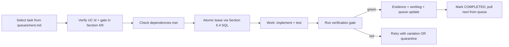

### 29.4 Verification Protocol (per task)

- Run the smallest relevant test suite (unit first, then integration)
- Run lint/type-check (`ruff check src/`, `mypy src/`)
- For effect-path tasks: run failure injection (Section 9 L6)
- For UI tasks: run E2E (Section 9 L5)
- Capture evidence to `artifacts/<task_id>/`
- Update `worklog.md` with: Task ID, Agent, Task, Work Log, Stage Summary

### 29.5 Worklog Protocol (append-only, shared)

```markdown
---
Task ID: <e.g. WS1-W2>
Agent: Zcode
Task: URL sanitization + adversarial tests (infer_site rewrite)

Work Log:
- Read src/jobot/adapters/registry.py (lines 20-50)
- Read tests/test_adapters.py
- Rewrote infer_site() with urlsplit + exact netloc match
- Added tests/test_url_inference.py with 15 adversarial cases
- Ran: pytest tests/test_url_inference.py → 15 passed
- Ran: ruff check src/jobot/adapters/registry.py → clean

Stage Summary:
- infer_site() now raises ValueError for unknown URLs (D1)
- 9 CodeQL alerts should close on next scan
- Evidence: artifacts/WS1-W2/
- Next: verify CodeQL re-scan closes alerts
```

### 29.6 Queue Update Protocol

- After completing a task: move it from `queues/next.md` to `worklog.md` summary; pull next task
- If blocked: add to `queues/blocked.md` with reason + smallest missing answer
- If failure exposed gap: add to `queues/improve.md`
- If repeated success: consider promoting to skill (Section 18) or harness (Section 12)

### 29.7 When to Ask vs Infer

**Ask (only for material ambiguities):**
- Decision in Section 8 marked safety-class (D5, D6, D10, D12, D14, D15, D18, D20, D24)
- Architecture change not covered by this plan
- Legal/compliance posture change
- User data safety question

**Infer (choose safe default and proceed):**
- Implementation detail within an approved task
- Choice between equivalent technical approaches
- Order of independent tasks within a phase

### 29.8 Stopping Rules

Do not stop after planning unless the human explicitly asks for planning only. Keep building until:
- the current milestone is fully implemented and verified
- there is a real blocker requiring human input
- budget/permissions/environment constraints prevent safe progress
- the human pauses or redirects

If blocked, report: the exact blocker, what was attempted, what evidence you gathered, the smallest human decision needed.

### 29.9 Anti-Patterns (forbidden for Zcode)

- Starting breadth work before P0 substrate is proven
- Marking a feature complete because code exists (DoD requires tests + evidence + docs)
- Bypassing policy gates for velocity
- Trusting model output / browser completion / local status flag as verified real-world success
- Leaving temporary scaffolding, duplicate docs, fake adapters, dead code, or unverified claims
- Giant multi-file changes (one-change rule, Section 15.5)
- Editing files without reading them first
- Assuming standard test commands — verify against `pyproject.toml` / `package.json`

### 29.10 Per-Phase Execution Checklist

Before starting any phase Pn:

- [ ] Previous phase gate G(n-1) is green (evidence in `artifacts/gates/`)
- [ ] Read the workstream scope (Section 5) for this phase
- [ ] Read the task DoD (Section 6.5) for tasks in this phase
- [ ] Verify repo state matches Section 2 baseline (or update baseline)
- [ ] Pull task list from `queues/next.md`
- [ ] For each task: claim → implement → verify → evidence → worklog → queue update
- [ ] At phase end: run full gate (Section 9) → produce `artifacts/gates/G<n>.json` → update `CHANGELOG.md` → update queues

---

## Section 30 — Appendix A: Executable Schemas

### 30.1 SQL DDL — All New Tables

```sql
-- Versioned migrations (UC-07)
CREATE TABLE schema_migrations (
    version INTEGER PRIMARY KEY,
    name TEXT NOT NULL,
    checksum TEXT NOT NULL,  -- SHA256 of migration SQL
    applied_at TIMESTAMP DEFAULT CURRENT_TIMESTAMP
);

-- Tasks (UC-01, G1)
CREATE TABLE tasks (
    id TEXT PRIMARY KEY,
    goal_id TEXT NOT NULL,
    project_id TEXT NOT NULL,
    description TEXT NOT NULL,
    skill_tags TEXT NOT NULL,  -- JSON array
    status TEXT NOT NULL DEFAULT 'PENDING',
    depends_on TEXT NOT NULL DEFAULT '[]',  -- JSON array of task_ids
    owner TEXT,
    reviewer TEXT,
    priority INTEGER NOT NULL DEFAULT 5,
    risk_level INTEGER NOT NULL DEFAULT 0,
    budget_limit_usd REAL,
    tokens_used INTEGER NOT NULL DEFAULT 0,
    attempts INTEGER NOT NULL DEFAULT 0,
    max_attempts INTEGER NOT NULL DEFAULT 3,
    verification_plan TEXT NOT NULL,
    evidence_paths TEXT NOT NULL DEFAULT '[]',  -- JSON array
    artifacts TEXT NOT NULL DEFAULT '[]',  -- JSON array
    escalation_reason TEXT,
    definition_of_done TEXT NOT NULL,
    created_at TIMESTAMP DEFAULT CURRENT_TIMESTAMP,
    updated_at TIMESTAMP DEFAULT CURRENT_TIMESTAMP,
    FOREIGN KEY (goal_id) REFERENCES goals(id),
    FOREIGN KEY (project_id) REFERENCES projects(id)
);
CREATE INDEX idx_tasks_status_priority ON tasks(status, priority, created_at);

-- Task attempts (UC-01)
CREATE TABLE task_attempts (
    id INTEGER PRIMARY KEY AUTOINCREMENT,
    task_id TEXT NOT NULL,
    attempt_number INTEGER NOT NULL,
    worker_id TEXT NOT NULL,
    started_at TIMESTAMP DEFAULT CURRENT_TIMESTAMP,
    completed_at TIMESTAMP,
    outcome TEXT,  -- SUCCESS | FAILURE | UNKNOWN
    error_message TEXT,
    evidence_path TEXT,
    FOREIGN KEY (task_id) REFERENCES tasks(id)
);

-- Task leases (UC-01, atomic claiming)
CREATE TABLE task_leases (
    id INTEGER PRIMARY KEY AUTOINCREMENT,
    task_id TEXT NOT NULL,
    worker_id TEXT NOT NULL,
    acquired_at TIMESTAMP DEFAULT CURRENT_TIMESTAMP,
    expires_at TIMESTAMP NOT NULL,
    heartbeat_at TIMESTAMP DEFAULT CURRENT_TIMESTAMP,
    FOREIGN KEY (task_id) REFERENCES tasks(id)
);
CREATE INDEX idx_leases_expires ON task_leases(expires_at);

-- Task events (UC-02, G1 — append-only event ledger)
CREATE TABLE task_events (
    id INTEGER PRIMARY KEY AUTOINCREMENT,
    task_id TEXT NOT NULL,
    event_type TEXT NOT NULL,
    payload TEXT NOT NULL,  -- JSON
    actor TEXT NOT NULL,
    correlation_id TEXT,
    causation_id TEXT,
    created_at TIMESTAMP DEFAULT CURRENT_TIMESTAMP,
    FOREIGN KEY (task_id) REFERENCES tasks(id)
);
CREATE INDEX idx_events_task ON task_events(task_id, created_at);
CREATE INDEX idx_events_correlation ON task_events(correlation_id);

-- Task artifacts
CREATE TABLE task_artifacts (
    id INTEGER PRIMARY KEY AUTOINCREMENT,
    task_id TEXT NOT NULL,
    artifact_type TEXT NOT NULL,  -- code | doc | evidence | diff | report
    path TEXT NOT NULL,
    checksum TEXT NOT NULL,  -- SHA256
    created_at TIMESTAMP DEFAULT CURRENT_TIMESTAMP,
    FOREIGN KEY (task_id) REFERENCES tasks(id)
);

-- Task dependencies
CREATE TABLE task_dependencies (
    task_id TEXT NOT NULL,
    depends_on_task_id TEXT NOT NULL,
    dependency_type TEXT NOT NULL DEFAULT 'BLOCKS',  -- BLOCKS | TRIGGERS | RELATES
    PRIMARY KEY (task_id, depends_on_task_id),
    FOREIGN KEY (task_id) REFERENCES tasks(id),
    FOREIGN KEY (depends_on_task_id) REFERENCES tasks(id)
);

-- External effects (UC-03, G2 — idempotency ledger)
CREATE TABLE external_effects (
    id TEXT PRIMARY KEY,  -- UUID
    task_id TEXT NOT NULL,
    application_id TEXT,
    effect_type TEXT NOT NULL,  -- SUBMIT | EMAIL | API_CALL | BROWSER_ACTION
    idempotency_key TEXT NOT NULL UNIQUE,  -- prevents duplicate effects
    request_hash TEXT NOT NULL,  -- SHA256 of canonical request
    started_at TIMESTAMP DEFAULT CURRENT_TIMESTAMP,
    completed_at TIMESTAMP,
    status TEXT NOT NULL DEFAULT 'PENDING',  -- PENDING | COMMITTED | FAILED | UNKNOWN | COMPENSATED
    external_reference TEXT,  -- confirmation_id, message_id, etc.
    verification_state TEXT,  -- UNVERIFIED | VERIFYING | VERIFIED | UNKNOWN | FAILED
    compensation_state TEXT,  -- NONE | PENDING | APPLIED | FAILED
    evidence_path TEXT,
    FOREIGN KEY (task_id) REFERENCES tasks(id)
);
CREATE INDEX idx_effects_idempotency ON external_effects(idempotency_key);

-- Approvals (UC-05, G4 — durable)
CREATE TABLE approval_requests (
    id TEXT PRIMARY KEY,
    task_id TEXT NOT NULL,
    application_id TEXT,
    action_type TEXT NOT NULL,  -- SUBMIT | OUTREACH | CREDENTIAL_CHANGE | etc.
    risk_level INTEGER NOT NULL,
    requested_at TIMESTAMP DEFAULT CURRENT_TIMESTAMP,
    requested_by TEXT NOT NULL,
    status TEXT NOT NULL DEFAULT 'PENDING',  -- PENDING | APPROVED | DENIED | DEFERRED | EXPIRED
    decided_at TIMESTAMP,
    decided_by TEXT,
    decision_reason TEXT,
    expires_at TIMESTAMP,
    evidence_path TEXT,
    FOREIGN KEY (task_id) REFERENCES tasks(id)
);

-- Checkpoints (UC-01, G2 — durable waitpoints)
CREATE TABLE checkpoints (
    id INTEGER PRIMARY KEY AUTOINCREMENT,
    task_id TEXT NOT NULL,
    phase TEXT NOT NULL,
    state_payload TEXT NOT NULL,  -- JSON: complete harness state
    created_at TIMESTAMP DEFAULT CURRENT_TIMESTAMP,
    restored_at TIMESTAMP,
    FOREIGN KEY (task_id) REFERENCES tasks(id)
);

-- Incidents (Section 11)
CREATE TABLE incidents (
    id TEXT PRIMARY KEY,
    severity INTEGER NOT NULL,  -- 1-4
    impact TEXT NOT NULL,
    affected_applications TEXT NOT NULL DEFAULT '[]',  -- JSON array
    timeline TEXT NOT NULL,  -- JSON array of {timestamp, event}
    last_known_good_version TEXT,
    root_cause TEXT,
    mitigation TEXT,
    corrective_action TEXT,
    eval_added_path TEXT,
    status TEXT NOT NULL DEFAULT 'CREATED',  -- CREATED | TRIAGED | MITIGATING | POSTMORTEM | PREVENTION | RESOLVED
    created_at TIMESTAMP DEFAULT CURRENT_TIMESTAMP,
    resolved_at TIMESTAMP
);

-- Budget reservations (UC-06, UC-20)
CREATE TABLE budget_reservations (
    id INTEGER PRIMARY KEY AUTOINCREMENT,
    task_id TEXT NOT NULL,
    scope TEXT NOT NULL,  -- task | goal | project | day | month
    scope_id TEXT NOT NULL,
    reserved_usd REAL NOT NULL,
    spent_usd REAL NOT NULL DEFAULT 0,
    status TEXT NOT NULL DEFAULT 'RESERVED',  -- RESERVED | CONSUMED | RELEASED | EXCEEDED
    created_at TIMESTAMP DEFAULT CURRENT_TIMESTAMP,
    FOREIGN KEY (task_id) REFERENCES tasks(id)
);

-- Memory tables — see Section 13.2 (memory_warm, memory_episodic, memory_semantic, memory_preference, memory_temporal, candidate_facts, answer_bank, form_field_memory)
-- (DDL not repeated here; see Section 13.2)

-- Audit log — see Section 11.4 (with hash chain)
```

### 30.2 Pydantic v2 Model Skeletons (key entities)

```python
# src/jobot/core/models.py
from datetime import datetime, timezone
from enum import Enum
from pydantic import BaseModel, Field

class TaskStatus(str, Enum):
    PENDING = "PENDING"; READY = "READY"; CLAIMED = "CLAIMED"
    RUNNING = "RUNNING"; WAITING = "WAITING"; RETRYING = "RETRYING"
    VERIFYING = "VERIFYING"; COMPLETED = "COMPLETED"; FAILED = "FAILED"
    QUARANTINED = "QUARANTINED"; UNKNOWN = "UNKNOWN"; CANCELLED = "CANCELLED"

class ApplicationState(str, Enum):
    DISCOVERED = "DISCOVERED"; NORMALIZED = "NORMALIZED"
    DEDUPLICATED = "DEDUPLICATED"; ENRICHED = "ENRICHED"
    MATCHED = "MATCHED"; SHORTLISTED = "SHORTLISTED"
    PREPARING = "PREPARING"; PREPARED = "PREPARED"
    AWAITING_APPROVAL = "AWAITING_APPROVAL"; SUBMITTING = "SUBMITTING"
    SUBMITTED = "SUBMITTED"; SUBMISSION_UNKNOWN = "SUBMISSION_UNKNOWN"
    VERIFYING = "VERIFYING"; VERIFIED = "VERIFIED"
    VERIFICATION_UNKNOWN = "VERIFICATION_UNKNOWN"
    OUTCOME_TRACKING = "OUTCOME_TRACKING"
    INTERVIEW = "INTERVIEW"; REJECTED = "REJECTED"
    OFFER = "OFFER"; WITHDRAWN = "WITHDRAWN"; EXPIRED = "EXPIRED"
    QUARANTINED = "QUARANTINED"; FAILED = "FAILED"

class EffectStatus(str, Enum):
    PENDING = "PENDING"; COMMITTED = "COMMITTED"; FAILED = "FAILED"
    UNKNOWN = "UNKNOWN"; COMPENSATED = "COMPENSATED"

class ApprovalStatus(str, Enum):
    PENDING = "PENDING"; APPROVED = "APPROVED"; DENIED = "DENIED"
    DEFERRED = "DEFERRED"; EXPIRED = "EXPIRED"

class Task(BaseModel):
    id: str; goal_id: str; project_id: str; description: str
    skill_tags: list[str] = Field(default_factory=list)
    status: TaskStatus = TaskStatus.PENDING
    depends_on: list[str] = Field(default_factory=list)
    owner: str | None = None; reviewer: str | None = None
    priority: int = 5; risk_level: int = 0
    budget_limit_usd: float | None = None
    tokens_used: int = 0; attempts: int = 0; max_attempts: int = 3
    verification_plan: str
    evidence_paths: list[str] = Field(default_factory=list)
    artifacts: list[str] = Field(default_factory=list)
    escalation_reason: str | None = None
    definition_of_done: str
    created_at: datetime = Field(default_factory=lambda: datetime.now(timezone.utc))
    updated_at: datetime = Field(default_factory=lambda: datetime.now(timezone.utc))

class ExternalEffect(BaseModel):
    id: str; task_id: str; application_id: str | None = None
    effect_type: str; idempotency_key: str; request_hash: str
    started_at: datetime; completed_at: datetime | None = None
    status: EffectStatus = EffectStatus.PENDING
    external_reference: str | None = None
    verification_state: str | None = None
    compensation_state: str | None = None
    evidence_path: str | None = None

class ApprovalRequest(BaseModel):
    id: str; task_id: str; application_id: str | None = None
    action_type: str; risk_level: int
    requested_at: datetime; requested_by: str
    status: ApprovalStatus = ApprovalStatus.PENDING
    decided_at: datetime | None = None
    decided_by: str | None = None
    decision_reason: str | None = None
    expires_at: datetime | None = None

class CandidateFact(BaseModel):
    id: int; profile_id: str; fact_type: str; fact_value: str
    source: str; source_path: str | None = None
    confidence: float = 1.0; verified: bool = False
    verified_at: datetime | None = None; verified_by: str | None = None
    created_at: datetime; superseded_by: int | None = None
```

### 30.3 TypeScript Types (sidecar RPC)

```typescript
// gui/src/types/sidecar.ts
export type TaskStatus =
  | "PENDING" | "READY" | "CLAIMED" | "RUNNING" | "WAITING"
  | "RETRYING" | "VERIFYING" | "COMPLETED" | "FAILED"
  | "QUARANTINED" | "UNKNOWN" | "CANCELLED";

export type ApplicationState =
  | "DISCOVERED" | "NORMALIZED" | "DEDUPLICATED" | "ENRICHED"
  | "MATCHED" | "SHORTLISTED" | "PREPARING" | "PREPARED"
  | "AWAITING_APPROVAL" | "SUBMITTING" | "SUBMITTED"
  | "SUBMISSION_UNKNOWN" | "VERIFYING" | "VERIFIED"
  | "VERIFICATION_UNKNOWN" | "OUTCOME_TRACKING"
  | "INTERVIEW" | "REJECTED" | "OFFER" | "WITHDRAWN" | "EXPIRED"
  | "QUARANTINED" | "FAILED";

export interface Task {
  id: string; goal_id: string; project_id: string; description: string;
  skill_tags: string[]; status: TaskStatus;
  depends_on: string[]; owner: string | null; reviewer: string | null;
  priority: number; risk_level: number;
  budget_limit_usd: number | null; tokens_used: number;
  attempts: number; max_attempts: number;
  verification_plan: string;
  evidence_paths: string[]; artifacts: string[];
  escalation_reason: string | null;
  definition_of_done: string;
  created_at: string; updated_at: string;
}

export interface ApprovalRequest {
  id: string; task_id: string; application_id: string | null;
  action_type: string; risk_level: number;
  requested_at: string; requested_by: string;
  status: "PENDING" | "APPROVED" | "DENIED" | "DEFERRED" | "EXPIRED";
  decided_at: string | null; decided_by: string | null;
  decision_reason: string | null; expires_at: string | null;
}

export interface ExternalEffect {
  id: string; task_id: string; application_id: string | null;
  effect_type: string; idempotency_key: string; request_hash: string;
  started_at: string; completed_at: string | null;
  status: "PENDING" | "COMMITTED" | "FAILED" | "UNKNOWN" | "COMPENSATED";
  external_reference: string | null;
  verification_state: string | null;
  compensation_state: string | null;
  evidence_path: string | null;
}
```

### 30.4 CLI Command Signatures (Typer)

```python
# src/jobot/cli/admin.py
import typer
app = typer.Typer()

@app.command()
def task_list(status: str = None, limit: int = 50):
    """List tasks, optionally filtered by status."""

@app.command()
def task_claim(task_id: str):
    """Atomically claim a READY task for this worker."""

@app.command()
def task_complete(task_id: str, evidence_path: str):
    """Mark a task COMPLETED with evidence."""

@app.command()
def approval_list(status: str = "PENDING"):
    """List approval requests."""

@app.command()
def approval_decide(approval_id: str, decision: str, reason: str = ""):
    """Approve/deny/defer an approval request."""

@app.command()
def effect_check(idempotency_key: str):
    """Check if an external effect has been committed (idempotency)."""

@app.command()
def memory_list(tier: str, entity_type: str = None):
    """List memory entries by tier."""

@app.command()
def memory_search(query: str, tier: str = None):
    """Search memory across tiers."""

@app.command()
def doctor(json: bool = False, fix_safe: bool = False):
    """Run health checks. --json for machine-readable, --fix-safe for auto-remediation."""

@app.command()
def trace_export(task_id: str, format: str = "otel"):
    """Export task trace as OpenTelemetry JSON."""

@app.command()
def backup(output_path: str, encrypt: bool = True):
    """Create encrypted backup."""

@app.command()
def restore(backup_path: str):
    """Restore from backup."""

@app.command()
def db_migrate(target_version: int = None):
    """Run database migrations to target version (or latest)."""

@app.command()
def eval_run(suite: str, slice: str = None):
    """Run an eval suite (or subset)."""

@app.command()
def improve_list():
    """List queued improvement candidates."""

@app.command()
def improve_run(candidate_id: str):
    """Run a Mode 2 improvement candidate (one-change rule)."""
```

---

## Section 31 — Appendix B: Queue Seed Files

**Ready to drop into the repo.** These are the verbatim contents for the canonical file pack (per `AGENTS.md` "filesystem-first project OS").

### 31.1 `queues/now.md`

(See Section 26.1)

### 31.2 `queues/next.md`

(See Section 26.2)

### 31.3 `queues/blocked.md`

(See Section 26.3)

### 31.4 `queues/improve.md`

(See Section 26.4)

### 31.5 `queues/recurring.md`

(See Section 26.5)

### 31.6 `decisions.md` (seed)

```markdown
# Decisions Log

## Active decisions (from MASTER_PLAN_EXPANDED.md Section 8)

### D1: infer_site() unknown URLs
- **Default:** Raise ValueError; no silent default
- **Decided:** 2026-08-16
- **Decided by:** maintainer
- **Revisit trigger:** UX friction reports

### D2: vite upgrade path
- **Default:** 5.4.21 → 8.x line (8.2.1 candidate; re-verify at exec)
- **Status:** PENDING EXECUTION (WS1 W1)
- **Revisit trigger:** Build breakage → document residual

### D3: glib RUSTSEC-2024-0429
- **Default:** Accepted documented residual
- **Decided:** 2026-08-16
- **Revisit trigger:** tauri ≥ 3 / gtk4

### D15: Submission autonomy default
- **Default:** Human by default; trusted-site promotion only from measured outcomes
- **Status:** SAFE DEFAULT CHOSEN — awaiting owner confirmation
- **Revisit trigger:** Trust evidence

(see Section 8 for full D1-D24 list)
```

### 31.7 `FAILURE.md` (seed)

```markdown
# Failure Log

## Active failures (last 30 days)

(none — pre-execution)

## Failure protocol (from AGENTS.md)

When a task fails:
1. Record to memory_episodic table
2. Classify gap type (12-type taxonomy, Section 10.4)
3. If same failure twice → add guardrail/test/policy (anti-stall rule)
4. If repeated failure → QUARANTINED state + incident
5. Add to queues/improve.md if it exposes a blind spot
6. Never silently retry the same command

## Recent postmortems

(none — pre-execution)
```

### 31.8 `worklog.md` (seed)

```markdown
# Worklog

---
Task ID: P0-WS0
Agent: maintainer
Task: Adopt MASTER_PLAN_EXPANDED.md as canonical authority; execute P0 baselines

Work Log:
- Read agents.md, MASTER_PLAN.pdf, Plan1-Plan11
- Synthesized expanded plan with agents.md doctrine mapping
- Created MASTER_PLAN_EXPANDED.md (31 sections)
- Queues seeded (now/next/blocked/improve/recurring)
- Ready for P0 baseline execution

Stage Summary:
- MASTER_PLAN_EXPANDED.md supersedes MASTER_PLAN.pdf for execution
- 31 sections covering: original 20 expanded + 8 NEW agents.md doctrine sections + 3 appendices
- Optimized for Zcode consumption (executable schemas, dependency rails, DoD per task)
- Next: P0 baseline reports (inventory, tests, security, performance)
```

---

End of Master Implementation Plan (Expanded). Generated 2026-08-16 from exhaustive synthesis of all thirteen sources (agents.md + MASTER_PLAN.pdf + Plan1–Plan11), a live repository audit, and the AGENTS.md doctrine. Supersedes all prior plans for execution; originals archived under `docs/planning/archive/` for provenance.

**For Zcode:** Start at Section 29 (Zcode Agent Execution Protocol). Read `AGENTS.md` first. Then Section 1 (North Star), Section 2 (current state), Section 24 (build order), Section 25 (first milestone). Claim tasks from `queues/next.md` using the protocol in Section 29.3. Verify using Section 9 gates. Update `worklog.md` after every task.
