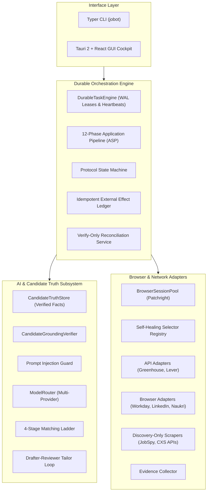

# `jobot` — Autonomous Job Application Operating System

> **Local-First, Privacy-Preserving, Human-Governed Job Discovery & Application Automation Platform (Developer Preview).**

[](LICENSE)
[](pyproject.toml)
[](gui/src-tauri/)
[](SECURITY.md)
[](README.md)

---

## 🌟 Overview

**JoBot** is a developer-preview job search and application automation toolkit. It orchestrates job discovery across public boards and APIs, provides AI-assisted resume/cover letter tailoring grounded in your candidate truth store, and supports automated application submissions across supported platforms with durable human-in-the-loop governance.

JoBot is built under a **Local-First & Grounded Truth Philosophy**:
- **Candidate Grounding Verification**: AI generation is checked against an immutable candidate truth store using heuristic token and entity validation to catch ungrounded skills, titles, or metrics.
- **Reconcile-Never-Replay**: Multi-step network submissions use pre-reserved idempotency keys and explicit state machines to prevent duplicate submissions across process restarts or transient disconnects.
- **Durable Human Approval Gates**: Every submission can be gated behind human approval in the inbox before any external action is executed.
- **Local-First Privacy**: Candidate PII and credentials remain on your machine in a Fernet-encrypted vault locked behind OS-native keyring security (`0600` permissions).

---

## 🌐 Platform Support Matrix & Adapter Tiers

JoBot strictly separates real submission capabilities from job discovery:

| Platform | Tier | Discovery / Scraping | URL Parsing | Application Submission | Submission Type |
|---|---|---|---|---|---|
| **Greenhouse** | Level 4 — Real | ✅ Public Boards API | ✅ Real Endpoint | ✅ Supported | Direct HTTP POST API |
| **Lever** | Level 4 — Real | ✅ Postings API | ✅ Real Endpoint | ✅ Supported | Direct HTTP POST API |
| **Workday** | Level 3 — Browser | ✅ CXS Feed | ✅ CXS Feed | ✅ Supported (`JOBOT_RUN_LIVE_BROWSER=1`) | Patchright Browser |
| **LinkedIn Easy Apply** | Level 3 — Browser | ✅ JobSpy Scraper | ⚠️ Live Browser Only | ✅ Supported (`JOBOT_RUN_LIVE_BROWSER=1`) | Patchright Browser |
| **Naukri** | Level 3 — Browser | ✅ Scraper Engine | ⚠️ Live Browser Only | ✅ Supported (`JOBOT_RUN_LIVE_BROWSER=1`) | Patchright Browser |
| **Ashby** | Level 2 — Discovery | ✅ Public JSON API | ✅ Minimal URL Parse | ❌ Discovery Only | — |
| **Workable** | Level 2 — Discovery | ✅ Public JSON API | ✅ Minimal URL Parse | ❌ Discovery Only | — |
| **Recruitee** | Level 2 — Discovery | ✅ Public JSON API | ✅ Minimal URL Parse | ❌ Discovery Only | — |
| **Teamtailor** | Level 2 — Discovery | ✅ Public JSON API | ✅ Minimal URL Parse | ❌ Discovery Only | — |
| **BambooHR** | Level 2 — Discovery | ✅ Public JSON API | ✅ Minimal URL Parse | ❌ Discovery Only | — |
| **Indeed / Glassdoor / ZipRecruiter / etc.** | Level 2 — Discovery | ✅ JobSpy Scraper | ❌ Discovery Only | ❌ Discovery Only | — |

> **Note on Discovery-Only Adapters:** Discovery-only adapters will cleanly raise `AdapterCapabilityError` if application submission is attempted, preventing any simulated or false success reporting.

---

## 🚀 Key Subsystems

### 1. 🧠 AI Grounding & Candidate Truth Ledger
- **Candidate Grounding Verifier (`CandidateGroundingVerifier`)**: Evaluates generated text against verified profile facts in `CandidateTruthStore` to ensure skills and experience match candidate data.
- **Prompt Injection Defense (`prompt_guard.py`)**: Sanitizes job descriptions, external questions, and instructions to neutralize prompt overrides and injection patterns.
- **Two-Pass Drafter-Reviewer Loop (`DocumentTailor`)**: Generates tailored resumes and cover letters with independent rubric evaluation (A–F grading) and automated revision loops.
- **4-Stage Matching Ladder (`MatchingLadder`)**: Filters jobs by hard location/salary criteria, Jaccard skill overlap, cosine vector similarity, and LLM fit explanations.
- **Universal LLM Router (`ModelRouter`)**: Multi-provider router supporting OpenAI, Anthropic, Gemini, Mistral, Cohere, Bedrock, Vertex AI, and local Ollama.

### 2. ⚡ Durable Execution Engine & Outbox Reliability
- **Crash-Resilient Task Engine (`DurableTaskEngine`)**: SQLite WAL control plane with atomic lease acquisition, periodic heartbeats, and exponential backoff retry.
- **External Effect Idempotency (`external_effects`)**: Idempotency keys reserved prior to network dispatch, preventing duplicate submissions on transient socket disconnects.
- **Verify-Only Reconciliation (`ReconciliationService`)**: Resolves ambiguous network states (`SUBMISSION_UNKNOWN`) without re-submitting.
- **Human Approval Inbox (`approval_requests`)**: Durable approval requests that survive application restarts, giving you full control before any external side-effect is triggered.

### 3. 🌐 Stealth Browser Automation
- **Stealth Session Pool (`BrowserSessionPool`)**: Managed browser processes powered by `Patchright` with humanized cursor physics, anti-detection flags, and session reuse.
- **Self-Healing Selectors (`SelectorRegistry`)**: Multi-tier heuristic fallback locator chains adapting dynamically to ATS DOM changes.
- **LinkedIn Easy Apply Saga (`EasyApplySaga`)**: Deterministic multi-step modal form solver with automated question mapping and file uploads.
- **Evidence Protocol (`BrowserEvidenceCollector`)**: Automatically captures DOM snapshots and confirmation screenshots in a local evidence directory.

### 4. 🖥️ Desktop Cockpit & Real-Time Monitoring
- **Tauri 2 + React Desktop Cockpit**: Native desktop application communicating via high-speed stdio JSON-RPC 2.0 sidecar.
- **Interactive Approval Inbox**: Review drafted form values, tailored resumes, and cover letters before authorizing one-click submission.
- **Diagnostic System Health**: Run comprehensive health checks and manage SQLite control plane state (`jobot doctor`, `jobot reset-db`).

---

## 🏗️ Architecture



---

## ⚡ Quick Start

### 1. Install JoBot

```bash
# Clone the repository
git clone https://github.com/aryansinghnagar/JoBot.git
cd JoBot

# Install Python package with developer and scraper dependencies
pip install -e ".[dev,scrapers]"

# Install browser automation binaries
patchright install chromium
```

### 2. Configure Profile & Credentials

```bash
# View and configure candidate profile
jobot profile

# Import your existing resume (PDF or text) to seed candidate facts
jobot import-resume path/to/your/resume.pdf

# Configure LLM provider API key (or local Ollama)
jobot config set llm.provider gemini
jobot config set api_keys.gemini <YOUR_API_KEY>
```

### 3. Run System Diagnostic

```bash
jobot doctor
```

### 4. Discover & Apply

```bash
# Discover jobs matching your skills
jobot scrape greenhouse --companies stripe,airbnb,cloudflare --save

# Review matches on the 4-stage matching ladder
jobot auto-apply --dry-run

# Apply with human approval
jobot apply <JOB_ID> --approve
```

For complete installation instructions, see **[`SETUP.md`](SETUP.md)**.  
For a walkthrough of workflows and CLI commands, see **[`USER_GUIDE.md`](USER_GUIDE.md)**.

---

## 📚 Documentation Index

- **[`SETUP.md`](SETUP.md)** — Step-by-step setup, API keys, OS keyring vault, Tauri desktop build, and troubleshooting.
- **[`USER_GUIDE.md`](USER_GUIDE.md)** — End-to-end user manual covering profile seeding, job scraping, tailored resumes, approvals, and campaigns.
- **[`ATTRIBUTION.md`](ATTRIBUTION.md)** — Open-source citations, architectural inspirations, and third-party license notices.
- **[`SECURITY.md`](SECURITY.md)** — Security policies, prompt guard defenses, SSRF protections, and vault encryption specs.
- **[`docs/dev/architecture.md`](docs/dev/architecture.md)** — In-depth architectural design, schemas, and state transitions.
- **[`docs/asp.md`](docs/asp.md)** — 12-Phase Application Submission Pipeline formal specification.
- **[`docs/contracts.md`](docs/contracts.md)** — Subsystem contract interfaces and freeze invariants.
- **[`docs/user/cli-reference.md`](docs/user/cli-reference.md)** — Complete reference for all CLI commands, arguments, and flags.

---

## 🛡️ Security, Privacy & Safety

1. **Local Storage**: All profile data, passwords, and tokens are stored locally in `~/.jobot/vault.enc` using Fernet symmetric encryption with file permissions locked to `0600`.
2. **Prompt Injection Defense**: External job descriptions and form prompts are sanitized against instruction-override and jailbreak patterns prior to LLM interpolation.
3. **SSRF Guard**: Outbound network requests are validated against strict IP and host allowlists (`url_guard.py`) preventing internal network traversal.
4. **No Fake Submissions**: Adapters without live submission support refuse submissions cleanly via `AdapterCapabilityError` rather than fabricating submission receipts.

---

## 📄 License

- **Core Engine & Orchestrator**: GNU Affero General Public License v3.0 ([`AGPL-3.0-only`](LICENSE))
- **Site Adapters**: [MIT License](https://opensource.org/licenses/MIT)

Copyright (c) 2026 Aryan Singh Nagar & Architecture Team.
