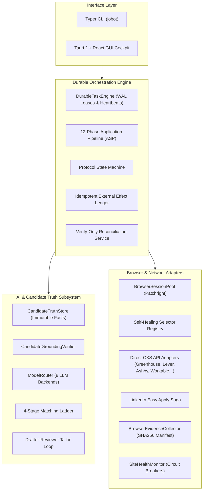

# `jobot` — Autonomous Job Application Operating System

> **Local-First, Privacy-Preserving, Human-Governed Job Discovery & Application Automation Platform.**

[](LICENSE)
[](pyproject.toml)
[](gui/src-tauri/)
[](SECURITY.md)
[](tests/)

---

## 🌟 Overview

**JoBot** is a production-grade autonomous agentic operating system designed to streamline and automate the entire career search lifecycle. It orchestrates job discovery across dozens of boards and direct ATS systems, executes two-pass grounding-verified resume/cover letter tailoring, and automates multi-step form applications with cryptographic non-repudiation evidence and durable human-in-the-loop governance.

JoBot is built under a **Local-First & Zero-Fabrication Philosophy**:
- **Zero Hallucination**: AI generation is bound to an immutable candidate truth store. It is mathematically and structurally impossible for the system to fabricate degrees, employers, or metrics.
- **Reconcile-Never-Replay**: Multi-step network submissions use pre-reserved idempotency keys and state machines to ensure zero duplicate applications across crashes or socket resets.
- **Full Proof of Execution**: Every submission captures SHA256-hashed DOM snapshots and screenshots in a permanent evidence manifest.
- **Local-First Privacy**: Candidate PII and credentials remain on your machine in a Fernet-encrypted vault locked behind OS-native keyring security (`0600` permissions).

---

## 🚀 Key Features

### 1. 🧠 AI Reliability & Candidate Ground Truth
- **Candidate Grounding Verifier (`CandidateGroundingVerifier`)**: Enforces strict verification against the candidate's truth ledger (`CandidateTruthStore`), preventing LLM hallucinations.
- **Two-Pass Drafter-Reviewer Loop (`DocumentTailor`)**: Generates tailored resumes and cover letters with independent rubric evaluation (A–F grading) and automated revision loops.
- **4-Stage Matching Ladder (`MatchingLadder`)**: Eliminates noise via hard location/salary filters, Jaccard skill overlap, bigram cosine vector similarity, and structured LLM fit explanations.
- **Universal LLM Router (`ModelRouter`)**: Real async token streaming across 8 backends: OpenAI, Anthropic Claude, Google Gemini, Mistral, Cohere, AWS Bedrock, GCP Vertex AI, and local Ollama.

### 2. ⚡ Durable Execution Engine & Outbox Reliability
- **Crash-Resilient Task Engine (`DurableTaskEngine`)**: SQLite WAL control plane with atomic `BEGIN IMMEDIATE` lease acquisition, periodic heartbeats, and exponential backoff retry.
- **External Effect Idempotency (`external_effects`)**: Idempotency keys reserved prior to network dispatch, preventing duplicate submissions on transient socket disconnects.
- **Verify-Only Reconciliation (`ReconciliationService`)**: Resolves ambiguous network states (`SUBMISSION_UNKNOWN`) without re-submitting.
- **Human Approval Inbox (`approval_requests`)**: Durable approval requests that survive application restarts, giving you full control before any external side-effect is triggered.

### 3. 🌐 Stealth Browser Automation & CXS Adapters
- **Stealth Session Pool (`BrowserSessionPool`)**: Managed browser processes powered by `Patchright` with humanized cursor physics, anti-detection flags, and session reuse.
- **Self-Healing Selectors (`SelectorRegistry`)**: Multi-tier heuristic fallback locator chains adapting dynamically to ATS DOM changes.
- **Direct ATS Adapters (`cxs.py`)**: High-speed, headless direct-API application submission for Greenhouse, Lever, Workday, Ashby, Workable, Recruitee, Teamtailor, BambooHR, and Naukri.
- **LinkedIn Easy Apply Saga (`LinkedInEasyApplySaga`)**: Deterministic multi-step modal form solver with automated question mapping and file uploads.
- **Evidence Protocol (`BrowserEvidenceCollector`)**: Automatically generates `manifest.json` with SHA256-hashed pre/post DOM snapshots and confirmation screenshots.

### 4. 🖥️ Desktop Cockpit & Real-Time Monitoring
- **Tauri 2 + React Desktop Cockpit**: Native desktop application communicating via high-speed stdio JSON-RPC 2.0 sidecar.
- **Interactive Approval Inbox**: Review drafted form values, tailored resumes, and cover letters before authorizing one-click submission.
- **Live Site Health Monitor**: Real-time circuit breaker tracking, latency metrics, and failure rates across all job portals.
- **Atomic Database Disaster Recovery**: Hot backup and restore commands (`jobot db backup`, `jobot db restore`) with zero-downtime WAL checkpointing.

---

## 🏗️ Architecture



---

## ⚡ Quick Start

### 1. Install JoBot

```bash
# Clone the repository
git clone https://github.com/aryansinghnagar/JoBot.git
cd JoBot

# Install Python package with developer and scraper dependencies
pip install -e ".[dev,scrapers]"

# Install browser automation binaries
patchright install chromium
```

### 2. Configure Profile & Credentials

```bash
# Initialize your encrypted candidate vault
jobot profile init

# Import your existing resume (PDF or text) to seed candidate facts
jobot import-resume path/to/your/resume.pdf

# Configure LLM provider API key (or local Ollama)
jobot config set llm.provider gemini
jobot config set api_keys.gemini <YOUR_API_KEY>
```

### 3. Run System Diagnostic

```bash
jobot doctor
```

### 4. Discover & Apply

```bash
# Discover jobs matching your skills
jobot scrape greenhouse --companies stripe,airbnb,cloudflare --save

# Review matches on the 4-stage matching ladder
jobot match-jobs

# Apply with human approval
jobot apply <JOB_ID> --approve
```

For complete installation instructions, see **[`SETUP.md`](SETUP.md)**.  
For a walkthrough of workflows and CLI commands, see **[`USER_GUIDE.md`](USER_GUIDE.md)**.

---

## 📚 Documentation Index

- **[`SETUP.md`](SETUP.md)** — Step-by-step setup, API keys, OS keyring vault, Tauri desktop build, and troubleshooting.
- **[`USER_GUIDE.md`](USER_GUIDE.md)** — End-to-end user manual covering profile seeding, job scraping, tailored resumes, approvals, and campaigns.
- **[`ATTRIBUTION.md`](ATTRIBUTION.md)** — Open-source citations, architectural inspirations, and third-party license notices.
- **[`SECURITY.md`](SECURITY.md)** — Security policies, SSRF protections, vault encryption specs, and vulnerability reporting.
- **[`docs/dev/architecture.md`](docs/dev/architecture.md)** — In-depth architectural design, schemas, and state transitions.
- **[`docs/asp.md`](docs/asp.md)** — 12-Phase Application Submission Pipeline formal specification.
- **[`docs/contracts.md`](docs/contracts.md)** — Subsystem contract interfaces and freeze invariants.
- **[`docs/user/cli-reference.md`](docs/user/cli-reference.md)** — Complete reference for all CLI commands, arguments, and flags.
- **[`docs/quality/production-readiness.md`](docs/quality/production-readiness.md)** — Verification scorecard and gate audit records.

---

## 🛡️ Security, Privacy & Clean-Room Guarantee

1. **Local Storage**: All profile data, passwords, and tokens are stored locally in `~/.jobot/vault.enc` using Fernet symmetric encryption with file permissions locked to `0600`.
2. **SSRF Guard**: All outbound network requests are validated against strict IP and host allowlists (`url_guard.py`) preventing internal network traversal.
3. **Zero Plagiarism**: All core code, parsers, state machines, and adapters are original clean-room implementations licensed under AGPL-3.0.

---

## 📄 License

- **Core Engine & Orchestrator**: GNU Affero General Public License v3.0 ([`AGPL-3.0-only`](LICENSE))
- **Site Adapters**: [MIT License](https://opensource.org/licenses/MIT)

Copyright (c) 2026 Aryan Singh Nagar & Architecture Team.
