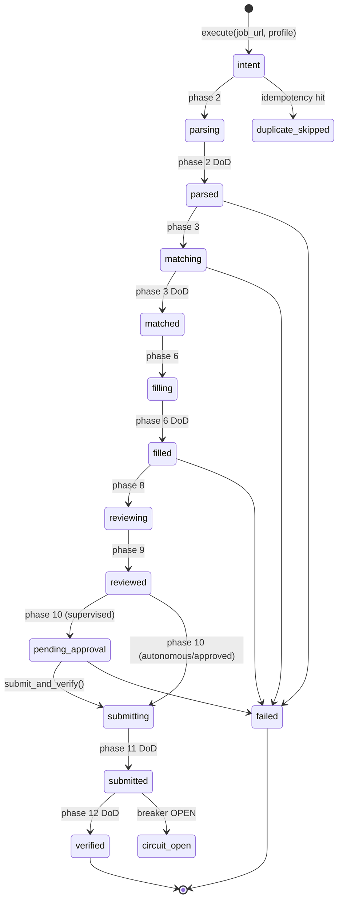

# Application Submission Pipeline (ASP) — 12-Phase State Machine

**Single source of truth for the ASP.** The canonical implementation is
`src/jobot/asp/pipeline.py` (`ApplicationSubmissionPipeline`); phase and status
enums live in `src/jobot/models/domain.py`. If this document and the code
disagree, the code wins.

## Invocation

```python
pipeline = ApplicationSubmissionPipeline(adapter, db_manager, ...)
app = await pipeline.execute(job_url, profile, auto_approve=False)
```

- `auto_approve=True` → autonomous trust (`TrustLevel.AUTONOMOUS`); otherwise
  supervised (`TrustLevel.SUPERVISED`) by default.
- `execute()` first computes an **idempotency key** `sha256(job_url::profile_id)`.
  An existing application in `VERIFIED` state is re-marked `DUPLICATE_SKIPPED`
  and returned immediately — no re-submission (see `tests/test_dedup.py`).
- `submit_and_verify(app)` runs phases 11–12 directly for already-approved
  applications (used by the supervised CLI path).

## The 12 Phases & DoD Gates

Each phase runs a per-phase Definition of Done (DoD) gate. A failed gate marks
the application `FAILED` (unless already `PENDING_APPROVAL` / `CIRCUIT_OPEN` /
`DUPLICATE_SKIPPED` / `REJECTED` / `BLOCKED`), records the reason in
`app.error_message`, dispatches an alert, and stops the pipeline.

| # | Phase | Status on entry | DoD gate (must be true to pass) |
|---|-------|-----------------|----------------------------------|
| 1 | `phase_1_intent` | `intent` | Profile has a name (first or last) **and** an email |
| 2 | `phase_2_parse` | `parsing` → `parsed` | Adapter parsed the posting: non-empty `title` **and** `job_id` (posting saved to DB) |
| 3 | `phase_3_match` | `matching` → `matched` | Job posting record exists in DB for `app.job_id` |
| 4 | `phase_4_extract_questions` | — | Form questions extracted from the target ATS (stored under `form_values["_extracted_questions"]`) |
| 5 | `phase_5_answer_questions` | — | `QAEngine.answer_question()` answers every question from profile facts; any answer requiring approval downgrades trust to `SUPERVISED` |
| 6 | `phase_6_fill_form` | `filling` → `filled` | Adapter `fill_form()` returns a non-empty `dict` |
| 7 | `phase_7_validate_fill` | — | `form_values` contains `email` **and** (`name` or `first_name` or `full_name`) |
| 8 | `phase_8_grounding_check` | `reviewing` | Filled email (if present) exactly equals the profile email — grounding against canonical facts |
| 9 | `phase_9_review` | `reviewed` | Policy governance gate (always passes; policy enforcement is at the caller level) |
| 10 | `phase_10_approval` | — | Supervised + not `auto_approve` → sets `PENDING_APPROVAL` and stops (approval required); otherwise passes |
| 11 | `phase_11_submit` | `submitting` → `submitted` | Circuit breaker not `OPEN` for the site; `submit_application()` returns `True`; evidence item appended |
| 12 | `phase_12_verify` | → `verified` | `verify_submission()` returns success (checked via `.success` or truthiness); evidence + confirmation id captured |

Phases 1–9 always run. Phase 10 runs for every application; when it sets
`PENDING_APPROVAL`, the pipeline stops and phases 11–12 must be completed later
via `submit_and_verify()` (supervised flow). Otherwise 10–12 run in sequence.

## Failure & Resilience Behavior

- **Circuit breaker** wraps submit and verify per site
  (`CircuitBreaker.execute_with_retry`) — an `OPEN` state blocks phase 11
  (`CIRCUIT_OPEN`).
- **Traces**: every phase opens a span via `TraceLogger` (`<phase_value>`),
  closed with `ok` or `<status>: <reason>`.
- **Alerts**: any DoD failure dispatches an `AlertDispatcher` alert
  (`HIGH` when `FAILED`, else `INFO`).
- **Evidence**: screenshots + form-data snapshots recorded as `EvidenceItem`
  for phases 11 and 12.
- **Persistence**: the application is saved whenever a `job_id` exists and the
  posting is known to the DB.

## State Machine (ApplicationStatus)



## Verification & Tests

- Unit: `tests/test_asp_12_phase.py` (12/12 per-phase DoD gates),
  `tests/test_asp.py`, `tests/test_dedup.py`
- Integration (live Mock ATS on port 5800): `tests/integration/test_pipeline_12_phase.py`,
  `tests/integration/test_mock_ats_end_to_end.py`
- Wired-subsystem tests: `tests/test_qa_engine_wired.py`,
  `tests/test_circuit_breaker_wired.py`, `tests/test_tracing_wired.py`,
  `tests/test_alerts_wired.py`
- Eval definitions: `tests/evals/` (grounding, daily-cap, circuit-breaker) via `jobot evals`

## Merge-Plan Note

The merge plan (§17.1) targets an event-sourced tracker state machine
(DISCOVERED → SAVED → APPLYING → APPLIED → …) — a superset of this ASP. Until
that lands, this document is authoritative for the pipeline's behavior.