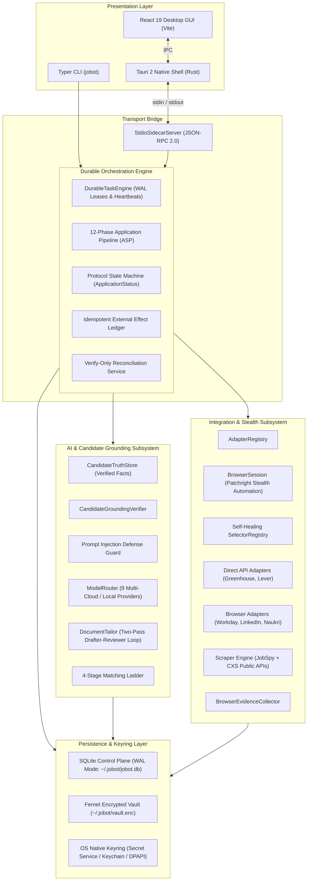
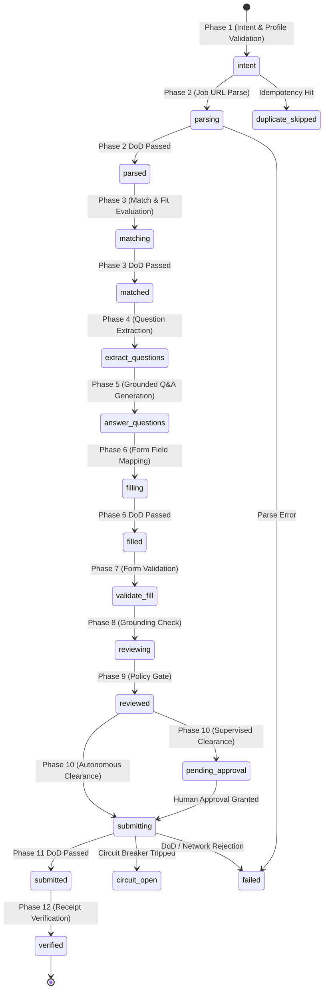

# JoBot System Architecture & Engineering Specification

> **Version:** 0.2.0 (Active Line)  
> **Status:** Living Canonical Architecture Document  
> **Target Audience:** Core Contributors, Adapter Authors, and System Architects

---

## 1. Executive Summary & Design Principles

**JoBot** is a local-first, privacy-preserving, single-user job application operating system. It orchestrates job discovery across public boards and APIs, provides AI-assisted resume/cover letter tailoring grounded in candidate ground truth, and executes reliable application submissions across supported platforms with durable human-in-the-loop governance.

### Core Architectural Invariants
1. **Candidate Ground Truth Primacy**: AI generation is anchored to an immutable fact store (`CandidateTruthStore`). Profile facts are verified using heuristic token overlap and entity validation to prevent ungrounded claims.
2. **Reconcile-Never-Replay**: Network mutations are recorded in an append-only effect ledger (`external_effects`). Ambiguous network drops transition into a `SUBMISSION_UNKNOWN` state resolved only via read-only confirmation polling—never double-submitted.
3. **Local-First Cryptographic Security**: All credentials, resumes, and personal facts reside encrypted in local OS storage (`~/.jobot/vault.enc`) under strict `0600` file permissions locked by the OS Keyring.
4. **Honest Adapter Capabilities**: Adapters never fabricate submission confirmations. Adapters lacking direct programmatic submission cleanly raise `AdapterCapabilityError` to activate Assisted Apply Mode.

---

## 2. System Topology & Layered Architecture



---

## 3. Storage & Cryptographic Architecture

### 3.1 Local Encrypted Profile Vault (`CredentialVault`)
Candidate PII, work history, education, and credentials are encrypted at rest:
- **Cipher**: Fernet symmetric encryption (`AES-128-CBC` with PKCS7 padding + `HMAC-SHA256` authentication).
- **Master Key Storage**: Stored in the host OS Keyring via `keyring` library (`service="jobot_vault"`, `username="master_key"`).
- **File Permissions**: Locked to `0600` (`S_IRUSR | S_IWUSR`) on POSIX systems; ACL-restricted on Windows.
- **Location**: `~/.jobot/vault.enc` (or overridden by `JOBOT_PROFILE_PATH`).

### 3.2 Control Plane Database (`DatabaseManager`)
Application history, job requisitions, execution tasks, idempotency keys, and trace spans are stored in SQLite:
- **Journal Mode**: `WAL` (Write-Ahead Logging) for high-concurrency non-blocking reads and crash recovery.
- **Synchronous Flag**: `NORMAL` for ACID durability without filesystem performance penalties.
- **Foreign Key Constraints**: `PRAGMA foreign_keys = ON;` enforced on every connection.
- **Location**: `~/.jobot/jobot.db` (or overridden by `JOBOT_DB_PATH`).
- **Schema Migrations**: Linear versioned migrations managed via `src/jobot/storage/migrations.py` with checksum validation.

---

## 4. 12-Phase Application Submission Pipeline (ASP)

The canonical execution path for submitting an application is the **12-Phase Application Submission Pipeline** (`ApplicationSubmissionPipeline`):



### Definition of Done (DoD) Phase Gates

| Phase | Phase Name | Status Transition | DoD Requirement |
| :--- | :--- | :--- | :--- |
| **1** | `phase_1_intent` | `-> intent` | Profile contains verified applicant name and primary email address. |
| **2** | `phase_2_parse` | `parsing -> parsed` | Adapter successfully extracts non-empty `title` and unique `job_id`. |
| **3** | `phase_3_match` | `matching -> matched` | Requisition record is successfully persisted in SQLite control plane. |
| **4** | `phase_4_extract_questions` | `—` | Custom application form questions extracted from target portal DOM/schema. |
| **5** | `phase_5_answer_questions` | `—` | `QAEngine` generates fact-grounded answers; sensitive fields flag supervised review. |
| **6** | `phase_6_fill_form` | `filling -> filled` | Adapter returns populated dictionary of mapped form values. |
| **7** | `phase_7_validate_fill` | `—` | Form payload contains required contact identifiers (`email` + `name`). |
| **8** | `phase_8_grounding_check` | `reviewing` | Grounding verifier confirms all values strictly match candidate truth ledger. |
| **9** | `phase_9_review` | `reviewed` | Policy evaluation checks daily submission limits and company exclusion rules. |
| **10** | `phase_10_approval` | `-> pending_approval` | Supervised applications halt for human authorization; autonomous proceed. |
| **11** | `phase_11_submit` | `submitting -> submitted` | Circuit breaker permits dispatch; mutation posted; evidence recorded. |
| **12** | `phase_12_verify` | `-> verified` | Verification protocol confirms receipt from portal dashboard / confirmation DOM. |

---

## 5. Adapter Architecture & Platform Capability Tiers

JoBot categorizes portal adapters into explicit capability tiers:

```
┌─────────────────────────────────────────────────────────────────────────┐
│ Level 4: Real Direct API (Greenhouse, Lever)                            │
│  - Public REST / JSON Postings API                                      │
│  - Direct multipart form POST submission                                │
│  - Sub-second network latency, zero browser overhead                    │
├─────────────────────────────────────────────────────────────────────────┤
│ Level 3: Stealth Browser Automation (Workday, LinkedIn Easy Apply,      │
│          Naukri)                                                        │
│  - Patchright anti-detection browser engine                             │
│  - Humanized mouse physics (Bezier curves) & dynamic typing delay       │
│  - Multi-step modal navigation sagas                                    │
├─────────────────────────────────────────────────────────────────────────┤
│ Level 2: Discovery-Only / Assisted Apply (Ashby, Workable, BambooHR,    │
│          Indeed, Glassdoor, ZipRecruiter)                               │
│  - Fast headless JSON scraping & JobSpy feed aggregation                │
│  - Assisted Apply Mode: Tailored resume, cover letter, clipboard paste, │
│    and one-click portal launch                                          │
└─────────────────────────────────────────────────────────────────────────┘
```

---

## 6. AI Subsystem & Candidate Grounding Engine

### 6.1 Candidate Grounding Verifier (`CandidateGroundingVerifier`)
To prevent LLM hallucination of unearned skills, inflated metrics, or false titles:
1. Candidate facts are parsed into discrete proposition tokens.
2. Generated documents and form answers are tokenized and checked for entity containment.
3. Any ungrounded entity drops document evaluation grade below threshold and triggers automated revision loop.

### 6.2 Prompt Injection Defense Guard (`prompt_guard.py`)
Job postings, recruiter emails, and interactive form fields are treated as untrusted input. The guard sanitizes instruction overrides, role-flipping delimiters, and prompt leakage directives before text reaches LLM context windows.

### 6.3 Universal Model Router (`ModelRouter`)
Multi-provider LLM abstraction supporting:
- **Commercial Cloud APIs**: Google Gemini (`gemini-2.5-flash`), Anthropic Claude (`claude-3-5-sonnet`), OpenAI (`gpt-4o`), Mistral AI, Cohere.
- **Enterprise Cloud SDKs**: AWS Bedrock, GCP Vertex AI.
- **Local / Self-Hosted**: Ollama (`llama3.3:70b`), vLLM, OpenRouter, and OpenAI-compatible endpoints.
- **Cost Controls**: Real-time daily budget enforcement (`llm.daily_cost_cap_usd`) with persistent spend tracking in `~/.jobot/data/llm_spend.json`.

---

## 7. Crash Resilience & Task Engine

- **Atomic Leases**: Tasks in `DurableTaskEngine` acquire exclusive row leases via SQLite timestamps. Stale leases are automatically reclaimed after heartbeat timeouts.
- **Idempotency Keys**: Network side-effects reserve unique SHA-256 keys (`sha256(job_url::profile_id)`) in `external_effects` table prior to dispatch.
- **Verify-Only Reconciliation**: Disconnected network requests (`SUBMISSION_UNKNOWN`) enter verification polling routines rather than triggering duplicate HTTP requests.

---

## 8. Observability, Tracing & Non-Repudiation Evidence

- **Distributed Tracing**: OpenTelemetry-compatible `TraceLogger` writes JSONL spans recording execution durations and phase outcomes.
- **Operational Alerts**: `AlertDispatcher` publishes events for tripped circuit breakers, authentication expiry, and daily rate cap limits.
- **Evidence Protocol**: `BrowserEvidenceCollector` captures full-page DOM HTML snapshots and PNG screenshots stored locally in `~/.jobot/evidence/` with cryptographic content hashes for verifiable proof of submission.

